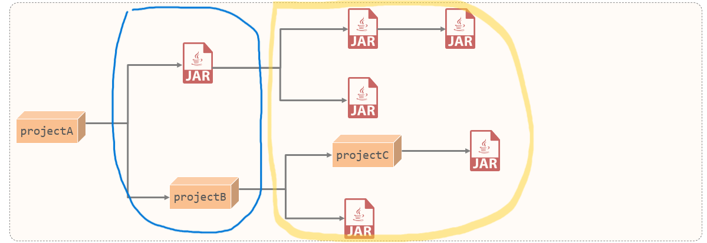

# Maven

[Maven](https://maven.apache.org) 是 apache 旗下的一个开源项目，是一款用于管理和构建 Java 项目的工具。

## 一、Maven 的作用

Maven 的作用主要有：

- **依赖管理**：方便快捷的管理项目依赖的资源（jar 包），避免版本冲突的问题。
- **统一项目结构**：提供标准统一的项目结构。
- **项目构建**：标准跨平台（Win、Mac、Linux）的自动化项目构建方式。

### 1.Maven 依赖管理

创建一个 Maven 项目（工程）：

1. 在其中不需要手动导入 jar 包，只需要在 pom.xml 配置文件中，描述要使用的 jav 包信息（坐标）；
2. Maven 会自动联网下载。

### 2.Maven 统一项目结构

在 eclipse、MyEclipse、IIDEA 这些 Java IDE 中，创建的普通 Java 项目（工程），结构都是不一样的。

而使用 Maven 创建的项目（工程），可以实现项目结构的统一。

Maven 创建的项目（工程），目录结构如下：

```shell
${maven-project}
|-- src
| |-- main # ----------- 实际项目资源
| | -- java # ---------- Java 源代码目录
| | -- resources # ----- 配置文件、静态资源目录
| |-- test # ----------- 测试项目资源
| | -- java # ---------- 测试源代码目录
| | -- resources # ----- 测试配置文件、静态资源目录
|-- pom.xml # ---------- 项目配置文件
|-- target # ----------- 项目编译、打包后，会将字节码文件或 jar 包放在该目录下
|-- LICENSE.txt
|-- NOTICE.txt
|-- README.txt
```

### 3.Maven 项目构建

普通 Java 项目（工程）开发完成后，要经历**编译**、**测试**、**打包**、**发布**的几个步骤。

在 Maven 工程中，提供了一套标准的指令，用于项目开发完成后的**清理**、**编译**、**测试**、**打包**、**发布**

- 比如：在 Maven 项目（工程）中，执行 `compile` 命令，会将整个项目（工程）进行**编译**，并把编译后的结果，放到 target 目录下。
- 比如：在 Maven 项目（工程）中，执行 `package` 命令，会将整个项目（工程）进行**打包**，并把打包后的 jar 包，放到 target 目录下。

## 二、Maven 的概述

Maven 是一个项目管理和构建工具，它基于**项目对象模型（Project Object Model，POM）**的概念：

- 通过一小段描述信息，来管理项目的构建。

Maven 构建项目，生命周期的各个阶段，如下图所示：

- 其中通过 Maven 的各个**插件**，完成不同的功能。
- 各个插件的构建操作，会产生不同的文件：比如：
  - 编译（`compile`）阶段会有 .class 字节码文件产生；
  - 打包（`package`）阶段会有 jar 包产生。


## 三、Maven 仓库

Maven 仓库，用于存储资源，管理各种 jar 包。

- 本地仓库：计算机本地的一个目录；
- 远程仓库（私服）：一般由公司团队搭建的私有仓库。
- [中央仓库](http://repo1.maven.org/maven2)：由 Maven 团队维护的全球唯一的远程仓库。

Maven 会先在本地仓库查找需要的 Jar 包进行关联，

1. 如果没有，会去远程仓库（私服）下载 jar 包到本地。
2. 如果远程仓库（私服）没有，就会去中央仓库下载 jar 包到远程仓库。


## 四、Maven 安装和配置

Maven 安装和配置，主要有 4 步：

Ⅰ、解压 maven 安装包（比如：apache-maven-3.6.2-bin-zip）到 maven 的安装目录，目录结构分析：

- bin 目录 ： 存放的是可执行命令（`mvn` 命令相关）。
- conf 目录 ：存放 Maven 的配置文件（比如：`settings.xml`）。
- lib 目录 ：存放 Maven 依赖的 jar 包（Maven 基于 java 开发，所以它也依赖其他的 jar 包）。

Ⅱ、配置本地仓库，

- 修改 maven 安装目录下的 `conf/settings.xml` 中的 `<localRepository>` 标签，为一个指定的本地目录；

```xml
<settings
  xmlns="http://maven.apache.org/SETTINGS/1.0.0"
  xmlns:xsi="http://www.w3.org/2001/XMLSchema-instance"
  xsi:schemaLocation="http://maven.apache.org/SETTINGS/1.0.0 http://maven.apache.org/xsd/settings-1.0.0.xsd"
>

  <localRepository>E:\Repository\mavenRepository</localRepository>

</settings>
```

Ⅲ、配置阿里云远程仓库（私服），修改 maven 安装目录下 `conf/settings.xml` 中的 `<mirros>` 标签，为其添加如下子标签。

```xml
<settings
  xmlns="http://maven.apache.org/SETTINGS/1.0.0"
  xmlns:xsi="http://www.w3.org/2001/XMLSchema-instance"
  xsi:schemaLocation="http://maven.apache.org/SETTINGS/1.0.0 http://maven.apache.org/xsd/settings-1.0.0.xsd"
>

  <mirrors>
    <mirror>
      <id>alimaven</id>
      <mirrorOf>central</mirrorOf>
      <name>aliyun maven</name>
      <url>http://maven.aliyun.com/nexus/content/groups/public/</url>
    </mirror>
  </mirrors>

</settings>
```

Ⅳ、配置本机的环境变量 `MAVEN_HOME` 为 maven 的安装目录路径。并将其下的 bin 目录，配置到 `PATH` 环境变量中。

你可以按以下步骤配置 Maven 的环境变量（假设你已经安装好了 Maven）：

1. **确认 Maven 安装位置**
   如果你是通过 Homebrew 安装 Maven，默认位置一般在 `/usr/local/Cellar/maven/版本号/libexec`。如果是手动下载安装，则需要记住你解压后的路径。

2. **确定所用的 Shell**
   macOS Catalina 及以后版本默认使用 zsh（早期版本可能是 bash）。

   - 如果使用 zsh，请编辑 `~/.zshrc` 或 `~/.zprofile` 文件。
   - 如果使用 bash，则编辑 `~/.bashrc` 或 `~/.bash_profile` 文件。

3. **编辑配置文件**
   打开终端，使用你喜欢的编辑器（例如 nano 或 vim）打开配置文件。例如，如果使用 zsh：

   ```bash
   vim ~/.zprofile
   ```

   在文件中加入下面的内容（请根据你的 Maven 安装路径进行调整）：

   ```bash
   # Maven 环境变量配置示例（Homebrew 安装示例）
   export M2_HOME=/usr/local/Cellar/maven/3.8.7/libexec
   export PATH=$PATH:$M2_HOME/bin
   ```

   如果你是手动安装的 Maven，则把 `/usr/local/Cellar/maven/3.8.7/libexec` 替换为你实际的 Maven 目录。

4. **使配置生效**
   保存修改后，在终端执行下面的命令以使改动生效：

   ```bash
   source ~/.zprofile
   ```

   （如果使用的是 bash，则执行 `source ~/.bash_profile` 或重新启动终端）

5. **验证配置**
   在终端中运行：

   ```bash
   mvn -version
   # 或者 👇
   mvn -v
   ```

   如果配置正确，你会看到 Maven 的版本信息以及 Java 环境信息。

Maven 是基于 java 开发的项目，Maven 的运行，也要基于本地的 JDK。

> 在真实开发中，很少在命令行执行 mvn 命令，绝大多数时候，都是使用 IDEA 中集成的 maven，来执行命令。

## 五、IDEA 集成 Maven 并创建 Maven 项目

IDEA 配置集成 Maven 有两种方案：

- 方案一：在当前项目（工程）中，集成 Maven 模块。
- 方案二：创建一个 Maven 项目（工程）。

这里演示方案一；方案二的步骤与方案一类似，只是要将创建模块（module）改为创建项目（project）。

### 1.空项目集成 Maven

第一步，配置集成的 maven 安装路径

1. 进入 File  =>  Settings  =>  Build,Execution,Deployment  =>  Build Tools  =>  Maven。
2. 在右侧配置 `Maven home path` 为本地的 maven 安装路径.。
3. 手动指定 `user settings file`，将它设为 maven 安装目录下的 `conf/settings.xml` 配置文件的路径。
4. IDEA 会加载该配置文件，并读取其中的本地仓库路径。

第二步，检查项目 maven 关联的 JRE 是否是要使用的版本：

1. 进入 File  =>  Settings  =>  Build,Execution,Deployment  =>  Build Tools  =>  Maven => Runner。
2. 在右侧配置 JRE 为当前想要使用的版本。

第三步，配置 Java 语言的字节码版本为要使用的版本。

1. 进入 File  =>  Settings  =>  Build,Execution,Deployment  =>  Compiler  => Java Compiler
2. 在右侧配置 project bytecode version 为想要使用的版本。

### 2.空项目中创建 maven 模块（module）

第一步，创建 Maven 模块。

1. 进入 Project Structure => Moudule => + 号 => New Module => java
2. 在右侧 Build system 选择 Maven。

第二步，填写 Maven 模块名称，坐标信息：

1. 接第一步，在右侧打开 Advanced Setting；

2. 配置 GroupId，ArtifactId，version 等信息；maven 项目中，这些信息被称为**坐标**。比如：
   - `GroupId`，设为 `com.kkcf`；表示：组织名

   - `ArtifactId`，设为 `maven-01`；表示：模块名，

   - `version` 会被 IDEA 自动生成，创建时无需指定。表示：版本号。

3. 点击 Create 创建项目。maven 会自动加载项目所依赖的插件，放入本地仓库中。

4. maven 项目创建完成后，会发现 `test` 目录下，没有 `resource` 目录，这是因为它不常用，需要的话要手动创建。

第三步，编写测试类，并运行。

demo-project/normal_project_with_maven/maven-01/src/main/java/com/kkcf/Test.java

```java
package com.kkcf;

public class Test {
    public static void main(String[] args) {
        System.out.println("Hello Project Module With Maven");
    }
}
```

在 IDEA 中，运行上面的代码，会发现项目目录结构中，多出了 `target` 目录，

## 六、IDEA 导入 Maven 项目

在 IDEA 中，导入 Maven 项目，操作路径：

- File -> Open -> 选中 Maven 项目下的 pom.xml 配置文件 -> Open as project.

在 IDEA 中，导入 Maven 模块，操作路径：

- File -> Project Structure -> + 号 -> Import Module -> 选中 Maven 项目下的 pom.xml 配置文件

## 七、Maven 项目 pom.xml 配置文件

创建 Maven 项目后，会生成一个 pom.xml 配置文件如下：

demo-project/normal_project_with_maven/maven-01/pom.xml

```xml
<?xml version="1.0" encoding="UTF-8"?>
<project xmlns="http://maven.apache.org/POM/4.0.0"
         xmlns:xsi="http://www.w3.org/2001/XMLSchema-instance"
         xsi:schemaLocation="http://maven.apache.org/POM/4.0.0 http://maven.apache.org/xsd/maven-4.0.0.xsd">
    <modelVersion>4.0.0</modelVersion>

    <groupId>com.kkcf</groupId>
    <artifactId>maven-01</artifactId>
    <version>1.0-SNAPSHOT</version>

    <properties>
        <maven.compiler.source>17</maven.compiler.source>
        <maven.compiler.target>17</maven.compiler.target>
        <project.build.sourceEncoding>UTF-8</project.build.sourceEncoding>
    </properties>

</project>
```

其中，包含 maven 项目的描述信息，即**坐标**：

- `<groupId>` 标签，表示组织名。
- `<artifactId>` 标签，表示项目（或模块）名。
- `<version>` 标签，表示版本号。

`<properties>` 标签下：

- `<maven.compiler.source>` 标签，表示当前 maven 项目使用的 JDK 版本。
- `<maven.compiler.target>` 标签，表示当前 maven 项目打包时使用的 JDK 版本，

## 八、Maven 项目的坐标

Maven 项目中的坐标，是资源的唯一标识，它可以唯一定位资源位置。Maven 项目中：

- 要使用坐标来定义项目；
- 也要使用坐标来引入项目中需要的依赖。

Maven 坐标的主要组成：

- `groupId`：表示当前 Maven 项目隶属组织名称，通常是域名反写。
  - 比如：`com.kkcf`
- `artifactId`：定义当前 Maven 项目名称，通常是模块名称。
  - 比如：`order-service`、`goods-service`
- `version`：定义当前项目的版本号：

Maven 项目的坐标如下：

```xml
<groupId>com.kkcf</groupId>
<artifactId>maven-01</artifactId>
<version>1.0-SNAPSHOT</version>
```

Maven 项目中，引入的依赖坐标如下：

```xml
<dependency>
    <groupId>ch.qos.logback</groupId>
    <artifactId>logback-classic</artifactId>
    <version>1.2.3</version>
</dependency>
```

## 九、Maven 依赖管理

### 1.依赖配置

Maven 中的依赖：就是当前项目运行所需要的 jar 包。

Maven 项目中可以引入多个依赖：步骤如下：

1. 在 pom.xml 中编写 `<dependencies>` 标签；

2. 在 `<dependencies>` 标签中使用 `<dependency>` 引入依赖的坐标；

3. 定义依赖的坐标：`<groupId>`、`<artifactId>`、`<version>`；

4. 在 IDEA 中点击**刷新按钮**，让 Maven 加载最新描述的依赖。
   - 刷新依赖：保证每一次引入新的依赖，或者修改现有的依赖配置，都可以加入最新的坐标。

> 在 IDEA 中，右侧 maven 面板，查看 maven 项目目录下是否有 `Dependencies`。
>
> 如果没有，点击刷新来加载依赖。

注意事项：

1. 如果引入的依赖，在本地仓库中不存在，将会连接远程仓库（或中央仓库）下载依赖；
   - 这个过程会比较耗时，需要耐心等待。
2. 如果不知道依赖的坐标信息，可以到 mvn 的[中央仓库站点](https://mvnrepository.com/)中搜索。

### 2.依赖传递

当 maven 项目中，引入了一个依赖，比如上面的 `logback-classic`，那么它依赖的另外两个 jar 包：`logback-core` 和 `slf4j`，也会被引入到项目中。

这就涉及到了 Maven 的依赖传递特性。

Maven 项目管理的依赖，可以分为：

- 直接依赖：在当前项目中，通过依赖坐标信息的配置，建立的依赖关系；
- 间接依赖：在当前项目中，被依赖的资源，还依赖了其他资源，那么当前项目间接依赖这些资源。



- 上图**蓝色区域**是 projectA 的直接依赖，**黄色区域**是 projectA 的间接依赖。

> 在 IDEA 中，在 pom.xml 查看依赖结构：
>
> 1. 进入 pom.xml 配置文件；
> 2. 右键 -> Diagrams -> Show Diagram

#### 1.排除依赖

Maven 项目 A 依赖 B，B 依赖 C，如果 A 项目不想将 C 依赖进来；可以通过**排除依赖**来实现。

排除依赖：指的是主动断开依赖的资源（被排除的资源无需指定版本）；

在 pom.xml 配置文件中，通过标签 `<exclusion>` 来指定排除的依赖。

pom.xml

```xml
<dependency>
    <groupId>com.itheima</groupId>
    <artifactId>maven-projectB</artifactId>
    <version>1.0-SNAPSHOT</version>

    <!--排除依赖, 主动断开依赖的资源-->
    <exclusions>
        <exclusion>
            <groupId>junit</groupId>
            <artifactId>junit</artifactId>
        </exclusion>
    </exclusions>
</dependency>
```

在 IDEA 中，pom.xml 配置文件更新后，通常要点击刷新来生效文件。

### 3.依赖范围

Maven 项目中，依赖的 jar 包，默认情况下，可以在任何地方使用。

如果希望限制依赖的使用范围，可以在 pom.xml 中，通过 `<scope>` 标签来设置。

依赖的作用范围，有如下几种：

- 主程序范围有效（`main` 文件夹范围内）。
- 测试程序范围有效（`test` 文件夹范围内）。
- 是否参与打包运行（`package` 指令范围内）。

下方的配置，将 `logback-classic` 依赖，通过 `<scope>` 标签指定了 `test` 作用范围。

- 那么这个依赖，就只能作用在 `test` 文件夹内。

```xml
<?xml version="1.0" encoding="UTF-8"?>
<project xmlns="http://maven.apache.org/POM/4.0.0"
         xmlns:xsi="http://www.w3.org/2001/XMLSchema-instance"
         xsi:schemaLocation="http://maven.apache.org/POM/4.0.0 http://maven.apache.org/xsd/maven-4.0.0.xsd">
    <modelVersion>4.0.0</modelVersion>

    <groupId>com.kkcf</groupId>
    <artifactId>maven-project01</artifactId>
    <version>1.0-SNAPSHOT</version>

    <properties>
        <maven.compiler.source>17</maven.compiler.source>
        <maven.compiler.target>17</maven.compiler.target>
        <project.build.sourceEncoding>UTF-8</project.build.sourceEncoding>
    </properties>

    <dependencies>
        <dependency>
            <groupId>ch.qos.logback</groupId>
            <artifactId>logback-classic</artifactId>
            <version>1.2.3</version>
            <scope>test</scope>
        </dependency>
    </dependencies>

</project>
```

`<scope>` 标签的取值范围：

| scope 值        | 主程序 | 测试程序 | 打包（运行） | 范例依赖    |
| --------------- | ------ | -------- | ------------ | ----------- |
| compile（默认） | ✔      | ✔        | ✔            | log4j       |
| test            | ❌      | ✔        | ❌            | junit       |
| provided        | ✔      | ✔        | ❌            | servlet-api |
| runtime         | ❌      | ✔        | ✔            | jdbc驱动    |

## 十、Maven 生命周期

Maven 的生命周期，就是为了对 Maven 项目的构建过程，进行抽象和统一。

Maven 的生命周期，描述了一次项目构建，经历哪些阶段。

### 1.Maven 生命周期有三套

Maven 对项目构建，有**三套**独立的生命周期，分别是：

- 第一套：`clean`：清理工作。
  - 比如：清理上一次编译的 .class 字节码文件；打包之后的 jar 包文件。

- 第二套：`default`：核心工作。
  - 比如：编译、测试、打包、安装、部署等。

- 第三套：`site`：生成报告、发布站点等（很少用）。

这三套生命周期，每一套又分为若干个阶段，如下图所示：

.png)

注意：**在同一套生命周期中**，当执行某一个阶段时，它前面的阶段，都会执行。

### 2.Maven 生命周期主要阶段

上图中，红色标记的是开发中主要关注的阶段：

- `clean`：移除上一次构建生成的文件。
- `compile`：编译项目源代码。
- `test`：使用合适的单元测试框架运行测试；比如：junit 框架。
- `package`：将编译后的文件打包；比如：jar、war 包。
- `install`：安装项目到本地仓库，形成一个 jar 包。

执行生命周期的两种方式：

- 方式一：在 IDEA 工具右侧的 maven 工具栏中，选择对应的生命周期，双击执行。
  - 在 IDEA 中，执行某一生命周期阶段时，如果要跳过它前面的阶段，那么要选中跳过的阶段，然后点击上方的”Skip Tests“图标。
- 方式二：在命令行中，通过 maven 命令执行。
  1. 在命令行中，进入 maven 项目目录。
  2. 执行 mvn 命令；比如：`mvn clean`、`mvn compile`

### 3.Maven 生命周期是抽象的

Maven 的生命周期是**抽象的**，这意味着生命周期本身不做任何实际工作。

在 Maven 的设计中，实际任务（比如：源代码编译）都交由与 Maven 绑定的**插件**来完成。


Maven 本质上是一个**插件的执行框架**。

## 十一、Maven 本地仓库中不完整 jar 包处理

初始情况下，Maven 本地仓库，是没有任何 jar 包的；

当从远程仓库（私服）或中央仓库下载 jar 包时，可能由于网络的原因，jar 包下载不完整；

这些不完整的 jar 包，在本地仓库中，都是以 `.lastUpdated` 结尾的形式存在的。

针对这些 jar 包，maven 不会再重新下载，需要手动删除它们，然后 maven 才会再次自动下载这些 jar 包。

如果本地仓库中，有很多这样的以 `.lastUpadted` 结尾的文件，可以定义一个批处理文件，在其中编写如下脚本来删除：

Ⅰ、创建批处理文件 del_lastUpdated.bat

```bat
set REPOSITORY_PATH=[本地maven仓库]
rem 正在搜索...

del /s /q %REPOSITORY_PATH%\*.lastUpdated

rem 搜索完毕
pause
```

mac 上要转成 .sh 文件

```sh
#!/bin/bash

# 设置本地 Maven 仓库路径
REPOSITORY_PATH="[本地maven仓库]"

# 提示信息
echo "正在搜索 *.lastUpdated 文件并删除..."

# 删除所有匹配的 *.lastUpdated 文件
find "$REPOSITORY_PATH" -type f -name "*.lastUpdated" -exec rm -f {} +

# 提示搜索完毕
echo "搜索完毕"
```

- 将 `[本地maven仓库]` 替换为实际的本地 maven 仓库绝对路径。

Ⅱ、双击运行批处理文件。
