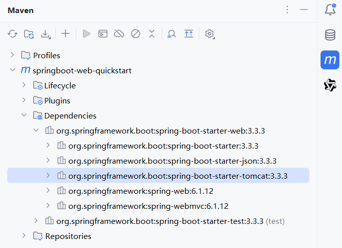

# Tomcat 服务器

## 一、服务器是什么？

服务器分为：

- 硬件服务器，也称伺服器。是提供计算服务的设备。
- 软件服务器，就是运行的应用程序，能够接收客户端请求，并根据请求给客户端响应数据。

Web 服务器，指的是软件服务器：

Web 服务器对 HTTP 协议的请求、响应操作进行封装：

- 使得开发者不用自行解析 Http 协议的请求，和封装 Http 协议的响应。让 Web 开发更加便捷。

Web 服务器，主要功能是"提供网上信息浏览服务"。

## 一、Tomcat 服务器介绍

[Tomcat](https://tomcat.apache.org) 服务器（软件），是 Apache 软件基金会的一个核心项目。它是一个免费的开源的 Web 应用服务器。

Tomcat 服务器，仅支持 Servlet、JSP 等少量 JavaEE 规范，所以是一个轻量级 Web 服务器。

> JavaEE（Java Enterprise Edition）规范，是指 Java 企业级开发的技术规范总和；
>
> 其中包含 13 项技术规范：JDBC、JNDI、EJB、RMI、JSP、Servlet、XML、JMS、Java IDL、JTS、JTA、JavaMail、JAF

Tomcat 服务器，也被称为 **Web 容器**、**Servlet 容器**；

- JavaWeb 程序，需要依赖 Tomcat 服务器才能运行。

## 二、Tomcat 服务器基本使用

### 1.Tomcat 下载

直接从[官方网站](https://tomcat.apache.org)下载。

### 2.Tomcat 安装

安装：解压压缩包；

- 最好解压到一个**不包含中文和空格**的目录；
- 因为后期在部署项目的时候，如果路径有中文或者空格，可能会导致程序部署失败。

目录结构如下：

├─📁 bin/--------------- # Tomcat 可执行文件
├─📁 conf/-------------- # Tomcat 配置文件
├─📁 lib/--------------- # Tomcat 依赖的 jar 包
├─📁 logs/-------------- # Tomcat 日志文件
├─📁 temp/-------------- # Tomcat 临时文件
├─📁 webapps/----------- # Tomcat 应用发布目录
├─📁 work/-------------- # Tomcat 工作目录
├─📄 BUILDING.txt
├─📄 CONTRIBUTING.md
├─📄 LICENSE
├─📄 NOTICE
├─📄 README.md
├─📄 RELEASE-NOTES
└─📄 RUNNING.txt

### 3.Tomcat 卸载

删除解压的目录即可；

### 4.Tomcat 启动

Tomcat 启动：执行 `bin/startup.bat`

- Tomcat 服务器启动后，窗口不会关闭，表示 Tomcat 服务器正在运行。

Tomcat 启动的过程中，遇到控制台有中文乱码时，可以通常修改 `conf/logging.prooperties` 配置文件中的如下部分解决：

```properties
java.util.logging.ConsoleHandler.encoding = GBK
```

> Tomcat 启动时，常见的问题：
>
> 问题一：Tomcat 启动时，窗口一闪而过；
>
> - 解决方法：检查 `JAVA_HOME` 环境变量，是否正确配置，Tomcat 启动时，要依赖 Java 环菌。
>
> 问题二：端口号冲突。体现在如下报错中：
>
> ```sh
> Caused by: java.net.BindException: Address already in use: bind
>         at java.base/sun.nio.ch.Net.bind0(Native Method)
>         at java.base/sun.nio.ch.Net.bind(Net.java:555)
> ```
>
> - 解决方案：换 Tomcat 端口号，修改 `conf/server.xml` 文件：
>
> ```xml
> <Connector port="8080" protocol="HTTP/1.1"
>            connectionTimeout="20000"
>            redirectPort="8443"
>            maxParameterCount="1000"/>
> ```

HTTP 协议，默认端口号为 80，如果将 Tomcat 端口号改为 80，那么访问 Tomcat 时，将不用输入端口号。

### 5.Tomcat 关闭

Tomcat 服务器关闭，有三种方式：

- 方式一：强制关闭：直接关闭 Tomcat 启动窗口（不建议）
- 方式二：正常关闭：执行 `bin\shutdown.bat`
- 方式三：正常关闭：在 Tomcat 启动窗口中按下 Ctrl+C

### 6.Tomcat 静态资源部署

将静态资源目录，放到 `webapps` 目录下，即可完成部署。

- 比如现有 haha 目录，下面有 haha.html 文件；
  1. 将 haha 目录放到 webapps 目录下；
  1. 就可以通过 `localhost:8080/haha/haha.html` 访问到静态资源。

不能放单个文件，要放目录。

## 三、Spring Boot 入门程序分析

### 1.Spring Boot 项目创建原理

Spring 官方提供了生成 Spring 项目的[网站](https://start.spring.io/)；

- IDEA 也是基于此，来创建 Spring 项目的；
- 所以，IDEA 创建 Spring 项目时，是需要联网的。

### 2.Spring Boot 起步依赖

当创建 Spring Boot 项目时，会添加两个依赖：

- `spring-boot-starter-web` 依赖，包含了 web 应用开发所需要的常见依赖。
- `spring-boot-starter-test` 依赖，包含了单元测试所需要的常见依赖。

它们也被称为**起步依赖**，它们利用 Maven 的依赖传递特性，将很多依赖聚合在了一起。

在 Spring Boot 项目中，有很多起步依赖，它们有一个共同的特征：就是以 `”spring-boot-starter-“` 作为开头。

Spring 的官方，提供了很多现成的 [starter（起步依赖）](https://docs.spring.io/spring-boot/docs/2.7.2/reference/htmlsingle/#using.build-systems.starters)，在开发应用相关功能时，只需要引入对应的 starter 即可。

- 比如：在 Spring Boot 项目中，要使用 redis 数据库时，只需要引入 `spring-boot-starter-redis`，即可导入 redis 开发所需要的依赖。

### 3.Spring Boot 父工程

在上文开发的 Spring Boot 入门案例中，使用 maven 引入的依赖，没有指定具体的依赖版本号，如下方所示：

demo-project/springboot-web-quickstart/pom.xml

```xml
<dependencies>
    <dependency>
        <groupId>org.springframework.boot</groupId>
        <artifactId>spring-boot-starter-web</artifactId>
    </dependency>

    <dependency>
        <groupId>org.springframework.boot</groupId>
        <artifactId>spring-boot-starter-test</artifactId>
        <scope>test</scope>
    </dependency>
</dependencies>
```

这是因为，每一个 Spring Boot 工程，都有一个父工程；引入的 Spring Boot 相关依赖的版本号，会在父工程中统一管理。

demo-project/springboot-web-quickstart/pom.xml

```xml
<parent>
    <groupId>org.springframework.boot</groupId>
    <artifactId>spring-boot-starter-parent</artifactId>
    <version>3.3.3</version>
    <relativePath/> <!-- lookup parent from repository -->
</parent>
```

### 4.Spring Boot 内嵌 Tomcat

之前开发的 Spring Boot 入门程序，并没有部署到 Tomcat 的 webapps 目录下，也可以作为 Web 服务器运行。

这是因为在 Spring Boot 项目中，引入了 `spring-boot-starter-web` 起步依赖，其内部已经集成了内置的 Tomcat 服务器。

- IDEA 开发工具右侧的 maven 面板中，可以看到 Tomcat 相关依赖被传递下来了；
- 所以在 Spring Boot 项目中，可以直接使用 Tomcat 服务器。


