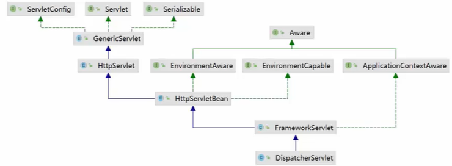
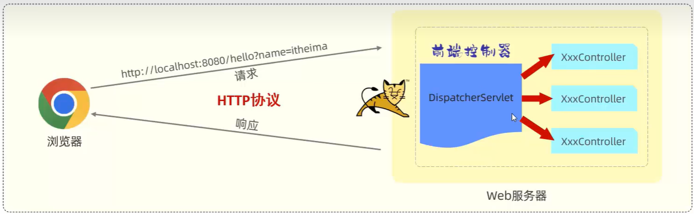
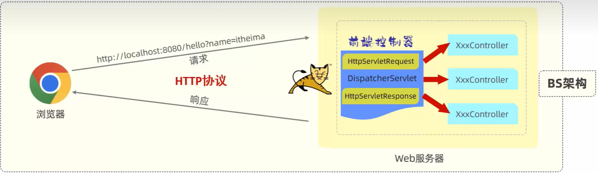

# Spring Boot 请求处理

在 Spring Boot 入门程序中，使用 Controller 控制器，进行了 Http GET 请求的处理

demo-project/springboot-web-quickstart/src/main/java/com/kkcf/controller/HelloController.java

```java
package com.kkcf.controller;

import org.springframework.web.bind.annotation.RequestMapping;
import org.springframework.web.bind.annotation.RestController;

@RestController
public class HelloController {
    @RequestMapping("/hello")
    public String hello() {
        return "Hello Frog";
    }
}
```

## 一、Tomcat 与 Controller 控制器的关系

Spring Boot 内置的 Tomcat 服务器，并不能识别 Spring 项目中的 Controller 控制器类。它们是怎么联系起来的？

- Tomcat 是 Servlet 容器，所以它能识别 Servlet 规范，
- Spring Boot 框架，提供了一个核心的 Servlet 程序 `DispatchServlet`，它实现了 Servlet 规范中的接口。

所以在 Spring Boot 项目中，对于 Http 请求的处理过程是：

1. 客户端（如浏览器）发送请求到 Spring Boot 后端服务；
2. Spring Boot 后端服务，通过 `DispatchServlet`，将请求转给 Controller 处理器。
3. Controller 处理器处理完成后，将响应返回给 `DispatchServlet`；
4. `DispatchServlet` 再将响应返回给浏览器（客户端）。

## 二、DispatchServlet 核心控制器

`DispatchServlet` 类的继承体系如下



- 可以看到，DispatchServlet 继承自 Servlet。

> `DispatcherServlet` 是 Spring 框架中用于处理 HTTP 请求的核心组件，它实现了 Servlet 规范中的 `javax.servlet.Servlet` 接口。
>
> 其主要作用是作为前端控制器（Front Controller），负责将请求分发到相应的处理程序（如控制器）。
>
> 在 Servlet 规范中，`Servlet` 负责接收和处理请求，而 `DispatcherServlet` 扩展了这一功能，提供了更强大的请求处理能力，包括：
>
> 1. **请求映射**：根据 URL 将请求映射到具体的处理方法。
> 2. **视图解析**：处理响应的视图解析，支持多种视图技术（如 JSP、Thymeleaf）。
> 3. **拦截器支持**：允许在请求处理前后添加自定义逻辑。
>
> 简而言之，`DispatcherServlet` 是基于 Servlet 规范的一个高级抽象，使得 Spring 框架能够更加灵活和强大。

`DispatchServlet` 是 Spring 框架非常核心的组件，在应用程序中，被称为“**核心控制器**”或”**前端控制器**“。

它的作用，如下图所示：



## 三、HttpServletRequest 请求对象 HttpServletResponse 响应对象

客户端（如浏览器）发送的请求，在 Spring 框架中，会经过 Tomcat 封装成一个 `HttpServletRequest` 对象（请求对象）；

- 应用程序，通过该对象，来获取请求信息，进行处理。

在 Spring 框架中，可使用 `HttpServletResponse` 对象（请求对象），来封装要返回的响应信息。

- Tomcat 会将该对象中封装的响应信息，返回给浏览器（客户端）。



开发者需要重点关注 Controller  控制器，在其中

1. 获取请求信息；
2. 处理请求；
3. 返回响应。

## 四、Spring Boot 请求处理

客户端在向服务器发起请求时，传递参数的方式是：

- GET 请求，在请求 url 中传递 query 字符串，或者通过路径传递参数。
- POST 请求，在请求体（body）中以多种形式（比如： x-www-form-urlencoded、json）方式传递的参数。

### 1.简单参数处理

在基于 Spring Boot 开发的后端服务中，接收传递过来的参数，有两种方式：

- 原始方式
- Spring Boot 特有的方式

#### 1.原始方式处理

Tomcat 接收到 http 请求时：会把请求的相关信息，封装到 `HttpServletRequest` 类型的请求对象中。

在原始的 Web 程序当中，需要通过 Servlet 中提供的 API：`HttpServletRequest` 请求对象，获取请求的相关信息。

- 比如：获取请求参数：

demo-project/springboot-web-quickstart/src/main/java/com/kkcf/controller/RequestController.java

```java
package com.kkcf.controller;

import jakarta.servlet.http.HttpServletRequest;
import org.springframework.web.bind.annotation.RequestMapping;
import org.springframework.web.bind.annotation.RestController;

@RestController
public class RequestController {
    @RequestMapping("/simpleParam")
    public String simplePath(HttpServletRequest req) {
        String name = req.getParameter("name");
        String ageStr = req.getParameter("age");

        int age = Integer.parseInt(ageStr);
        System.out.println(name + " " + age);

        return "haha";
    }
}
```

- `HttpServletRequest` 的 `getParameter` 方法取到的参数，都是 String 类型的。

在客户端，发送请求 `localhost:8080/simpleParam?name=zzt&age=18` 测试。

这种方式，仅做了解。在实际开发中不会使用。

#### 2.Spring Boot 方式处理

在 Spring Boot 框架中，对原始的 `HttpServletRequest` 请求对象 API 进行了封装；

使得在 Controller 控制器的方法中，接收参数的形式更加简单。

- 如果是处理简单参数，**请求参数名与形参变量名相同**，即可接收参数，会进行**自动类型转换**。

demo-project/springboot-web-quickstart/src/main/java/com/kkcf/controller/RequestController.java

```java
package com.kkcf.controller;

import org.springframework.web.bind.annotation.RequestMapping;
import org.springframework.web.bind.annotation.RestController;

@RestController
public class RequestController {
    @RequestMapping("/simpleParam")
    public String simplePath(String name, int age) {
        System.out.println(name + " " + age);

        return "haha";
    }
}
```

参数名与形参变量名不相同，那么形参接收到的值为 `null`；

在客户端，发送请求 `localhost:8080/simpleParam?name=zzt&age=18` 测试。

#### 3.@RequestParam 注解

如果要将不同的请求参数名，与形参变量名映射起来，要使用 `@RequestParam` 注解

##### 1.value 属性

在方法形参前面，加上 `@RequestParam` 注解，然后通过 `value` 属性作为请求参数名，从而完成映射。代码如下：

demo-project/springboot-web-quickstart/src/main/java/com/kkcf/controller/RequestController.java

```java
package com.kkcf.controller;

import org.springframework.web.bind.annotation.RequestMapping;
import org.springframework.web.bind.annotation.RequestParam;
import org.springframework.web.bind.annotation.RestController;

@RestController
public class RequestController {
    @RequestMapping("/simpleParam")
    public String simplePath(@RequestParam(value = "name") String username, int age) {
        System.out.println(username + " " + age);

        return "haha";
    }
}
```

在客户端，发送请求 `localhost:8080/simpleParam?name=zzt&age=18` 测试。

##### 2.required 属性

`@RequestParam` 注解中的 `required` 属性，默认为 `true`，表示该请求参数必须传递，如果不传递就报错。

- 如果参数是可选的，要手动将 `required` 属性设置为 `false` 。

demo-project/springboot-web-quickstart/src/main/java/com/kkcf/controller/RequestController.java

```java
package com.kkcf.controller;

import org.springframework.web.bind.annotation.RequestMapping;
import org.springframework.web.bind.annotation.RequestParam;
import org.springframework.web.bind.annotation.RestController;

@RestController
public class RequestController {
    @RequestMapping("/simpleParam")
    public String simplePath(@RequestParam(value = "name", required = false) String username, int age) {
        System.out.println(username + " " + age);

        return "haha";
    }
}
```

在客户端，发送请求 `localhost:8080/simpleParam?name=zzt&age=18` 测试。

### 2.实体参数处理

上面的案例中，请求在传递简单参数时，请求中有多少个请求参数，后端 Controller 控制器的处理方法中，形参就要有多少个。

如果请求参数比较多，一个参数一个参数的接收，会比较繁琐。

这时，可以考虑将请求参数，封装到一个实体（pojo）类的对象中。

- 要遵守**请求参数名与实体类的属性名相同**的规则。

创建一个实体（pojo）类 User：

demo-project/springboot-web-quickstart/src/main/java/com/kkcf/pojo/User.java

```java
package com.kkcf.pojo;

public class User {
    private String name;
    private int age;

    public User() {
    }

    public User(String name, int age) {
        this.name = name;
        this.age = age;
    }

    public String getName() {
        return name;
    }

    public void setName(String name) {
        this.name = name;
    }

    public int getAge() {
        return age;
    }

    public void setAge(int age) {
        this.age = age;
    }

    @Override
    public String toString() {
        return "User{" +
                "name='" + name + '\'' +
                ", age=" + age +
                '}';
    }
}
```

在 Controller 控制器中，定义处理方法：

demo-project/springboot-web-quickstart/src/main/java/com/kkcf/controller/RequestController.java

```java
package com.kkcf.controller;

import com.kkcf.pojo.User;
import org.springframework.web.bind.annotation.RequestMapping;
import org.springframework.web.bind.annotation.RequestParam;
import org.springframework.web.bind.annotation.RestController;

@RestController
public class RequestController {
    @RequestMapping("/simplePojo")
    public String simplePojo(User user) {
        System.out.println(user);

        return "haha";
    }
}
```

在客户端，发送请求 `localhost:8080/simplePojo?name=zzt&age=18` 测试。

#### 1.实体类的封装

`User` 实体类中，还有一个 `Address` 类型的属性。

demo-project/springboot-web-quickstart/src/main/java/com/kkcf/pojo/User.java

```java
package com.kkcf.pojo;

public class User {
    private String name;
    private int age;
    private Address address;

    // constructor……

    // getter、setter……

    // toString()……
}
```

`Address` 类

demo-project/springboot-web-quickstart/src/main/java/com/kkcf/pojo/Address.java

```java
package com.kkcf.pojo;

public class Address {
    private String province;
    private String city;

    // constructor……

    // getter、setter……

    // toString()……
}
```

Controller 控制器中的处理方法：

demo-project/springboot-web-quickstart/src/main/java/com/kkcf/controller/RequestController.java

```java
package com.kkcf.controller;

import com.kkcf.pojo.User;
import org.springframework.web.bind.annotation.RequestMapping;
import org.springframework.web.bind.annotation.RequestParam;
import org.springframework.web.bind.annotation.RestController;

@RestController
public class RequestController {
    @RequestMapping("/complexPojo")
    public String complexPojo(User user) {
        System.out.println(user);

        return "haha";
    }
}
```

测试，在客户端发起的请求 url 应为：`localhost:8080/simplePojo?name=zzt&age=18&address.province=广东&address.city="深圳"`

### 3.数组参数处理

浏览器（客户端）发送请求，传递数组参数的形式可以是：

- `localhost:8080/arrayParam?hobby=唱&hobby=跳&hobby=rap&hobby=篮球`
- `localhost:8080/arrayParam?hobby=唱,跳,rap,篮球`

#### 1.数组接收

直接使用数组类型的形参，来接收请求的参数。

Controller 控制器：

demo-project/springboot-web-quickstart/src/main/java/com/kkcf/controller/RequestController.java

```java
package com.kkcf.controller;

import com.kkcf.pojo.User;
import org.springframework.web.bind.annotation.RequestMapping;
import org.springframework.web.bind.annotation.RequestParam;
import org.springframework.web.bind.annotation.RestController;

import java.util.Arrays;

@RestController
public class RequestController {
    @RequestMapping("/arrayParam")
    public String arrayParam(String[] hobby) {
        System.out.println(Arrays.toString(hobby));

        return "haha";
    }
}
```

#### 2.集合接收

要求请求参数名，与形参集合对象名相同；且请求参数为多个，

##### 1.@RequestParam 注解

要使用 `@RequestParam` 注解，绑定请求参数与集合类型的形参之间的关系。

Controller 控制器：

demo-project/springboot-web-quickstart/src/main/java/com/kkcf/controller/RequestController.java

```java
package com.kkcf.controller;

import com.kkcf.pojo.User;
import org.springframework.web.bind.annotation.RequestMapping;
import org.springframework.web.bind.annotation.RequestParam;
import org.springframework.web.bind.annotation.RestController;

import java.util.Arrays;
import java.util.List;

@RestController
public class RequestController {
    @RequestMapping("/listParam")
    public String listParam(@RequestParam List<String> hobby) {
        System.out.println(hobby);

        return "haha";
    }
}
```

### 4.日期参数处理

在一些特殊的需求中，可能会涉及到请求传递日期类型的数据。比如：

- `localhost:8080/dateParam?updateTime=2024-09-06 11:05:33`

日期的格式多种多样（如：2022-12-12 10:05:45 、2022/12/12 10:05:45）；

#### 1.@DateTimeFormat 注解

对于日期类型的参数，需要使用 `@DateTimeFormat` 注解，以及其 `pattern` 属性，来设置形参的日期的格式。

- 客户端请求传递的日期参数，必须按照指定的格式传递。
- 服务器端 Controller 控制器的方法中，要使用 `Date` 或 `LocalDateTime` 类型，来接收传递的参数。
- 请求参数的名称，与 Controller 控制器的方法中形参名称相同。

demo-project/springboot-web-quickstart/src/main/java/com/kkcf/controller/RequestController.java

```java
package com.kkcf.controller;

import com.kkcf.pojo.User;
import org.springframework.format.annotation.DateTimeFormat;
import org.springframework.web.bind.annotation.RequestMapping;
import org.springframework.web.bind.annotation.RequestParam;
import org.springframework.web.bind.annotation.RestController;

import java.time.LocalDateTime;
import java.util.Arrays;
import java.util.List;

@RestController
public class RequestController {
    @RequestMapping("/dateParam")
    public String dateParam(@DateTimeFormat(pattern = "yyyy-MM-dd HH:mm:ss") LocalDateTime updateTime) {
        System.out.println(updateTime);

        return "haha";
    }
}
```

### 5.JSON 参数处理

客户端请求传递 JSON 格式的参数，通常会使用 POST 请求方式，并在请求体中携带 JSON 数据，比如：

- `localhost:8080/jsonParam`，在请求体中，携带如下 json 参数：

```json
{
  "name": "zzt",
  "age": 18,
  "address": {
    "province": "广东",
    "city": "深圳"
  }
}
```

#### 1.@RequestBody 注解

服务器端 Controller 控制器中的方法，处理 JSON 类型的参数：

- 一般使用实体（pojo）类，接收 JSON 格式的参数。JSON 数据键名，与形参对象属性名相同；
- 要使用 `@RequestBody` 标识形参。

Controller 控制器

demo-project/springboot-web-quickstart/src/main/java/com/kkcf/controller/RequestController.java

```java
package com.kkcf.controller;

import com.kkcf.pojo.User;
import org.springframework.web.bind.annotation.RequestBody;
import org.springframework.web.bind.annotation.RequestMapping;
import org.springframework.web.bind.annotation.RestController;

@RestController
public class RequestController {
    @RequestMapping("/jsonParam")
    public String jsonParam(@RequestBody User user) {
        System.out.println(user);

        return "haha";
    }
}
```

### 6.路径（路由）参数处理

实际开发中，经常会直接在请求的 URL 中，传递参数。比如：

- `localhost:8080/pathParam/1/zzt`

#### 1.@PathVariable 注解

服务器端 Controller 控制器的处理方法，要使用 `@RequestMapping` 结合 `@PathVariable` 注解来处理：

demo-project/springboot-web-quickstart/src/main/java/com/kkcf/controller/RequestController.java

```java
package com.kkcf.controller;

import org.springframework.web.bind.annotation.*;

@RestController
public class RequestController {
    @RequestMapping("/pathParam/{id}/{name}")
    public String pathParam(@PathVariable Integer id, @PathVariable String name) {
        System.out.println(id + " " + name);

        return "haha";
    }
}
```
