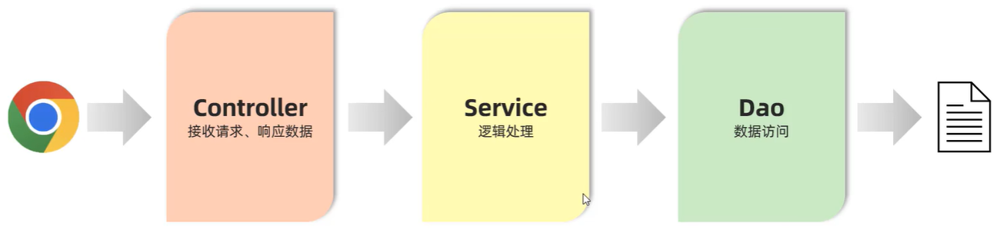

# Spring Boot 分层解耦

## 一、Web 开发三层架构思想

分层架构，遵循**单一职责原则**。它指的是一个类，或一个方法，就只管一块功能，或只管一件事。

- 这样就可以让类、接口、方法的复杂度更低，可读性更强，扩展性更好，也更利于后期的维护。

上文中编写的程序，并不满足单一职责原则：


在 Web 项目开发中，可以将代码分为三层：

- Controller 控制层：接收前端发送的请求，对请求进行处理，并响应数据。
- Service 业务逻辑层：处理具体的业务逻辑。
- Dao（Data Access Object）数据访问层：也称为持久层。负责数据访问操作，包括数据的增、删、改、查。

基于三层架构的程序执行流程：



1. 前端发起的请求
2. Controller 层接收请求
3. Controller 层调用 Service 层，来进行逻辑处理，
4. Serivce 层调用 Dao 层，逻辑处理过程中，需要用到的一些数据要从 Dao 层获取。
5. Dao 层操作文件中的数据，将操作结果返回给 Service 层。
6. Service 层处理完后，把处理结果，返回给 Controller 层；
7. 最后再由 Controller 层响应数据给客户端；

使用三层架构思想，重构之前的代码。

### 1.Dao 层

创建一个 dao 包（package），在其中创建一个接口 `EmpDao`，用于增强灵活性

demo-project/springboot-web-quickstart/src/main/java/com/kkcf/dao/EmpDao.java

```java
package com.kkcf.dao;

import com.kkcf.pojo.Emp;

import java.util.List;

public interface EmpDao {
    List<Emp> listEmp();
}
```

在 dao 包下，创建一个 impl 包，用于存放接口的实现类；

在其下创建一个 `EmpDaoA` 类，实现 `EmpDao` 接口，表示 A 实现方案：

demo-project/springboot-web-quickstart/src/main/java/com/kkcf/dao/impl/EmpDaoA.java

```java
package com.kkcf.dao.impl;

import com.kkcf.dao.EmpDao;
import com.kkcf.pojo.Emp;
import com.kkcf.utils.XmlParserUtils;

import java.util.List;
import java.util.Objects;

public class EmpDaoA implements EmpDao {
    @Override
    public List<Emp> listEmp() {
        ClassLoader classLoader = this.getClass().getClassLoader(); // 获取类加载器
        String file = Objects.requireNonNull(classLoader.getResource("emp.xml")).getFile();
        System.out.println("file: " + file);
        return XmlParserUtils.parse(file, Emp.class);
    }
}
```

### 2.Service 层

创建一个 service 包（package），在其中创建一个接口 `EmpService`，用于增强灵活性。

demo-project/springboot-web-quickstart/src/main/java/com/kkcf/service/EmpService.java

```java
package com.kkcf.service;

import com.kkcf.pojo.Emp;

import java.util.List;

public interface EmpService {
    List<Emp> listEmp();
}
```

在 service 包下，创建一个 impl 包，用于存放 Service 层接口的实现类。

创建一个 `EmpServiceA` 类，实现 `EmpService` 接口：

- 使用 Dao 层创建的实例对象 `empDao` 调用方法，获取数据。

```java
package com.kkcf.service.impl;

import com.kkcf.dao.EmpDao;
import com.kkcf.dao.impl.EmpDaoA;
import com.kkcf.pojo.Emp;
import com.kkcf.service.EmpService;

import java.util.List;

public class EmpServiceA implements EmpService {
    public EmpDao empDao = new EmpDaoA();

    @Override
    public List<Emp> listEmp() {
        List<Emp> empList = empDao.listEmp();

        // 对数据进行处理
        empList.forEach(emp -> {
            // 性别
            String gender = emp.getGender();
            String genderStr = switch (gender) {
                case "1" -> "男";
                case "2" -> "女";
                default -> "";
            };
            emp.setGender(genderStr);

            // 工作
            String job = emp.getJob();
            String jobStr = switch (job) {
                case "1" -> "讲师";
                case "2" -> "班主任";
                case "3" -> "就业指导";
                default -> "";
            };
            emp.setJob(jobStr);
        });

        return empList;
    }
}
```

### 3.Controller 层

在 `EmpController` 中，使用 Service 层创建的实例对象 `empService`，获取数据。

demo-project/springboot-web-quickstart/src/main/java/com/kkcf/controller/EmpController.java

```java
package com.kkcf.controller;

import com.kkcf.pojo.Emp;
import com.kkcf.pojo.Result;
import com.kkcf.service.EmpService;
import com.kkcf.service.impl.EmpServiceA;
import org.springframework.web.bind.annotation.RequestMapping;
import org.springframework.web.bind.annotation.RestController;

import java.util.List;

@RestController
public class EmpController {
    public EmpService empService = new EmpServiceA();

    @RequestMapping("/listEmp")
    public Result<List<Emp>> listEmp() {
        List<Emp> empList = empService.listEmp();

        return Result.success(empList);
    }
}
```

## 二、Web 开发分层解耦思想

软件开发，涉及到两个概念：

- **内聚**：软件中，各个功能模块内部的功能联系。

- **耦合**：软件中，各个层、模块之间的依赖、关联。

### 1.高内聚、低耦合

软件设计原则是：高内聚，低耦合；

- 高内聚，指的是一个模块中，各个元素（语句、代码段）之间的联系程度越高越好。
- 低耦合，指的是软件中各个层、模块之间的依赖关联程度越低越好。

高内聚、低耦合的目的，是使程序模块的可重用性、移植性大大增强。


在之前编写的代码中，

内聚体现在：

- `EmpServiceA` 类中，只编写了和员工相关的逻辑处理代码。

耦合体现在：

- 如果把 Controller 层中要用到的业务类，变为 `EmpServiceB` 时，需要修改 Controller 层中的代码；
- 也就是说：当 Service 层的实现类，变了之后， 我们还需要修改 Controller 层的代码，改变引入的 Service 层实例对象。

为了解决上方代码耦合度高的问题，就不能在 `EmpController` 中使用 `new` 创建 Servcie 层的对象。如下方所示：

demo-project/springboot-web-quickstart/src/main/java/com/kkcf/controller/EmpController.java

```java
@RestController
public class EmpController {
    public EmpService empService = new EmpServiceA();

    // ……
}
```

不能 `new`，意味着没有业务层对象，程序运行就会报错：

为解决这个问题，就要引入容器的概念。

- 容器中存储一些对象（比如：`EmpService` 接口类型的对象)。
- Controller 层会从容器中，获取这些对象。

### 2.IOC 控制反转、DI 依赖注入、Bean 对象

要想实现上述解耦操作，就涉及到 Spring 中的两个核心概念：

- **控制反转（IOC、Inversion Of Control）**：对象的创建控制权，由程序自身转移到外部容器。
  - 这个容器称为：**IOC 容器**或 **Spring 容器**。
- **依赖注入（DI、Dependency Injection）**：容器为应用程序提供运行时，所依赖的资源，称之为依赖注入。
  - 程序运行时，需要某个资源，此时容器就为其提供这个资源。
  - 比如：`EmpController` 程序运行时，需要 `EmpService` 对象，Spring 容器就为其提供并注入 `EmpService` 对象。

- **Bean 对象**：指的是 IOC 容器中，创建、管理的对象。

## 三、Spring Boot IOC 控制反转

使用 IOC 重构上方代码；

将 Dao 层，Service 层的实现类，都交给 IOC 容器管理。

### 1.@Component 注解

那么就要将 Dao 层、Service 层的实现类上，加上 `@Componet` 注解

Dao 层 `EmpDaoA` 实现类：

demo-project/springboot-web-quickstart/src/main/java/com/kkcf/dao/impl/EmpDaoA.java

```java
@Component // 将当前类，交给 IOC 容器管理，成为 IOC 容器中的 Bean 对象
public class EmpDaoA implements EmpDao {
    // ……
}
```

Service 层 `EmpServiceA` 实现类：

demo-project/springboot-web-quickstart/src/main/java/com/kkcf/service/impl/EmpServiceA.java

```java
@Component // 将当前类，交给 IOC 容器管理，成为 IOC 容器中的 Bean 对象
public class EmpServiceA implements EmpService {
    // ……
}
```

## 四、Spring Boot DI 依赖注入

使用 DI 依赖注入，重构上方代码。

- Service 层代码运行的时候，需要使用 IOC 容器中 Dao 层的 Bean 对象；
- Controller 层代码运行的时候，需要使用 IOC 容器中 Service 层的 Bean 对象。

### 1.@Autowired 注解

那么就要分别将 Service 层，Controller 层实现类中，使用的 Dao 层，Service 层的成员变量实例对象上，加上 `@Autowired` 注解，表示自动装配。

Service 层 `EmpServiceA` 实现类：

demo-project/springboot-web-quickstart/src/main/java/com/kkcf/service/impl/EmpServiceA.java

```java
@Component // 将当前类，交给 IOC 容器管理，成为 IOC 容器中的 Bean
public class EmpServiceA implements EmpService {
    @Autowired // 运行时，IOC 容器会提供该类的 Bean 对象，并赋值给该变量，这被称为依赖注入
    public EmpDao empDao;

    // ……
}
```

Controller 层 `EmpController` 控制器类：

demo-project/springboot-web-quickstart/src/main/java/com/kkcf/controller/EmpController.java

```java
@RestController
public class EmpController {
    @Autowired // 运行时，IOC 容器会提供该类的 Bean 对象，并赋值给该变量，这被称为依赖注入
    public EmpService empService;

    // ……
}
```

## 五、Spring Boot IOC 解耦合的体现

再创建一个 `EmpServiceB` 实现类，作为 Service 层的 B 方案；

demo-project/springboot-web-quickstart/src/main/java/com/kkcf/service/impl/EmpServiceB.java

```java
@Component
public class EmpServiceB implements EmpService {
    @Autowired
    public EmpDao empDao;

    // ……
}
```

注释掉 `EmpServiceA` 实现类中的 `@Component` 注解

demo-project/springboot-web-quickstart/src/main/java/com/kkcf/service/impl/EmpServiceA.java

```java
// @Component // 将当前类，交给 IOC 容器管理，称为 IOC 容器中的 Bean
public class EmpServiceA implements EmpService {
    @Autowired // 运行时，IOC 容器会提供该类的 Bean 对象，并赋值给该变量，这被称为依赖注入
    public EmpDao empDao;

    // ……
}
```

即可实现 Service 层逻辑的切换。

## 六、Spring Boot IOC 控制反转详解

由上面的案例可知，IOC 控制反转，就是将对象的控制权，交给 Spring 的 IOC 容器，由 IOC 容器创建及管理对象。

IOC 容器，创建的对象，称为 bean 对象。

在上面的入门案例中，要把某个类的对象，交给 IOC 容器管理，需要在类上添加一个注解：`@Component`

### 1.@Controller、@Service、@Repository 注解

事实上，Spring 框架为了更好的标识 web 应用程序开发当中，bean 对象到底归属于哪一层，提供了 `@Component` 的衍生注解如下：

| 注解        | 说明                     | 位置                                                    |
| ----------- | ------------------------ | ------------------------------------------------------- |
| `@Component`  | 声明 bean 对象的基础注解 | 不属于以下三类时，用此注解                              |
| `@Controller` | `@Component` 的衍生注解    | 标注在控制器类上                                        |
| `@Service`    | `@Component` 的衍生注解    | 标注在业务（Service 层）类上                             |
| `@Repository` | `@Component` 的衍生注解    | 标注在数据访问（Dao 层）类上（后续使用 Mybatis 框架后，用的很少） |

- 因为 Controller 控制器类上，通常标注了 `@RestController` 注解。它是 `@Controller` + `@ResponseBody` 的组合注解，所以不用再标注 `@Controller` 注解。
- 使用以上四个注解，都可以声明 Bean 对象，但是在 Spring Boot 框架中，声明控制器（Controller）Bean 只能用 `@Controller` 注解。

使用这些注解，重构上方代码：

Service 层 `EmpServiceA` 类：

demo-project/springboot-web-quickstart/src/main/java/com/kkcf/service/impl/EmpServiceA.java

```java
@Service // 将当前类，交给 IOC 容器管理，称为 IOC 容器中的 Bean
public class EmpServiceA implements EmpService {
    // ……
}
```

Dao 层 `EmpDaoA` 类：

demo-project/springboot-web-quickstart/src/main/java/com/kkcf/dao/impl/EmpDaoA.java

```java
@Repository
public class EmpDaoA implements EmpDao {
    // ……
}
```

### 2.Bean 对象名称指定

 在 IOC 容器中，每一个Bean 对象，都有一个标识，也就是名字。

- 默认为类名首字母小写（比如：`empDaoA`）
- 也可以用 `@Component` 注解或其衍生注解的 `value` 属性，指定 bean 对象的名字。

将 bean 对象  `empDaoA`，指定名称为 `daoA`；

demo-project/springboot-web-quickstart/src/main/java/com/kkcf/dao/impl/EmpDaoA.java

```java
@Repository(value = "daoA")
public class EmpDaoA implements EmpDao {
    // ……
}
```

或者：

```java
@Repository("daoA")
public class EmpDaoA implements EmpDao {
    // ……
}
```

- `value` 在括号中可省略不写。

## 七、Spring Boot Bean 组件扫描

使用上面注解声明的 Bean 对象，想要生效，还需要被组件扫描：

下面修改项目 dao 包的目录结构，来测试 Dao 层的 bean 对象是否生效：

修改后的结构如下：demo-project/springboot-web-quickstart/src/main/java

├─📁 com/
│ └─📁 kkcf/
└─📁 dao/
  ├─📁 impl/
  └─📄 EmpDao.java

启动项目，出现如下错误：

```sh
***************************
APPLICATION FAILED TO START
***************************

Description:

Field empDao in com.kkcf.service.impl.EmpServiceA required a bean of type 'dao.EmpDao' that could not be found.

The injection point has the following annotations:
  - @org.springframework.beans.factory.annotation.Autowired(required=true)
```

### 1.@ComponentScan 注解

没有找到 bean 对象，是因为 bean 对象没有被组件扫描注解 `@ComponentScan` 扫描到。

### 2.@SpringBootApplication 注解

`@ComponentScan` 注解，虽然没有显式配置，但是已经包含在了引导类（`SpringbootWebQuickstartApplication`）声明注解 `@SpringBootApplication` 中；

- 其中默认扫描的范围是 Spring Boot 启动类所在包，及其子包。

为解决上面的错误：要手动添加 `@ComponentScan` 注解，指定要扫描的包（仅做了解，不推荐）。

推荐做法：将定义的 controller，service，dao 这些包，都放在引导类所在包（比如：`com.kkcf` ）的子包下，如下方目录结构所示：

- 这样 bean 对象就会被自动的扫描到。

├─📁 controller/
├─📁 dao/
├─📁 service/
└─📄 SpringbootWebQuickstartApplication.java

## 八、Spring Boot DI 依赖注入详解

DI 依赖注入，是指 IOC 容器，要为应用程序去提供运行时所依赖的资源，这个资源就是 Bean 对象。

在入门程序案例中，使用了 `@Autowired` 注解，完成了依赖注入的操作（Autowired 翻译过来：自动装配）。

`@Autowired` 注解，默认是按照**类型**，进行自动装配的（去 IOC 容器中找某个类型的对象，然后完成注入操作）

现在 Service 层，有两个实现类 `EmpServiceA` 和 `EmpServiceB` 都声明了 Bean 对象。

demo-project/springboot-web-quickstart/src/main/java/com/kkcf/service/impl/EmpServiceA.java

```java
@Service // 将当前类，交给 IOC 容器管理，称为 IOC 容器中的 Bean
public class EmpServiceA implements EmpService {
    // ……
}
```

demo-project/springboot-web-quickstart/src/main/java/com/kkcf/service/impl/EmpServiceB.java

```java
@Service
public class EmpServiceB implements EmpService {
    // ……
}
```

然后可以看到：IDEA 中，`EmpController` 类出现了编译错误。

demo-project/springboot-web-quickstart/src/main/java/com/kkcf/controller/EmpController.java

```java
@RestController
public class EmpController {
    @Autowired
    public EmpService empService; // 编译错误

    // ……
}
```

启动项目失败，报错如下：

```sh
***************************
APPLICATION FAILED TO START
***************************

Description:

Field empService in com.kkcf.controller.EmpController required a single bean, but 2 were found:
  - empServiceA: defined in file [D:\Workshop\tutorial\JAVAWEB\demo-project\springboot-web-quickstart\target\classes\com\kkcf\service\impl\EmpServiceA.class]
  - empServiceB: defined in file [D:\Workshop\tutorial\JAVAWEB\demo-project\springboot-web-quickstart\target\classes\com\kkcf\service\impl\EmpServiceB.class]
```

为解决这个问题，Spring 提供了以下几个注解：

### 1.@Primary 注解

当存在多个相同类型的 Bean 对象可供注入时，使用 `@Primary` 注解：来设置默认（优先级高）的 Bean 对象注入。

比如：为 Service 层 `EmpServiceA` 类上，加上该注解，

demo-project/springboot-web-quickstart/src/main/java/com/kkcf/service/impl/EmpServiceA.java

```java
@Primary
@Service // 将当前类，交给 IOC 容器管理，称为 IOC 容器中的 Bean
public class EmpServiceA implements EmpService {
    // ……
}
```

### 2.@Qualifier 注解

当存在多个相同类型的 Bean 对象可供注入时，可以使用 `@Autowired` 结合 `@Qualifier` 注解

- `@Qualifier` 注解不能单独使用，必须配合 `@Autowired` 注解使用。
- `@Qualifier` 注解，使用 `value` 属性。按照类型，进行 Bean 对象注入，

比如：在 Controller 层中，为 Bean 对象注入指定一个对象：

demo-project/springboot-web-quickstart/src/main/java/com/kkcf/controller/EmpController.java

```java
@RestController
public class EmpController {
    @Autowired // 运行时，IOC 容器会提供该类的 Bean 对象，并赋值给该变量，这被称为依赖注入
    @Qualifier(value = "empServiceA")
    public EmpService empService;

    // ……
}
```

或者 👇

```java
@RestController
public class EmpController {
    @Autowired // 运行时，IOC 容器会提供该类的 Bean 对象，并赋值给该变量，这被称为依赖注入
    @Qualifier("empServiceA")
    public EmpService empService;

    // ……
}
```

### 3.@Resource 注解

当存在多个相同类型的 Bean 注入时，也可以使用 `@Resource` 注解。

- `@Resource` 注解，由 JDK 提供，而非 Spring 框架提供。
- `@Resource` 注解，使用 `name` 属性。按照名称，进行 Bean 对象注入。

比如：在 Controller 层中，为 Bean 对象注入指定一个对象：

demo-project/springboot-web-quickstart/src/main/java/com/kkcf/controller/EmpController.java

```java
@RestController
public class EmpController {
    @Autowired // 运行时，IOC 容器会提供该类的 Bean 对象，并赋值给该变量，这被称为依赖注入
    @Resource(name = "empServiceA")
    public EmpService empService;

    // ……
}
```

> 【面试题】`@Resource` 注解和 `@Autowired` 注解的区别：
>
> - `@Autowired` 是 Spring 框架提供的注解；`@Resource` 是 JDK 提供的注解。
> - `@Autowired` 默认是按照类型注入；`@Resource` 是按照名称注入。
