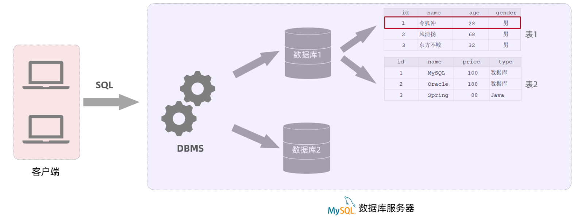

# MySQL 基本介绍

## 一、数据库是什么？

数据库（DB）（DataBase）是存储和管理数据的仓库。

数据库管理系统（DBMS）（DataBase Management System）：是一个软件，用于操作数据库以及数据库存放的数据。

结构化查询语言 SQL（Structured Query Language），它是操作关系型数据库的编程语言；

- SQL 定义了一套操作关系型数据库的统一标准；
- 学习数据库开发，最为重要的就是学习 SQL 语句 。

客户端给数据库管理系统（DBMS）发送 SQL 语句，再由数据库管理系统，操作数据库当中的数据。

目前常见的关系型数据库有：

- Oracle：甲骨文（Oracle）公司产品，大型的收费数据库，价格昂贵。
- MySQL：开源免费的中小型数据库，
  - 后被 Sun 公司收购；Oracle 又收购了 Sun 公司。
  - 目前 Oracle 推出两个版本的 MySQL：社区版（开源免费）、商业版（收费）。

- SQL Server：微软（Microsoft）公司推出的收费的中型数据库；C#、.net 语言常用。
- PostgreSQL：开源免费的中小型数据库。
- DB2：IBM 公司的大型收费数据库产品。
- SQLLite：嵌入式的微型数据库。Android 内置的数据库。
- MariaDB：开源免费的中小型数据库。是 MySQL 数据库的另外一个分支、另外一个衍生产品，与 MySQL 数据库有很好的兼容性。

## 二、数据库认识阶段

认识数据库，主要分为三个阶段：

阶段一：数据库设计

1. MySQL 概述
2. 数据库设计 DDL
3. 多表设计

阶段二：数据库操作

1. 数据库操作 DML
2. 数据库查询 DQL
3. 事务
4. 多表查询

阶段三：数据库优化

1. 索引
2. SQL 优化
3. 分库分表
4. ……

## 三、MySQL 数据库连接

在命令行，连接 MySQL 的命令：

```shell
mysql -u[username] -p[password] -h[数据库服务器的IP地址] -P[端口号]
```

## 四、MySQL 数据库模型

关系型数据库（RDBMS），指的是建立在关系模型基础上，由多张相互连接的**二维表**组成的数据库。

二维表，指的是由行和列组成的表。它的优点有：

- 使用表存储数据，格式统一，便于维护。

- 使用 SQL 语言操作，标准统一，使用方便，可用于复杂查询

基于二维表存储数据的数据库，就称为**关系型数据库**；不是基于二维表存储数据的数据库，就是**非关系型数据库**（比如 Redis）。

MySQL 是关系型数据库，所以是基于二维表进行数据存储的，具体的结构图下:



1. 使用 MySQL 客户端，连接数据库管理系统（DBMS），给它发送 SQL 语句指令；
2. 数据库管理系统（DMBS）根据 SQL 语句指令，去操作数据库中的表结构及数据；

一个数据库服务器中，可以创建多个数据库；一个数据库中，也可以包含多张表；而一张表中，又可以包含多行记录。

在 MySQL 数据库服务器中，存储数据，需要：

1. 先去创建数据库（可以创建多个数据库，它们之间是相互独立的）；
2. 在数据库下再去创建数据表（一个数据库下，可以创建多张表）；
3. 再将数据存放在数据表中（一张表，可以存储多行数据）；

## 五、SQL 语句

SQL（Structured Query Language）：表示结构化查询语言。其中定义了操作所有关系型数据库的统一标准。

### 1.SQL 通用语法

语法一：SQL 语句可以单行或多行书写，以分号结尾。

```mysql
mysql> CREATE
    -> DATABASE
    -> JAVAWEB_DEMO_DB
    -> ;
```

语法二：SQL 语句可以使用空格、缩进来增强语句的可读性。

```mysql
show databases;
```

语法三：MySQL 数据库的 SQL 语句中的关键字，不区分大小写。

```mysql
SHOW DATABASES;
```

语法四：注释：

- 单行注释：使用 `--` 注释内容。
- MySQL 特有单行注释：使用 `#` 注释内容。
- 多行注释： 使用 `/* */` 注释内容。

### 2.SQL 分类

SQL 语句，根据其功能，被分为四大类：DDL、DML、DQL、DCL

| 分类 | 全称                       | 说明                                                     |
| ---- | -------------------------- | -------------------------------------------------------- |
| DDL  | Data Definition Language   | 数据定义语言，用来定义数据库对象（数据库，表，字段）     |
| DML  | Data Manipulation Language | 数据操作语言，用来对数据库表中的记录。进行增、删、改操作 |
| DQL  | Data Query Language        | 数据查询语言，用来查询数据库中表的记录                   |
| DCL  | Data Control Language      | 数据控制语言，用来创建数据库用户、控制数据库的访问权限   |
