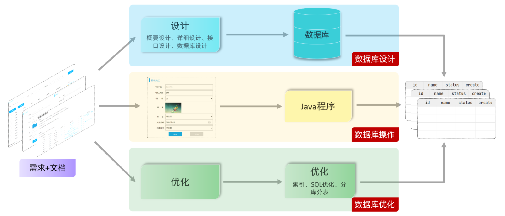
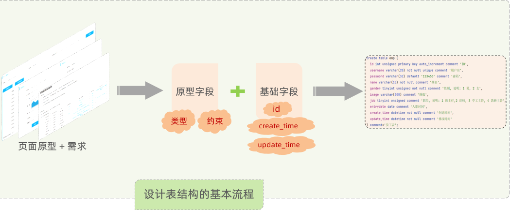

# MySQL 数据库设计 DDL

一个项目，或者项目中某个模块，开发的完整流程如下：

1. 页面原型和需求文档设计：
   - 先拿到产品经理（或你自己）提供的**页面原型**及**需求文档**。
2. 项目设计：

   - 拿到产品原型，和需求文档之后，首先要做的不是编码，而是要先进行项目的设计；
   - 其中就包括**概要设计**、**详细设计**、**接口设计**、**数据库设计**等等。
   - 数据库设计根据产品原型、需求文档，来分析各个模块涉及到的表结构，以及表结构之间的关系，最终将数据库、数据库中的表结构，创建出来。
3. 开发、测试：

   - 参照页面原型和需求，进行编码，实现业务功能。
   - 在这个过程当中，需要操作设计出来的数据库表结构，来完成业务的**增、删、改、查**操作。
4. 部署上线：

   - 在项目的功能开发测试完成之后，项目就可以上线运行了；
5. 项目优化
   - 后期如果项目遇到性能瓶颈，还需要对项目进行优化。其中很重要的一个部分，就是数据库的优化，
   - 比如**索引的建立、SQL 的优化、分库分表**等操作。

一个项目，完整的开发流程，如下图所示：



上述的流程中，针对数据库来说，主要包括三个阶段：

1. 数据库设计阶段：参照页面原型、需求文档，来设计**数据库表结构**。
2. 数据库操作，查询阶段：根据业务功能的实现，编写 SQL 语句，对数据库表中的数据，进行**增、删、改、查**操作。
3. 数据库优化阶段：通过数据库的优化，来提高数据库的访问性能；
   - 优化手段：**索引建立、SQL 优化、分库分表**等。

上述流程中，数据库的设计，就是

1. 创建数据库；
2. 创建数据库中的表结构；
3. 创建数据库表结构中的字段；

需要用到 DDL 语句

## 一、DATABASE 操作

### 1.DATABASE 查询

查询所有的数据库，执行 DDL 语句：

```mysql
SHOW DATABASES;
```

查看当前正在使用的数据库，执行 DDL 语句：

```mysql
SELECT DATABASE();
```

- `DATABASE()` 是 MySQL 中的函数，返回当前正在使用的数据库。

### 2.DATABASE 创建

数据库名字是唯一的，所以在创建数据库时，可以加上 `IF NOT EXISTS` 关键字：

```mysql
CREATE DATABASE IF NOT EXISTS 数据库名;
```

### 2.DATABASE 使用

要操作某一个数据库，必须切换到对应的数据库中。

```mysql
USE 数据库名;
```

### 3.DATABASE 删除

不能删除不存在的数据库，所以可以加上 `IF EXISTS` 关键字，执行 DDL 语句：

```mysql
DROP DATABASE IF EXISTS 数据库名;
```

> 上述语法中的 `DATABASE`，也可以替换成 `SCHEMA`，比如：
>
> ```mysql
> SHOW SCHEMAS;
>
> CREATE SCHEMA IF NOT EXISTS 数据库名;
> ```

## 二、TABLE 操作

### 1.TABLE 创建

数据库表创建，语法如下：

```mysql
CREATE TABLE 表名 (
  字段1 字段1类型 [约束] [COMMENT 字段1注释],
  字段2 字段2类型 [约束] [COMMENT 字段2注释],
  ......
  字段n 字段n类型 [约束] [COMMENT 字段n注释]
) [COMMENT 表注释] ;
```

- 注意： `[ ]` 中的内容为可选参数；
- 最后一个字段后面，没有逗号。

创建一个 user 表；执行 DDL 语句：

```mysql
CREATE TABLE IF NOT EXISTS user
(
    id       INT COMMENT '用户ID，唯一标识',
    username VARCHAR(20) COMMENT '用户名',
    name     VARCHAR(20) COMMENT '姓名',
    age      INT COMMENT '年龄',
    gender   CHAR(1) COMMENT '性别'
) COMMENT '用户表';
```

#### 1.字段约束

想要限制字段所存储的数据，就需要用到数据库中的**约束**。

约束，就是作用在表中字段上的规则，用于限制存储在表中的数据。来保证字段存储数据的正确性、有效性和完整性。

MySQL 数据库当中，提供了以下五种约束：

| 关键字      | 约束     | 描述                                             |
| ----------- | -------- | ------------------------------------------------ |
| `NOT NULL`  | 非空约束 | 限制该字段值不能为 `null`。                      |
| `UNIQUE`      | 唯一约束 | 保证字段的所有数据都是唯一、不重复的。           |
| `PRIMARY KEY` | 主键约束 | 主键是一行数据的唯一标识，要求**非空且唯一**，常与 `AUTO_INCREMENT` 自增一起使用。 |
| `DEFAULT`     | 默认约束 | 保存数据时，如果**未指定**该字段值，则采用默认值。 |
| `FOREIGN KEY` | 外键约束 | 让两张表的数据建立连接，保证数据的一致性和完整性 |

> 约束作用于字段上，
>
> 可以在创建表、修改表的时候，添加约束。
>
> 主键自增：`AUTO_INCREMENT`
>
> - 每次插入新的行记录时，常用于数据库自动生成 Id 字段（主键）下的值。
> - 具有 `AUTO_INCREMENT` 的数据列是一个正数序列，从 1 开始自增。

为上面的数据库表创建的 DDL 语句，加上约束

```mysql
CREATE TABLE IF NOT EXISTS user
(
    id       INT PRIMARY KEY AUTO_INCREMENT COMMENT '用户ID，唯一标识',
    username VARCHAR(20) NOT NULL UNIQUE COMMENT '用户名',
    name     VARCHAR(20) NOT NULL COMMENT '姓名',
    age      INT COMMENT '年龄',
    gender   CHAR(1) DEFAULT '男' COMMENT '性别'
) COMMENT '用户表';
```

#### 2.MySQL 数据类型

MySQL 中的数据类型，主要分为三类：

- 数值类型；
- 字符串类型；
- 日期时间类型。

##### 1.MySQL 数值类型

MySQL 数值类型，如下表所示：

| 类型        | 大小   | 有符号（SIGNED）范围                                  | 无符号（UNSIGNED）范围                                     | 描述               |
| ----------- | ------ | ----------------------------------------------------- | ---------------------------------------------------------- | ------------------ |
| `TINYINT`     | 1byte | (-128, 127)                                         | (0, 255)                                                 | 小整数值           |
| `SMALLINT`    | 2bytes | (-32768, 32767)                                     | (0, 65535)                                               | 大整数值           |
| `MEDIUMINT`   | 3bytes | (-8388608, 8388607)                                   | (0, 16777215)                                            | 大整数值           |
| `INT`  /  `INTEGER` | 4bytes | (-2147483648, 2147483647)                             | (0, 4294967295)                                            | 大整数值           |
| `BIGINT`      | 8bytes | (-2^63, 2^63-1)                                       | (0, 2^64-1)                                                | 极大整数值         |
| `FLOAT`       | 4bytes | (-3.402823466 E+38, 3.402823466351 E+38)              | 0 和 (1.175494351  E-38, 3.402823466 E+38)                 | 单精度浮点数值     |
| `DOUBLE`      | 8bytes | (-1.7976931348623157 E+308, 1.7976931348623157 E+308) | 0 和  (2.2250738585072014 E-308, 1.7976931348623157 E+308) | 双精度浮点数值     |
| `DECIMAL`     |        | 依赖于M（精度）和 D（标度）的值                       | 依赖于M（精度）和 D（标度）的值                            | 小数值（精确定点数） |

- 数值类型，默认是有符号的，如果要声明无符号的数值类型，要加上 `UNSIGNED`；比如 `TINYINT UNSIGNED`。
- `DECIMAL`  类型，底层用字符串来处理小数，避免精度损失。
- `FLOAT(5,2)` / `DOUBLE(5,2)` /  `DECIMAL(5,2)`：5 表示数字长度，2 表示数字中小数位个数。

示例:：

- 年龄字段，不会出现负数，而且人的年龄不会太大，可以这样声明 `age TINYINT UNSIGNED`；
- 分数，总分 100 分，最多出现一位小数，可以这样声明：`score DOUBLE(4,1)`

##### 2.MySQL 字符串类型

MySQL 字符串类型，如下表所示：

| 类型       | 大小                  | 描述                         |
| ---------- | --------------------- | ---------------------------- |
| `CHAR`       | 0-255 bytes           | 定长字符串（需要指定长度）   |
| `VARCHAR`    | 0-65535 bytes         | 变长字符串（需要指定长度）   |
| `TINYBLOB`   | 0-255 bytes           | 不超过 255 个字符的二进制数据 |
| `TINYTEXT`   | 0-255 bytes           | 短文本字符串                 |
| `BLOB`       | 0-65 535 bytes        | 二进制形式的长文本数据       |
| `TEXT`       | 0-65 535 bytes        | 长文本数据                   |
| `MEDIUMBLOB` | 0-16 777 215 bytes    | 二进制形式的中等长度文本数据 |
| `MEDIUMTEXT` | 0-16 777 215 bytes    | 中等长度文本数据             |
| `LONGBLOB`   | 0-4 294 967 295 bytes | 二进制形式的极大文本数据     |
| `LONGTEXT`   | 0-4 294 967 295 bytes | 极大文本数据                 |

- `CHAR(10)`：固定存 10 个字符；性能高（不用判断数据的长度），但浪费空间。
- `VARCHAR(10)`：最多存 10 个字符，不足 10 个按照实际长度存储；性能相对低（要判断数据的长度），但节省空间。

示例：

- 用户名，长度不定，最长不会超过 50，可以这样声明：`username VARCHAR(50)`；
- 手机号，固定长度为 11，可以这样声明：`phone CHAR(11)`。

##### 3.MySQL 日期类型

MySQL 日期类型，如下表所示：

| 类型      | 大小 | 范围                                       | 格式                | 描述                     |
| --------- | ---- | ------------------------------------------ | ------------------- | ------------------------ |
| `DATE`      | 3    | 1000-01-01 至  9999-12-31                  | YYYY-MM-DD          | 日期值                   |
| `TIME`      | 3    | -838:59:59 至  838:59:59                   | HH:MM:SS            | 时间值或持续时间         |
| `YEAR`      | 1    | 1901 至 2155                               | YYYY                | 年份值                   |
| `DATETIME`  | 8    | 1000-01-01 00:00:00 至 9999-12-31 23:59:59 | YYYY-MM-DD HH:MM:SS | 混合日期和时间值         |
| `TIMESTAMP` | 4    | 1970-01-01 00:00:01 至 2038-01-19 03:14:07 | YYYY-MM-DD HH:MM:SS | 混合日期和时间值，时间戳 |

`DATE`、`DATETIME`、`TIMESTAMP` 用的比较多。

示例:

- 生日字段，生日只需要年、月、日；可以这样声明：`birthday DATE`；
- 创建时间，需要精确到时、分、秒；可以这样声明：`createtime DATETIME`

使用数据类型，重构上面建表的 DDL 语句。

```mysql
CREATE TABLE IF NOT EXISTS user
(
    id       INT UNSIGNED PRIMARY KEY AUTO_INCREMENT COMMENT '用户ID，唯一标识',
    username VARCHAR(20) NOT NULL UNIQUE COMMENT '用户名',
    name     VARCHAR(20) NOT NULL COMMENT '姓名',
    age      TINYINT UNSIGNED COMMENT '年龄',
    gender   CHAR(1) DEFAULT '男' COMMENT '性别'
) COMMENT '用户表';
```

在 MySQL 中，创建一张包含创建时间（`created_at`）和修改时间（`updated_at`）字段的表时，通常遵循以下规范：

1. `created_at`: 表示记录创建的时间，通常设置为 `TIMESTAMP` 或 `DATETIME` 类型，并设置默认值为当前时间。
2. `updated_at`: 表示记录最后一次修改的时间，可以自动更新为每次修改的时间戳。

```mysql
CREATE TABLE your_table (
    id INT AUTO_INCREMENT PRIMARY KEY,
    …… ,
    created_at TIMESTAMP DEFAULT CURRENT_TIMESTAMP,
    updated_at TIMESTAMP DEFAULT CURRENT_TIMESTAMP ON UPDATE CURRENT_TIMESTAMP
);
```

设计表结构的基本流程，如下图所示：



### 2.TABLE 查询

查询当前使用的数据库中所有表，执行 DDL 语句：

```mysql
SHOW TABLES;
```

查看指定表结构：

- 可以查看指定表的字段、字段的类型、是否可以为 NULL、是否存在默认值……信息。

```mysql
DESC 表名;
```

查询指定表的建表语句：

```mysql
SHOW CREATE TABLE 表名;
```

### 3.TABLE 修改

在表中，**添加字段**，语法如下：

```mysql
ALTER TABLE 表名 ADD 字段名 类型(长度) [COMMENT 注释] [约束];
```

在表中，**修改字段类型**，语法如下：

```mysql
ALTER TABLE 表名 MODIFY 字段名 新数据类型 [COMMENT 注释] [约束];
```

在表中，**修改字段名，和字段类型**，语法如下：

```mysql
ALTER TABLE 表名 CHANGE 旧字段名 新字段名 新数据类型 [COMMENT 注释] [约束];
```

在表中，**删除字段**，语法如下：

```mysql
ALTER TABLE 表名 DROP 字段名;
```

在表中，**修改表名**，语法如下：；

```mysql
RENAME TABLE 表名 TO 新表名;
```

### 4.TABLE 删除

删除一张表，DDL 语法如下：

```mysql
DROP TABLE [IF EXISTS] 表名;
```

删除表后，表中的全部数据，都会被删除。
