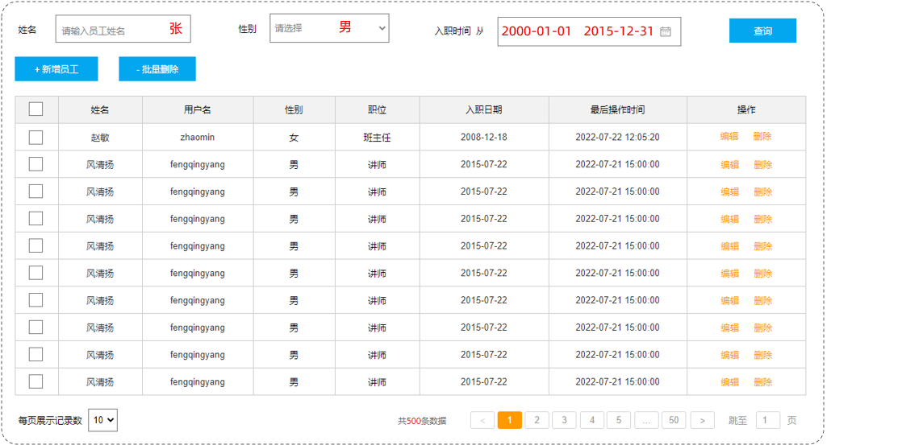
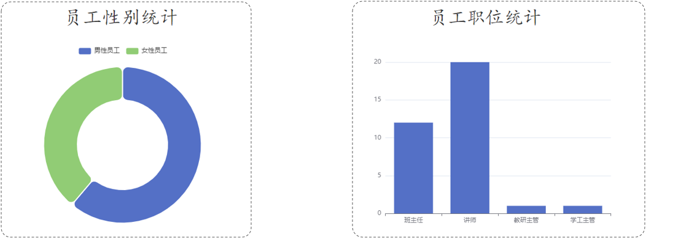

# MySQL 数据库操作 DQL

数据查询语言 DQL（Data Query Language），用来查询数据库表中的记录。

查询操作，是所有 SQL 语句当中最为常见，最为重要的操作；

- 在一个正常的业务系统中，查询操作的使用频次，远高于增、删、改操作。

DQL 的语法，如下：

```mysql
SELECT
  字段列表
FROM
  表名列表
WHERE
  条件列表
GROUP BY
  分组字段列表
HAVING
  分组后条件列表
ORDER BY
  排序字段列表
LIMIT
  分页参数
```

其中：

- 基本查询（不带任何条件）

  ```mysql
  SELECT
    字段列表
  FROM
    表名列表
  ```

- 条件查询（WHERE）

  ```mysql
  SELECT 字段列表
  FROM 表名列表
  WHERE
    条件列表
  ```

- 分组查询（GROUP BY …… HAVING ……）

  ```mysql
  SELECT 字段列表
  FROM 表名列表
  WHERE 条件列表
  GROUP BY
    分组字段列表
  HAVING
    分组后条件列表
  ```

- 排序查询（ORDER BY）

  ```mysql
  SELECT 字段列表
  FROM 表名列表
  WHERE 条件列表
  GROUP BY 分组字段列表
  HAVING 分组后条件列表
  ORDER BY
    排序字段列表
  ```

- 分页查询（LIMIT …… OFFSET ……）

  ```mysql
  SELECT 字段列表
  FROM 表名列表
  WHERE 条件列表
  GROUP BY 分组字段列表
  HAVING 分组后条件列表
  ORDER BY 排序字段列表
  LIMIT
    [偏移量（offset）], 限制量（limit）
  ```

## 一、基本查询

DQL 语句的基本查询，不带任何的查询条件，语法如下：

### 1.查询多个字段

```mysql
SELECT 字段1, 字段2, 字段3 FROM 表名;
```

### 2.查询所有字段（通配符）

```mysql
SELECT * FROM 表名;
```

- 通配符效率低，阅读性差，在真实项目开发中要避免使用。

### 3.查询字段并设置别名

```mysql
SELECT 字段1 [AS 别名1], 字段2 [AS 别名2] FROM 表名;
```

- `AS` 可省略；

### 4.查询字段并去除重复值记录

```mysql
SELECT DISTINCT 字段列表 FROM 表名;
```

案例理解：初始化员工表 emp，执行如下 SQL 语句。

```mysql
-- 员工管理
CREATE TABLE emp
(
    id          INT UNSIGNED PRIMARY KEY AUTO_INCREMENT COMMENT 'id',
    username    VARCHAR(20)      NOT NULL UNIQUE COMMENT '用户名',
    password    VARCHAR(32) DEFAULT '123456' COMMENT '密码',
    name        VARCHAR(10)      NOT NULL COMMENT '姓名',
    gender      TINYINT UNSIGNED NOT NULL COMMENT '性别, 说明: 1 男, 2 女',
    image       VARCHAR(300) COMMENT '图像',
    job         TINYINT UNSIGNED COMMENT '职位, 说明: 1 班主任,2 讲师, 3 学工主管, 4 教研主管',
    entrydate   DATE COMMENT '入职时间',
    create_time DATETIME         NOT NULL COMMENT '创建时间',
    update_time DATETIME         NOT NULL COMMENT '修改时间'
) COMMENT '员工表';

INSERT INTO emp
(id, username, password, name, gender, image, job, entrydate, create_time, update_time)
VALUES (1, 'jinyong', '123456', '金庸', 1, '1.jpg', 4, '2000-01-01', now(), now()),
       (2, 'zhangwuji', '123456', '张无忌', 1, '2.jpg', 2, '2015-01-01', now(), now()),
       (3, 'yangxiao', '123456', '杨逍', 1, '3.jpg', 2, '2008-05-01', now(), now()),
       (4, 'weiyixiao', '123456', '韦一笑', 1, '4.jpg', 2, '2007-01-01', now(), now()),
       (5, 'changyuchun', '123456', '常遇春', 1, '5.jpg', 2, '2012-12-05', now(), now()),
       (6, 'xiaozhao', '123456', '小昭', 2, '6.jpg', 3, '2013-09-05', now(), now()),
       (7, 'jixiaofu', '123456', '纪晓芙', 2, '7.jpg', 1, '2005-08-01', now(), now()),
       (8, 'zhouzhiruo', '123456', '周芷若', 2, '8.jpg', 1, '2014-11-09', now(), now()),
       (9, 'dingminjun', '123456', '丁敏君', 2, '9.jpg', 1, '2011-03-11', now(), now()),
       (10, 'zhaomin', '123456', '赵敏', 2, '10.jpg', 1, '2013-09-05', now(), now()),
       (11, 'luzhangke', '123456', '鹿杖客', 1, '11.jpg', 2, '2007-02-01', now(), now()),
       (12, 'hebiweng', '123456', '鹤笔翁', 1, '12.jpg', 2, '2008-08-18', now(), now()),
       (13, 'fangdongbai', '123456', '方东白', 1, '13.jpg', 1, '2012-11-01', now(), now()),
       (14, 'zhangsanfeng', '123456', '张三丰', 1, '14.jpg', 2, '2002-08-01', now(), now()),
       (15, 'yulianzhou', '123456', '俞莲舟', 1, '15.jpg', 2, '2011-05-01', now(), now()),
       (16, 'songyuanqiao', '123456', '宋远桥', 1, '16.jpg', 2, '2010-01-01', now(), now()),
       (17, 'chenyouliang', '12345678', '陈友谅', 1, '17.jpg', NULL, '2015-03-21', now(), now()),
       (18, 'zhang1', '123456', '张一', 1, '2.jpg', 2, '2015-01-01', now(), now()),
       (19, 'zhang2', '123456', '张二', 1, '2.jpg', 2, '2012-01-01', now(), now()),
       (20, 'zhang3', '123456', '张三', 1, '2.jpg', 2, '2018-01-01', now(), now()),
       (21, 'zhang4', '123456', '张四', 1, '2.jpg', 2, '2015-01-01', now(), now()),
       (22, 'zhang5', '123456', '张五', 1, '2.jpg', 2, '2016-01-01', now(), now()),
       (23, 'zhang6', '123456', '张六', 1, '2.jpg', 2, '2012-01-01', now(), now()),
       (24, 'zhang7', '123456', '张七', 1, '2.jpg', 2, '2006-01-01', now(), now()),
       (25, 'zhang8', '123456', '张八', 1, '2.jpg', 2, '2002-01-01', now(), now()),
       (26, 'zhang9', '123456', '张九', 1, '2.jpg', 2, '2011-01-01', now(), now()),
       (27, 'zhang10', '123456', '张十', 1, '2.jpg', 2, '2004-01-01', now(), now()),
       (28, 'zhang11', '123456', '张十一', 1, '2.jpg', 2, '2007-01-01', now(), now()),
       (29, 'zhang12', '123456', '张十二', 1, '2.jpg', 2, '2020-01-01', now(), now());
```

案例 1：查询指定字段 name，entrydate 并返回

```mysql
SELECT name, entrydate FROM emp;
```

案例 2：查询返回所有字段

```mysql
SELECT * FROM emp;
```

案例 3：查询所有员工的 name, entrydate，并起别名 `'姓名'`、`'入职日期'`。

```mysql
SELECT name AS 姓名, entrydate AS 入职时间 FROM emp;
-- 或者 👇
SELECT name '姓  名', entrydate '入职时间' FROM emp;
```

- 特殊字符（比如空格），要用引号（`''`）包裹。

案例 4：查询已有的员工关联了哪几种职位，不要重复值

```mysql
SELECT DISTINCT job FROM emp;
```

## 二、条件查询

条件查询，语法如下：

```mysql
SELECT 字段列表
FROM 表名
WHERE
  条件列表; -- 条件列表：意味着可以有多个条件
```

构建条件的运算符，分为两类。

### 1.比较运算符构建条件

| 比较运算符            | 功能                                                         |
| --------------------- | ------------------------------------------------------------ |
| `>`                     | 大于                                                         |
| `>=`                    | 大于等于                                                     |
| `<`                     | 小于                                                         |
| `<=`                    | 小于等于                                                     |
| `=`                     | 等于                                                         |
| `<>` 或 `!=`              | 不等于                                                       |
| `BETWEEN...AND...`  | 在某个范围之内（含最小、最大值）                             |
| `IN(...)`               | 在 IN 之后的列表中的值，多选一                               |
| `LIKE` 占位符           | 模糊匹配 `_` 匹配单个字符，`%` 匹配任意个字符（可以是 0 个） |
| `IS NULL` / `IS NOT NULL` | 是 NULL / 不是 NULL                                          |

### 2.逻辑运算符构建条件

| 逻辑运算符    | 功能                         |
| ------------- | ---------------------------- |
| `AND` 或 `&&` | 并且（多个条件同时成立）     |
| `OR` 或 \|\|  | 或者（多个条件任意一个成立） |
| `NOT` 或  `!` | 非，不是                     |

案例 1：查询姓名为"杨逍"的员工信息。

```mysql
SELECT *
FROM emp
WHERE name = '杨逍';
```

案例 2：查询 id 小于等于 5 的员工信息；

```mysql
SELECT *
FROM emp
WHERE ID <= 5;
```

案例 3：查询没有分配职位的员工信息。

```mysql
SELECT *
FROM emp
WHERE job IS NULL;
```

案例 4：查询有职位的员工信息。

```mysql
SELECT *
FROM emp
WHERE job IS NOT NULL;
```

案例 5：查询密码不等于 “123456” 的员工信息：

```mysql
SELECT *
FROM emp
WHERE password != '123456';

-- 或者 👇

SELECT *
FROM emp
WHERE password <> '123456';
```

案例 6：查询入职日期在 “2000-01-01”（包含）到 “2010-01-01”（包含）之间的员工信息

```mysql
SELECT *
FROM emp
WHERE entrydate BETWEEN '2000-01-01' AND '2010-01-01';

-- 或者 👇

SELECT *
FROM emp
WHERE entrydate >= '2000-01-01'
  AND entrydate <= '2010-01-01';
```

案例7：查询入职日期在 ”2000-01-01“（包含）到 “2010-01-01”（包含）之间且性别为 '女' 的员工信息。

```mysql
SELECT *
FROM emp
WHERE entrydate BETWEEN '2000-01-01' AND '2010-01-01'
  AND gender = 2;
```

案例 8：查询职位是 2（讲师），3（学工主管），4（教研主管）的员工信息：

```mysql
SELECT *
FROM emp
WHERE job IN (2, 3, 4);

-- 或者 👇

SELECT *
FROM emp
WHERE job = 2
   OR job = 3
   OR job = 4;
```

案例9：查询姓名为两个字的员工信息：

```mysql
SELECT *
FROM emp
WHERE name LIKE '__';
```

- 通配符 "`_`" 代表任意1个字符

案例 10：查询姓 '张' 的员工信息：

```mysql
SELECT *
FROM emp
WHERE name LIKE '张%';
```

## 三、分组查询

分组查询，指的是按照某一列，或者某几列，把相同的数据进行合并输出。

- 分组，就是按列，进行分类（指定列下相同的数据归为一类），然后可以对分类完的数据进行合并计算。
- 分组查询，通常会使用**聚合函数**进行计算。

分组查询，语法如下：

```mysql
SELECT 字段列表
FROM 表名
[WHERE 条件]
GROUP BY
  分组字段名
[HAVING 分组后过滤条件];
```

### 1.聚合函数

聚合函数查询，就是纵向查询，将一列数据作为一个整体，进行纵向计算，然后返回一个结果值。

聚合函数，语法如下：

```mysql
SELECT 聚合函数(字段列表) FROM  表名 ;
```

聚合函数，会忽略 NULL 值（对 NULL 值不作统计）。

常用聚合函数有：

| 函数  | 功能                                     |
| ----- | ---------------------------------------- |
| `COUNT` | 按照列去统计有多少行数据                 |
| `MAX`   | 计算指定列的最大值                       |
| `MIN`   | 计算指定列的最小值                       |
| `AVG`   | 计算指定列的平均值                       |
| `SUM`   | 求和，如果不是数值类型，那么计算结果为 0 |

`COUNT` 聚合函数，三种使用方式。

- 用法一：`COUNT(字段名)`
- 用法二：`COUNT(常量)`
- 用法三：`COUNT(*)`，推荐的做法，数据库底层对此做了优化。

案例 1：统计该企业员工数量：

```mysql
SELECT COUNT(id) FROM emp; -- 结果：29
SELECT COUNT(job) FROM emp; -- 结果：28 （聚合函数对 NULL 值不做计算）

-- 或者 👇

SELECT COUNT(0) FROM emp;
SELECT COUNT('A') FROM emp;

-- 或者 👇

SELECT COUNT(*) FROM emp; -- 推荐的做法
```

案例 2：统计该企业最早入职的员工：

```mysql
SELECT MIN(entrydate) FROM emp;
```

案例 3：统计该企业最迟入职的员工：

```mysql
SELECT MAX(entrydate) FROM emp;
```

案例 4：统计该企业员工 ID 的平均值（无意义的行为，仅作为聚合函数的演示）。

```mysql
SELECT AVG(id) FROM emp
```

案例 5：统计该企业员工的 ID 之和（无意义的行为，仅作为聚合函数的演示）。

```mysql
SELECT SUM(id) FROM emp
```

### 2.分组查询案例

分组查询，返回的结果，包含两部分：

- 一部分是聚合函数的结果；
- 一部分是分组的字段。

案例 1：根据性别分组 , 统计男性员工和女性员工的数量：

```mysql
SELECT
    gender, COUNT(*)
FROM
    emp
GROUP BY
    gender; -- 按照 gender 字段，进行分组（gender 字段下相同的数据为一组）
```

案例 2：查询入职时间在 '2015-01-01'（包含）以前的员工，并对结果，根据职位分组，获取员工数量大于等于 `2` 的职位；

```mysql
SELECT
    job, COUNT(*)
FROM
    emp
WHERE
    entrydate <= '2015-01-01'
GROUP BY
    job
HAVING COUNT(*) >= 2;
```

- `HAVING`，用于对分组后的条件，进行筛选，可在其中使用聚合函数；

`HAVING` 和 `WHERE` 的区别：

- 执行时机不同：
  - `WHERE` 是分组之前进行过滤，不满足 `WHERE` 条件，不参与分组。
  - `HAVING` 是分组之后，对（聚合函数的）结果进行过滤。
- 判断条件不同：
  - `WHERE` 不能对聚合函数进行判断；
  - `HAVING` 可以对聚合函数进行判断；

分组查询的注意事项：

- 分组之后，查询的字段，一般为聚合函数，和分组字段；查询其他字段无任何意义。
- 执行顺序：WHERE > 聚合函数 > HAVING

## 四、排序查询

排序查询，语法：

```mysql
SELECT 字段列表
FROM 表名
[WHERE 条件列表]
[GROUP BY 分组字段]
ORDER BY
  字段1 排序方式1,
  字段2 排序方式2, …… ;
```

### 1.排序方式两种

排序方式，有两种：

- `ASC`：升序（默认值）。

- `DESC`：降序。

案例 1：根据入职时间，对员工进行升序排序：

```mysql
SELECT *
FROM emp
ORDER BY entrydate;

-- 或者 👇

SELECT *
FROM emp
ORDER BY entrydate ASC;
```

- `ASC` 可省略；

案例 2：根据入职时间，对员工进行降序：

```mysql
SELECT *
FROM emp
ORDER BY entrydate DESC;
```

### 2.多字段排序

案例 3：根据入职时间，对公司的员工进行升序排序，如果入职时间相同，再按照最后更新时间，进行降序排序：

```mysql
SELECT *
FROM emp
ORDER BY entrydate, update_time DESC;
```

- 如果是多字段排序，当第一个字段值相同时，才会根据第二个字段，进行排序 ；

## 五、分页查询

分页查询，语法：

```mysql
SELECT 字段列表
FROM 表名
LIMIT [偏移量（offset）], [限制量（limit）];
```

案例 1：从起始索引 0 开始，查询员工数据，每页展示 5 条记录；

```mysql
SELECT *
FROM emp
LIMIT 0, 5;
```

案例 2：查询第 1 页员工数据，每页展示 5 条记录。

```mysql
SELECT *
FROM emp
LIMIT 5;
```

- 效果和上面案例一样。

案例 3：查询第 2 页员工数据，每页展示 5 条记录。

```mysql
SELECT *
FROM emp
LIMIT 5, 5;
```

案例 4：查询第 3 页员工数据，每页展示 5 条记录

```mysql
SELECT *
FROM emp
LIMIT 10, 5;
```

分页查询，注意事项：

1. 起始索引从 0 开始；计算公式：`偏移量（起始索引） = (查询页码 - 1）* 每页记录数`；
2. 分页查询，是数据库的方言，不同的数据库有不同的实现，
   - MySQL 中使用 `LIMIT` 语句来实现；
3. 如果查询的是第一页数据，起始索引可以省略，直接简写为 `LIMIT 页码条数`。

## 六、案例练习

### 1.案例一：条件排序分页查询

案例：根据需求，完成员工管理的条件分页查询：

如下图所示，根据输入的条件，查询第 1 页数据：

1. 在员工管理的列表上方，有一些查询条件：员工姓名、员工性别，员工入职时间（开始时间—结束时间）
   - 姓名：包含“张”字；
   - 性别：男；
   - 入职时间：2000-01-01—2015-12-31。

2. 除了查询条件外，在列表的下面还有一个分页条，这就涉及到了分页查询。
   - 查询第 1 页数据（每页显示 10 条数据）。
3. 基于查询的结果，按照修改时间，进行降序排序。

结论：条件查询 + 分页查询 + 排序查询



```mysql
SELECT *
FROM emp
WHERE name LIKE '%张%'
  AND gender = 1
  AND entrydate BETWEEN '2000-01-01' AND '2015-12-31'
ORDER BY entrydate DESC
LIMIT 0, 10;
```

### 2.案例二：分组查询

如下图所示：根据需求，完成员工信息的统计：



员工性别统计：以饼状图的形式，展示出企业男性员工人数，和女性员工人数

```mysql
SELECT IF(gender = 1, '男性员工', '女性员工') '性别', COUNT(*) '人数'
FROM emp
GROUP BY gender;
```

> MySQL 流程控制函数 `IF(条件表达式, TRUE取值, FALSE取值)`

员工职位统计：以柱状图的形式展示各职位的在岗人数

```mysql
SELECT (CASE job
            WHEN 1 THEN '班主任'
            WHEN 2 THEN '讲师'
            WHEN 3 THEN '学工主管'
            WHEN 4 THEN '教研主管'
            ELSE '未分配职位' END) '职位',
       COUNT(*) '人数'
FROM emp
GROUP BY job;
```

> MySQL 流程控制函数 `CASE 表达式 WHEN 值1 THEN 结果1 WHEN 值2 THEN 结果2 …… ELSE 结果N END`
