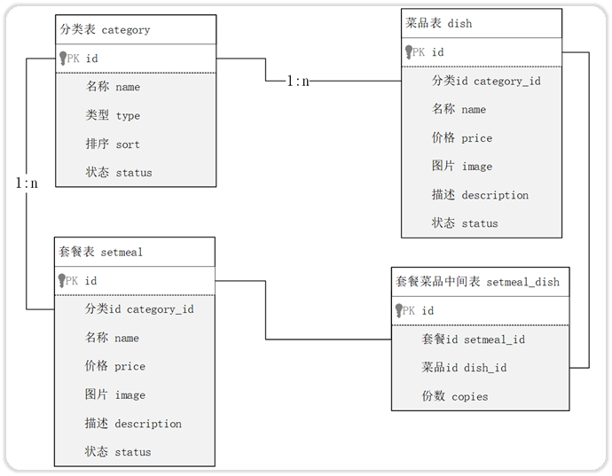

# MySQL 数据库多表查询

数据准备：创建部门表 dept 和员工表 emp，并初始化数据。

```mysql
-- 部门管理
CREATE TABLE dept
(
    id          INT UNSIGNED PRIMARY KEY AUTO_INCREMENT COMMENT '主键ID',
    name        VARCHAR(10) NOT NULL UNIQUE COMMENT '部门名称',
    create_time DATETIME    NOT NULL COMMENT '创建时间',
    update_time DATETIME    NOT NULL COMMENT '修改时间'
) COMMENT '部门表';

INSERT INTO dept (id, name, create_time, update_time)
VALUES (1, '学工部', now(), now()),
       (2, '教研部', now(), now()),
       (3, '咨询部', now(), now()),
       (4, '就业部', now(), now()),
       (5, '人事部', now(), now());

-- 员工管理
CREATE TABLE emp
(
    id          INT UNSIGNED PRIMARY KEY AUTO_INCREMENT COMMENT 'ID',
    username    VARCHAR(20)      NOT NULL UNIQUE COMMENT '用户名',
    password    VARCHAR(32) DEFAULT '123456' COMMENT '密码',
    name        VARCHAR(10)      NOT NULL COMMENT '姓名',
    gender      TINYINT UNSIGNED NOT NULL COMMENT '性别, 说明: 1 男, 2 女',
    image       VARCHAR(300) COMMENT '图像',
    job         TINYINT UNSIGNED COMMENT '职位, 说明: 1 班主任,2 讲师, 3 学工主管, 4 教研主管, 5 咨询师',
    entrydate   DATE COMMENT '入职时间',
    dept_id     INT UNSIGNED COMMENT '部门ID',
    create_time DATETIME         NOT NULL COMMENT '创建时间',
    update_time DATETIME         NOT NULL COMMENT '修改时间'
) COMMENT '员工表';

INSERT INTO emp
(id, username, password, name, gender, image, job, entrydate, dept_id, create_time, update_time)
VALUES (1, 'jinyong', '123456', '金庸', 1, '1.jpg', 4, '2000-01-01', 2, now(), now()),
       (2, 'zhangwuji', '123456', '张无忌', 1, '2.jpg', 2, '2015-01-01', 2, now(), now()),
       (3, 'yangxiao', '123456', '杨逍', 1, '3.jpg', 2, '2008-05-01', 2, now(), now()),
       (4, 'weiyixiao', '123456', '韦一笑', 1, '4.jpg', 2, '2007-01-01', 2, now(), now()),
       (5, 'changyuchun', '123456', '常遇春', 1, '5.jpg', 2, '2012-12-05', 2, now(), now()),
       (6, 'xiaozhao', '123456', '小昭', 2, '6.jpg', 3, '2013-09-05', 1, now(), now()),
       (7, 'jixiaofu', '123456', '纪晓芙', 2, '7.jpg', 1, '2005-08-01', 1, now(), now()),
       (8, 'zhouzhiruo', '123456', '周芷若', 2, '8.jpg', 1, '2014-11-09', 1, now(), now()),
       (9, 'dingminjun', '123456', '丁敏君', 2, '9.jpg', 1, '2011-03-11', 1, now(), now()),
       (10, 'zhaomin', '123456', '赵敏', 2, '10.jpg', 1, '2013-09-05', 1, now(), now()),
       (11, 'luzhangke', '123456', '鹿杖客', 1, '11.jpg', 5, '2007-02-01', 3, now(), now()),
       (12, 'hebiweng', '123456', '鹤笔翁', 1, '12.jpg', 5, '2008-08-18', 3, now(), now()),
       (13, 'fangdongbai', '123456', '方东白', 1, '13.jpg', 5, '2012-11-01', 3, now(), now()),
       (14, 'zhangsanfeng', '123456', '张三丰', 1, '14.jpg', 2, '2002-08-01', 2, now(), now()),
       (15, 'yulianzhou', '123456', '俞莲舟', 1, '15.jpg', 2, '2011-05-01', 2, now(), now()),
       (16, 'songyuanqiao', '123456', '宋远桥', 1, '16.jpg', 2, '2007-01-01', 2, now(), now()),
       (17, 'chenyouliang', '123456', '陈友谅', 1, '17.jpg', NULL, '2015-03-21', NULL, now(), now());
```

直接进行多表查询，得到结果的总记录数，是两张表的笛卡尔积。比如：

- dept 表中有 5 条记录；
- emp 表中有 17 条记录；
- 那么执行下方的 SQL 语句，会得到 5 * 17 = 85 条数据。

```mysql
SELECT * FROM dept, emp;
```

去除掉笛卡尔积中无效的数据，可以加入一些条件，比如：

```mysql
SELECT * FROM emp, dept WHERE emp.dept_id = dept.id;
```

消除笛卡尔乘积中，无效的记录，有两种方式：

- 方式一：连接查询
  - 内连接
  - 外连接
    - 左外连接
    - 右外连接
- 方式二：子查询

## 一、连接查询

### 1.内连接

内连接，查询的是两张表，或多张表有交集的部分，即下图 A∩B 部分：


内连接从语法上可以分为：

- 隐式内连接

- 显式内连接

隐式内连接语法：

```mysql
SELECT 字段列表
FROM 表1, 表2
WHERE 条件 ... ;
```

- 查询时，字段使用 `表名.字段名` 来指定。

显式内连接语法：

```mysql
SELECT 字段列表
FROM 表1
        [INNER] JOIN 表2 ON 连接条件 ... ;
```

案例理解；查询员工的姓名及所属的部门名称

```mysql
SELECT emp.name, dept.name
FROM emp,
     dept
WHERE emp.dept_id = dept.id;

-- 或者 👇

SELECT emp.name, dept.name
FROM emp
         INNER JOIN dept ON emp.dept_id = dept.id;
```

查询时，也可以为表起别名；格式如下：

- `tableA AS 别名1` 或 `tableA 别名1`；

```mysql
SELECT e.name '员工姓名', d.name '部门名称'
FROM emp e
         INNER JOIN dept d ON e.dept_id = d.id;
```

- 一共查询到了 16 条数据。

一旦为表起了别名，就只能使用别名，来指定字段。不能再使用表名指定对应的字段了。

### 2.外连接

外连接分为两种：左外连接，右外连接。

#### 1.左外连接

左外连接语法：

```mysql
SELECT 字段列表
FROM 表1
        LEFT [OUTER] JOIN 表2 ON 连接条件 ... ;
```

左外连接，查询的是：

- 左表的全部；
- 以及左表与右表有交集的部分。

即下图的 A 和 A∩B 部分。


案例理解；查询员工表中，所有员工的姓名，和对应的部门名称。

```mysql
SELECT e.name '员工姓名', d.name '部门姓名'
FROM emp e
         LEFt JOIN dept d ON e.dept_id = d.id;
```

- 一共查询到了 17 条记录，其中左表与右表的交集 16 条记录， 左表 1 条记录。

#### 2.右外连接

右外连接语法：

```mysql
SELECT 字段列表
FROM 表1
        RIGHT [OUTER] JOIN 表2 ON 连接条件 ... ;
```

右外连接，查询到是：

- 右表的全部；
- 以及右表与左表有交集的部分。

即下图的 B 和 A∩B 部分。


案例理解：查询部门表中，所有部门的名称, 和对应的员工名称。

```mysql
SELECT e.name '员工姓名', d.name '部门姓名'
FROM emp e
         RIGHT JOIN dept d ON e.dept_id = d.id;
```

- 一共查询到了 18 条记录，其中左表与右表的交集 16 条记录， 右表 2 条记录。

左外连接和右外连接，可以相互替换，只要调整连接查询时，表的先后顺序就可以了。

使用左外连接，实现上方查询的结果：

```mysql
SELECT e.name '员工姓名', d.name '部门姓名'
FROM dept d
         LEFT JOIN emp e ON e.dept_id = d.id;
```

所以在实际开发中，习惯都使用左外连接。

## 二、子查询

SQL 语句中，嵌套 SQL 语句，称为嵌套查询，又称子查询。

- 子查询相对于连接查询，效率较低，尽量使用连接查询来替代子查询。

子查询的形式有很多，比如：

```mysql
SELECT *
FROM t1
WHERE column1 = (SELECT column1
                 FROM t2 ...);
```

子查询**外部的**的语句，可以是 `SELECT`、`INSERT`、`UPDATE`、`DELETE` 语句；最为常见的是 `SELECT` 语句。

子查询，有如下分类：

- **标量子查询**：子查询结果为一行一列,，即单个值；
- **列子查询**：子查询结果为一列，但可以是多行，即一个数组；
- **行子查询**：子查询结果为一行，但可以是多列，即一个对象；
- **表子查询**：子查询结果为多行多列，即一张临时表。

### 1.标量子查询

标量子查询，返回的结果，是单个值（数字、字符串、日期……）；这是子查询最简单的形式，

标量子查询中，常用的操作符有：`=`、`<>`、`>`、`>=`、`<`、`<=`

案例理解：查询"教研部"的所有员工信息，可以将需求分解为两步：

1. 查询 "教研部" 部门 ID
2. 根据 "教研部" 部门 ID，查询员工信息

```mysql
SELECT id
FROM dept
WHERE name = '教研部'; -- 结果为 2

SELECT *
FROM emp
WHERE dept_id = 2;
```

使用标量子查询，进行 SQL 合并：

```mysql
SELECT *
FROM emp
WHERE dept_id = (SELECT id
                 FROM dept
                 WHERE name = '教研部');
```

案例理解：查询在"方东白"入职之后的员工信息，可以将需求分解为两步：

1. 查询“方东白”的入职日期。
2. 查询该入职日期之后入职的员工信息。

```mysql
SELECT entrydate
FROM emp
WHERE name = '方东白'; -- 结果为 2012-11-01

SELECT *
FROM emp
WHERE entrydate > '2012-11-01';
```

使用标量子查询，进行优化：

```mysql
SELECT *
FROM emp
WHERE entrydate > (SELECT entrydate
                   FROM emp
                   WHERE name = '方东白');
```

### 2.列子查询

列子查询，返回的结果是一列（可以是多行）。

列子查询中，常用的操作符有：`IN`、`NOT IN`

案例理解：查询"教研部"和"咨询部"的所有员工信息，分解为以下两步：

1. 查询"销售部"和"市场部"的部门 ID。
2. 根据部门 ID，查询员工信息。

```mysql
SELECT id
FROM dept
WHERE name IN ('教研部', '咨询部');

SELECT *
FROM emp
WHERE dept_id IN (2, 3);
```

使用列子查询，进行优化

```mysql
SELECT *
FROM emp
WHERE dept_id IN (SELECT id
                  FROM dept
                  WHERE name IN ('教研部', '咨询部'));
```

### 3.行子查询

行子查询，返回的结果是一行（可以是多列）。

常用的操作符：`=` 、`<>`、`IN`、`NOT IN`

案例理解：查询与"韦一笑"的入职日期、职位都相同的员工信息，可以拆解为两步进行：

1. 查询"韦一笑" 的入职日期、职位。
2. 查询与"韦一笑"的入职日期及职位相同的员工信息

```mysql
SELECT entrydate, job
FROM emp
WHERE name = '韦一笑'; -- 查询结果为 2007-01-01   2

SELECT *
FROM emp
WHERE (entrydate, job) = ('2007-01-01', 2);
```

- 以上是**组合值查询**的写法。

使用行子查询，进行优化：

```mysql
SELECT *
FROM emp
WHERE (entrydate, job) = (SELECT entrydate, job
                          FROM emp
                          WHERE name = '韦一笑');
```

### 4.表子查询

表子查询，返回的结果是多行多列，常作为临时表。

案例理解：查询入职日期是"2006-01-01"之后的员工信息 , 及其部门信息，可分解为两步执行：

1. 查询入职日期是"2006-01-01"之后的员工信息。
2. 基于查询到的员工信息表，再查询对应的部门信息。

```mysql
SELECT *
FROM emp
WHERE entrydate > '2006-01-01';

SELECT e.*, d.*
FROM (SELECT *
      FROM emp
      WHERE entrydate > '2006-01-01') e
         LEFT JOIN dept d ON e.dept_id = d.id;
```

## 三、案例练习

表结构，和数据初始化。创建四张表：分类表 category，菜品表 dish，套餐表 setmeal，中间表 setmeal_dish

```mysql
-- 分类表
CREATE TABLE category
(
    id          INT UNSIGNED PRIMARY KEY AUTO_INCREMENT COMMENT '主键ID',
    name        VARCHAR(20)      NOT NULL UNIQUE COMMENT '分类名称',
    type        TINYINT UNSIGNED NOT NULL COMMENT '类型 1 菜品分类 2 套餐分类',
    sort        TINYINT UNSIGNED NOT NULL COMMENT '顺序',
    status      TINYINT UNSIGNED NOT NULL DEFAULT 0 COMMENT '状态 0 禁用，1 启用',
    create_time DATETIME         NOT NULL COMMENT '创建时间',
    update_time DATETIME         NOT NULL COMMENT '更新时间'
) COMMENT '分类';

-- 菜品表
CREATE TABLE dish
(
    id          INT UNSIGNED PRIMARY KEY AUTO_INCREMENT COMMENT '主键ID',
    name        VARCHAR(20)      NOT NULL UNIQUE COMMENT '菜品名称',
    category_id INT UNSIGNED     NOT NULL COMMENT '菜品分类ID',
    price       DECIMAL(8, 2)    NOT NULL COMMENT '菜品价格',
    image       VARCHAR(300)     NOT NULL COMMENT '菜品图片',
    description VARCHAR(200) COMMENT '描述信息',
    status      TINYINT UNSIGNED NOT NULL DEFAULT 0 COMMENT '状态, 0 停售 1 起售',
    create_time DATETIME         NOT NULL COMMENT '创建时间',
    update_time DATETIME         NOT NULL COMMENT '更新时间'
) COMMENT '菜品';

-- 套餐表
CREATE TABLE setmeal
(
    id          INT UNSIGNED PRIMARY KEY AUTO_INCREMENT COMMENT '主键ID',
    name        VARCHAR(20)      NOT NULL UNIQUE COMMENT '套餐名称',
    category_id INT UNSIGNED     NOT NULL COMMENT '分类id',
    price       DECIMAL(8, 2)    NOT NULL COMMENT '套餐价格',
    image       VARCHAR(300)     NOT NULL COMMENT '图片',
    description VARCHAR(200) COMMENT '描述信息',
    status      TINYINT UNSIGNED NOT NULL DEFAULT 0 COMMENT '状态 0:停用 1:启用',
    create_time DATETIME         NOT NULL COMMENT '创建时间',
    update_time DATETIME         NOT NULL COMMENT '更新时间'
) COMMENT '套餐';

-- 套餐菜品关联表
CREATE TABLE setmeal_dish
(
    id         INT UNSIGNED PRIMARY KEY AUTO_INCREMENT COMMENT '主键ID',
    setmeal_id INT UNSIGNED     NOT NULL COMMENT '套餐id ',
    dish_id    INT UNSIGNED     NOT NULL COMMENT '菜品id',
    copies     TINYINT UNSIGNED NOT NULL COMMENT '份数'
) COMMENT '套餐菜品中间表';

-- ================================== 导入测试数据 ====================================
-- category
INSERT INTO category (id, type, name, sort, status, create_time, update_time)
VALUES (1, 1, '酒水饮料', 10, 1, '2022-08-09 22:09:18', '2022-08-09 22:09:18');
INSERT INTO category (id, type, name, sort, status, create_time, update_time)
VALUES (2, 1, '传统主食', 9, 1, '2022-08-09 22:09:32', '2022-08-09 22:18:53');
INSERT INTO category (id, type, name, sort, status, create_time, update_time)
VALUES (3, 2, '人气套餐', 12, 1, '2022-08-09 22:11:38', '2022-08-10 11:04:40');
INSERT INTO category (id, type, name, sort, status, create_time, update_time)
VALUES (4, 2, '商务套餐', 13, 1, '2022-08-09 22:14:10', '2022-08-10 11:04:48');
INSERT INTO category (id, type, name, sort, status, create_time, update_time)
VALUES (5, 1, '经典川菜', 6, 1, '2022-08-09 22:17:42', '2022-08-09 22:17:42');
INSERT INTO category (id, type, name, sort, status, create_time, update_time)
VALUES (6, 1, '新鲜时蔬', 7, 1, '2022-08-09 22:18:12', '2022-08-09 22:18:28');
INSERT INTO category (id, type, name, sort, status, create_time, update_time)
VALUES (7, 1, '汤类', 11, 1, '2022-08-10 10:51:47', '2022-08-10 10:51:47');

-- dish
INSERT INTO dish (id, name, category_id, price, image, description, status, create_time, update_time)
VALUES (1, '王老吉', 1, 6.00,
        'https://reggie-itcast.oss-cn-beijing.aliyuncs.com/41bfcacf-7ad4-4927-8b26-df366553a94c.png', '', 1,
        '2022-06-09 22:40:47', '2022-06-09 22:40:47');
INSERT INTO dish (id, name, category_id, price, image, description, status, create_time, update_time)
VALUES (2, '北冰洋', 1, 4.00,
        'https://reggie-itcast.oss-cn-beijing.aliyuncs.com/4451d4be-89a2-4939-9c69-3a87151cb979.png',
        '还是小时候的味道', 1, '2022-06-10 09:18:49', '2022-06-10 09:18:49');
INSERT INTO dish (id, name, category_id, price, image, description, status, create_time, update_time)
VALUES (3, '雪花啤酒', 1, 4.00,
        'https://reggie-itcast.oss-cn-beijing.aliyuncs.com/bf8cbfc1-04d2-40e8-9826-061ee41ab87c.png', '', 1,
        '2022-06-10 09:22:54', '2022-06-10 09:22:54');
INSERT INTO dish (id, name, category_id, price, image, description, status, create_time, update_time)
VALUES (4, '米饭', 2, 2.00,
        'https://reggie-itcast.oss-cn-beijing.aliyuncs.com/76752350-2121-44d2-b477-10791c23a8ec.png', '精选五常大米', 1,
        '2022-06-10 09:30:17', '2022-06-10 09:30:17');
INSERT INTO dish (id, name, category_id, price, image, description, status, create_time, update_time)
VALUES (5, '馒头', 2, 1.00,
        'https://reggie-itcast.oss-cn-beijing.aliyuncs.com/475cc599-8661-4899-8f9e-121dd8ef7d02.png', '优质面粉', 1,
        '2022-06-10 09:34:28', '2022-06-10 09:34:28');
INSERT INTO dish (id, name, category_id, price, image, description, status, create_time, update_time)
VALUES (6, '老坛酸菜鱼', 5, 56.00,
        'https://reggie-itcast.oss-cn-beijing.aliyuncs.com/4a9cefba-6a74-467e-9fde-6e687ea725d7.png',
        '原料：汤，草鱼，酸菜', 1, '2022-06-10 09:40:51', '2022-06-10 09:40:51');
INSERT INTO dish (id, name, category_id, price, image, description, status, create_time, update_time)
VALUES (7, '经典酸菜鮰鱼', 5, 66.00,
        'https://reggie-itcast.oss-cn-beijing.aliyuncs.com/5260ff39-986c-4a97-8850-2ec8c7583efc.png',
        '原料：酸菜，江团，鮰鱼', 1, '2022-06-10 09:46:02', '2022-06-10 09:46:02');
INSERT INTO dish (id, name, category_id, price, image, description, status, create_time, update_time)
VALUES (8, '蜀味水煮草鱼', 5, 38.00,
        'https://reggie-itcast.oss-cn-beijing.aliyuncs.com/a6953d5a-4c18-4b30-9319-4926ee77261f.png', '原料：草鱼，汤', 1,
        '2022-06-10 09:48:37', '2022-06-10 09:48:37');
INSERT INTO dish (id, name, category_id, price, image, description, status, create_time, update_time)
VALUES (9, '清炒小油菜', 6, 18.00,
        'https://reggie-itcast.oss-cn-beijing.aliyuncs.com/3613d38e-5614-41c2-90ed-ff175bf50716.png', '原料：小油菜', 1,
        '2022-06-10 09:51:46', '2022-06-10 09:51:46');
INSERT INTO dish (id, name, category_id, price, image, description, status, create_time, update_time)
VALUES (10, '蒜蓉娃娃菜', 6, 18.00,
        'https://reggie-itcast.oss-cn-beijing.aliyuncs.com/4879ed66-3860-4b28-ba14-306ac025fdec.png', '原料：蒜，娃娃菜',
        1, '2022-06-10 09:53:37', '2022-06-10 09:53:37');
INSERT INTO dish (id, name, category_id, price, image, description, status, create_time, update_time)
VALUES (11, '清炒西兰花', 6, 18.00,
        'https://reggie-itcast.oss-cn-beijing.aliyuncs.com/e9ec4ba4-4b22-4fc8-9be0-4946e6aeb937.png', '原料：西兰花', 1,
        '2022-06-10 09:55:44', '2022-06-10 09:55:44');
INSERT INTO dish (id, name, category_id, price, image, description, status, create_time, update_time)
VALUES (12, '炝炒圆白菜', 6, 18.00,
        'https://reggie-itcast.oss-cn-beijing.aliyuncs.com/22f59feb-0d44-430e-a6cd-6a49f27453ca.png', '原料：圆白菜', 1,
        '2022-06-10 09:58:35', '2022-06-10 09:58:35');
INSERT INTO dish (id, name, category_id, price, image, description, status, create_time, update_time)
VALUES (13, '清蒸鲈鱼', 5, 98.00,
        'https://reggie-itcast.oss-cn-beijing.aliyuncs.com/c18b5c67-3b71-466c-a75a-e63c6449f21c.png', '原料：鲈鱼', 1,
        '2022-06-10 10:12:28', '2022-06-10 10:12:28');
INSERT INTO dish (id, name, category_id, price, image, description, status, create_time, update_time)
VALUES (14, '东坡肘子', 5, 138.00,
        'https://reggie-itcast.oss-cn-beijing.aliyuncs.com/a80a4b8c-c93e-4f43-ac8a-856b0d5cc451.png', '原料：猪肘棒', 1,
        '2022-06-10 10:24:03', '2022-06-10 10:24:03');
INSERT INTO dish (id, name, category_id, price, image, description, status, create_time, update_time)
VALUES (15, '梅菜扣肉', 5, 58.00,
        'https://reggie-itcast.oss-cn-beijing.aliyuncs.com/6080b118-e30a-4577-aab4-45042e3f88be.png', '原料：猪肉，梅菜',
        1, '2022-06-10 10:26:03', '2022-06-10 10:26:03');
INSERT INTO dish (id, name, category_id, price, image, description, status, create_time, update_time)
VALUES (16, '剁椒鱼头', 5, 66.00,
        'https://reggie-itcast.oss-cn-beijing.aliyuncs.com/13da832f-ef2c-484d-8370-5934a1045a06.png', '原料：鲢鱼，剁椒',
        1, '2022-06-10 10:28:54', '2022-06-10 10:28:54');
INSERT INTO dish (id, name, category_id, price, image, description, status, create_time, update_time)
VALUES (17, '馋嘴牛蛙', 5, 98.00,
        'https://reggie-itcast.oss-cn-beijing.aliyuncs.com/7a55b845-1f2b-41fa-9486-76d187ee9ee1.png',
        '配料：鲜活牛蛙，丝瓜，黄豆芽', 1, '2022-06-10 10:37:52', '2022-06-10 10:37:52');
INSERT INTO dish (id, name, category_id, price, image, description, status, create_time, update_time)
VALUES (18, '鸡蛋汤', 7, 4.00,
        'https://reggie-itcast.oss-cn-beijing.aliyuncs.com/c09a0ee8-9d19-428d-81b9-746221824113.png', '配料：鸡蛋，紫菜',
        1, '2022-06-10 10:54:25', '2022-06-10 10:54:25');
INSERT INTO dish (id, name, category_id, price, image, description, status, create_time, update_time)
VALUES (19, '平菇豆腐汤', 7, 6.00,
        'https://reggie-itcast.oss-cn-beijing.aliyuncs.com/16d0a3d6-2253-4cfc-9b49-bf7bd9eb2ad2.png', '配料：豆腐，平菇',
        1, '2022-06-10 10:55:02', '2022-06-10 10:55:02');

-- setmeal
INSERT INTO setmeal (id, category_id, name, price, status, description, image, create_time, update_time)
VALUES (1, 4, '商务套餐A', 20.00, 1, '',
        'https://reggie-itcast.oss-cn-beijing.aliyuncs.com/21a5ed3a-97f6-447a-af9d-53deabfb5661.png',
        '2022-06-10 10:58:09', '2022-06-10 10:58:09');
INSERT INTO setmeal (id, category_id, name, price, status, description, image, create_time, update_time)
VALUES (2, 4, '商务套餐B', 22.00, 1, '',
        'https://reggie-itcast.oss-cn-beijing.aliyuncs.com/8d0075f8-9008-4390-94ca-2ca631440304.png',
        '2022-06-10 11:00:13', '2022-06-10 11:11:37');
INSERT INTO setmeal (id, category_id, name, price, status, description, image, create_time, update_time)
VALUES (3, 3, '人气套餐A', 49.00, 1, '',
        'https://reggie-itcast.oss-cn-beijing.aliyuncs.com/8979566b-0e17-462b-81d8-8dbace4138f4.png',
        '2022-06-10 11:11:23', '2022-06-10 11:11:23');

-- setmeal_dish
INSERT INTO setmeal_dish (id, setmeal_id, dish_id, copies)
VALUES (1, 1, 1, 1);
INSERT INTO setmeal_dish (id, setmeal_id, dish_id, copies)
VALUES (2, 1, 4, 1);
INSERT INTO setmeal_dish (id, setmeal_id, dish_id, copies)
VALUES (3, 1, 11, 1);
INSERT INTO setmeal_dish (id, setmeal_id, dish_id, copies)
VALUES (4, 2, 2, 1);
INSERT INTO setmeal_dish (id, setmeal_id, dish_id, copies)
VALUES (5, 2, 4, 1);
INSERT INTO setmeal_dish (id, setmeal_id, dish_id, copies)
VALUES (6, 2, 9, 1);
INSERT INTO setmeal_dish (id, setmeal_id, dish_id, copies)
VALUES (7, 3, 2, 1);
INSERT INTO setmeal_dish (id, setmeal_id, dish_id, copies)
VALUES (8, 3, 6, 1);
INSERT INTO setmeal_dish (id, setmeal_id, dish_id, copies)
VALUES (9, 3, 5, 1);
```

他们的关系，如下图所示：



### 1.案例一：左连接应用

案例一：查询价格低于 10 元的菜品的名称、价格，及其菜品的分类名称。

- 即使菜品没有分类 , 也要将菜品查询出来，使用左连接。

```mysql
SELECT d.name '菜品名称', d.price '菜品价格', c.name '分类名称'
FROM dish d
         LEFT JOIN category c ON d.category_id = c.id
WHERE d.price < 10;
```

### 2.案例二：左连接应用

案例二：查询所有价格在 10 元（含）到 50 元（含）之间，且状态为"起售"的菜品名称，价格及其分类名称。

- 即使菜品没有分类 , 也要将菜品查询出来，使用左连接。

```mysql
SELECT d.name, d.price, c.name
FROM dish d
         LEFT JOIN category c ON d.category_id = c.id
WHERE d.price BETWEEN 10 AND 50
  AND d.status = 1;
```

### 3.案例三：左连接和分组应用

案例三：查询每个分类下，最贵的菜品，展示出分类的名称，最贵的菜品的价格。

```mysql
SELECT c.name '菜品分类', MAX(d.price)
FROM dish d
         LEFT JOIN category c ON d.category_id = c.id
GROUP BY c.name;
```

### 4.案例四：左连接和分组条件应用

案例四：查询各个分类下，菜品状态为"起售"，并且该分类下菜品总数量大于等于 3  的分类名称。

```mysql
SELECT c.name '菜品分类', COUNT(*)
FROM dish d
         LEFT JOIN category c ON d.category_id = c.id
WHERE d.status = 1
GROUP BY c.name
HAVING COUNT(*) >= 3;
```

### 5.案例五：多对多（中间表）的内连接应用

案例五：查询出"商务套餐A"中，包含了哪些菜品（展示出套餐名称、价格，包含的菜品名称、价格、份数）

```mysql
SELECT s.name '套餐名称', s.price '套餐价格', d.name '菜品名称', d.price '菜品价格', sd.copies '份数'
FROM setmeal s
         INNER JOIN setmeal_dish sd ON s.id = sd.setmeal_id
         INNER JOIN dish d ON sd.dish_id = d.id
WHERE s.name = '商务套餐A';
```

### 6.案例六：子查询应用

案例六：查询出低于菜品平均价格的菜品信息（展示出菜品名称、菜品价格）。

```mysql
SELECT d.name, d.price
FROM dish d
WHERE d.price < (SELECT AVG(d.price) FROM dish d);
```

## 四、处理复杂表查询总结

查询”一对多“关系时，“多”对应的子表，一般写在子查询中；

- 如果查询中，仅有一个“一对多”关系，那么可写在 `LEFT JOIN` 中；

查询“多对一”关系时，“一”对应的父表，一般写在 `LEFT JOIN` 中。

查询”多对多“关系时，关系表和后者“多”对应的表，一般写在 `LEFT JOIN` 中。
