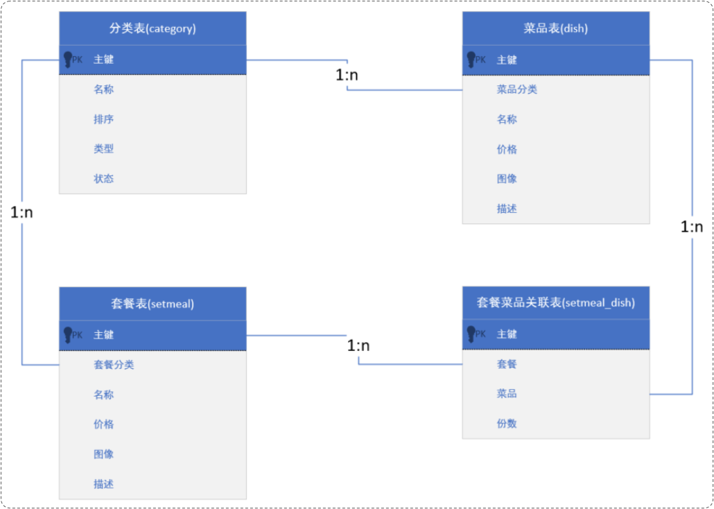

# MySQL 数据库多表设计

数据库表结构之间的关系，只有三种：

- 一对多
- 多对多
- 一对一

## 一、一对多

设计部门表，员工表

- 一个部门对应多个员工；
- 一个员工只能有一个部门。

部门表与员工表构成了“一对多”的关系。在这个关系中：

- 部门表，也成为父表；
- 员工表，也成为子表。

将这两个表建立起联系，可以创建外键约束。它让两张表的数据建立连接，保证数据的一致性和完整性。

### 1.外键约束

外键约束，创建的两个场景：

场景一：创建表时指定：

```mysql
CREATE TABLE 表名(
  字段名 数据类型,
  ...
  [CONSTRAINT] [外键名称] FOREIGN KEY(外键字段名) REFERENCES 主表(主表列名)
);
```

场景二：建完表后，添加外键

```mysql
ALTER TABLE 表名 ADD CONSTRAINT 外键名称 FOREIGN KEY(外键字段名) REFERENCES 主表(主表列名);
```

在之前的案例上，进行完善：

创建一个部门表 dept。并插入数据：

```mysql
CREATE TABLE dept
(
    id          INT UNSIGNED PRIMARY KEY AUTO_INCREMENT COMMENT '主键ID',
    name        VARCHAR(10) NOT NULL UNIQUE COMMENT '部门名称',
    create_time DATETIME    NOT NULL COMMENT '创建时间',
    update_time DATETIME    NOT NULL COMMENT '修改时间'
) COMMENT '部门表';

-- 部门表测试数据
INSERT INTO dept (id, name, create_time, update_time)
VALUES (1, '学工部', now(), now()),
       (2, '教研部', now(), now()),
       (3, '咨询部', now(), now()),
       (4, '就业部', now(), now()),
       (5, '人事部', now(), now());
```

在员工表 emp 中，增加一个字段 dept_id，来关联 dept 部门表的主键。使用外键约束。

```mysql
ALTER TABLE emp ADD dept_id INT UNSIGNED COMMENT '部门 ID（外键）'

ALTER TABLE emp ADD CONSTRAINT fk_emp_dept_id FOREIGN KEY (dept_id) REFERENCES dept (id);
```

删除 emp 表中的全部数据：

```mysql
DELETE FROM emp;
```

再往 emp 表中插入数据：

```mysql
INSERT INTO emp
(id, username, password, name, gender, image, job, entrydate, dept_id, create_time, update_time)
VALUES (1, 'jinyong', '123456', '金庸', 1, '1.jpg', 4, '2000-01-01', 2, now(), now()),
       (2, 'zhangwuji', '123456', '张无忌', 1, '2.jpg', 2, '2015-01-01', 2, now(), now()),
       (3, 'yangxiao', '123456', '杨逍', 1, '3.jpg', 2, '2008-05-01', 2, now(), now()),
       (4, 'weiyixiao', '123456', '韦一笑', 1, '4.jpg', 2, '2007-01-01', 2, now(), now()),
       (5, 'changyuchun', '123456', '常遇春', 1, '5.jpg', 2, '2012-12-05', 2, now(), now()),
       (6, 'xiaozhao', '123456', '小昭', 2, '6.jpg', 3, '2013-09-05', 1, now(), now()),
       (7, 'jixiaofu', '123456', '纪晓芙', 2, '7.jpg', 1, '2005-08-01', 1, now(), now()),
       (8, 'zhouzhiruo', '123456', '周芷若', 2, '8.jpg', 1, '2014-11-09', 1, now(), now()),
       (9, 'dingminjun', '123456', '丁敏君', 2, '9.jpg', 1, '2011-03-11', 1, now(), now()),
       (10, 'zhaomin', '123456', '赵敏', 2, '10.jpg', 1, '2013-09-05', 1, now(), now()),
       (11, 'luzhangke', '123456', '鹿杖客', 1, '11.jpg', 1, '2007-02-01', 1, now(), now()),
       (12, 'hebiweng', '123456', '鹤笔翁', 1, '12.jpg', 1, '2008-08-18', 1, now(), now()),
       (13, 'fangdongbai', '123456', '方东白', 1, '13.jpg', 2, '2012-11-01', 2, now(), now()),
       (14, 'zhangsanfeng', '123456', '张三丰', 1, '14.jpg', 2, '2002-08-01', 2, now(), now()),
       (15, 'yulianzhou', '123456', '俞莲舟', 1, '15.jpg', 2, '2011-05-01', 2, now(), now()),
       (16, 'songyuanqiao', '123456', '宋远桥', 1, '16.jpg', 2, '2010-01-01', 2, now(), now()),
       (17, 'chenyouliang', '123456', '陈友谅', 1, '17.jpg', NULL, '2015-03-21', NULL, now(), now());
```

### 2.物理外键和逻辑外键

物理外键，指的是使用 `FOREIGN KEY` 定义外键关联另外一张表。以上在表中加入的外键约束，称为物理外键。

物理外键的缺点：：

- 增、删、改效率低，需要检查外键关系。
- 仅用于单节点数据库，不适用与分布式、集群场景。
- 容易引发数据库的死锁问题，消耗性能。

逻辑外键，指的是在业务层逻辑中，解决外键关联。

逻辑外键，可以很方便的解决物理外键存在的问题。

在实际的企业开发中，很少会使用物理外键，甚至在一些数据库开发规范中，会明确指出禁止使用物理外键 `FOREIGN KEY`

## 二、一对一

一对一关系表，在实际开发中，通常是用来做单表的拆分，也就是将一张大表，拆分成两张小表；

- 将大表中的一些基础字段，放在一张表当中；
- 将其他的字段，放在另外一张表当中，

以此来提高数据的操作效率。

使用场景：在业务系统中，对用户的基本信息，查询频率高，但是对于用户的身份信息，查询频率低；

- 为提高查询效率，可以将这张大表拆分成两张小表。
- 第一张表存放的是用户的基本信息，而第二张表存放的就是用户的身份信息。
- 它们们两者之间一对一的关系

为体现一对一的关系，可在任意一方的表中，为关联字段加入外键，并将该字段设置成唯一的（`UNIQUE`）。

案例理解：创建 user 表，并插入数据。

```mysql
-- 用户基本信息表
CREATE TABLE user
(
    id     INT UNSIGNED PRIMARY KEY AUTO_INCREMENT COMMENT 'ID',
    name   VARCHAR(10)      NOT NULL COMMENT '姓名',
    gender TINYINT UNSIGNED NOT NULL COMMENT '性别, 1 男  2 女',
    phone  CHAR(11) COMMENT '手机号',
    degree VARCHAR(10) COMMENT '学历'
) COMMENT '用户基本信息表';

-- 测试数据
INSERT INTO user
VALUES (1, '白眉鹰王', 1, '18812340001', '初中'),
       (2, '青翼蝠王', 1, '18812340002', '大专'),
       (3, '金毛狮王', 1, '18812340003', '初中'),
       (4, '紫衫龙王', 2, '18812340004', '硕士');
```

创建 user_card 表，表示身份证，为 user_id 字段，加上外键唯一约束，插入测试数据。

```mysql
-- 用户身份信息表
CREATE TABLE user_card
(
    id           INT UNSIGNED PRIMARY KEY AUTO_INCREMENT COMMENT 'ID',
    nationality  VARCHAR(10)  NOT NULL COMMENT '民族',
    birthday     DATE         NOT NULL COMMENT '生日',
    idcard       CHAR(18)     NOT NULL COMMENT '身份证号',
    issued       VARCHAR(20)  NOT NULL COMMENT '签发机关',
    expire_begin DATE         NOT NULL COMMENT '有效期限-开始',
    expire_end   DATE COMMENT '有效期限-结束',
    user_id      INT UNSIGNED NOT NULL UNIQUE COMMENT '用户ID',
    CONSTRAINT fk_user_id FOREIGN KEY (user_id) REFERENCES user (id)
) COMMENT '用户身份信息表';

-- 测试数据
INSERT INTO user_card
VALUES (1, '汉', '1960-11-06', '100000100000100001', '朝阳区公安局', '2000-06-10', NULL, 1),
       (2, '汉', '1971-11-06', '100000100000100002', '静安区公安局', '2005-06-10', '2025-06-10', 2),
       (3, '汉', '1963-11-06', '100000100000100003', '昌平区公安局', '2006-06-10', NULL, 3),
       (4, '回', '1980-11-06', '100000100000100004', '海淀区公安局', '2008-06-10', '2028-06-10', 4);
```

## 二、多对多

多对多的关系，在实际开发中很常见。

比如：学生，课程的关系；一个学生可以选修多门课程，一个课程也可以供多个学生选修。

要建立第三张表；中间表中，至少有两个外键字段，分别关联两张便的主键。

创建学生表 student，并插入数据

```mysql
-- 学生表
CREATE TABLE student
(
    id   INT AUTO_INCREMENT PRIMARY KEY COMMENT '主键ID',
    name VARCHAR(10) COMMENT '姓名',
    no   VARCHAR(10) COMMENT '学号'
) COMMENT '学生表';

-- 学生表测试数据
INSERT INTO student(name, no)
VALUES ('黛绮丝', '2000100101'),
       ('谢逊', '2000100102'),
       ('殷天正', '2000100103'),
       ('韦一笑', '2000100104');
```

创建课程表 course，并插入数据

```mysql
-- 课程表
CREATE TABLE course
(
    id   INT AUTO_INCREMENT PRIMARY KEY COMMENT '主键ID',
    name VARCHAR(10) COMMENT '课程名称'
) COMMENT '课程表';

-- 课程表测试数据
INSERT INTO course (name)
VALUES ('Java'),
       ('PHP'),
       ('MySQL'),
       ('Hadoop');
```

创建中间表 student_course，并插入数据

```mysql
-- 学生课程表（中间表）
CREATE TABLE student_course
(
    id         INT AUTO_INCREMENT COMMENT '主键' PRIMARY KEY,
    student_id INT NOT NULL COMMENT '学生ID',
    course_id  INT NOT NULL COMMENT '课程ID',
    CONSTRAINT fk_courseid FOREIGN KEY (course_id) REFERENCES course (id),
    CONSTRAINT fk_studentid FOREIGN KEY (student_id) REFERENCES student (id)
) COMMENT '学生课程中间表';

-- 学生课程表测试数据
INSERT INTO student_course(student_id, course_id) VALUES (1,1),(1,2),(1,3),(2,2),(2,3),(3,4);
```

- 在中间表中，为体现关联关系，使用物理外键；在实际开发中很少见。

> 在 IDEA 中，选中有关联关系的表，右键 -> Show Diagram

## 三、案例练习

在外码系统中，存在三个模块：菜品分类，菜品，套餐；它们的关系如下：

- 一个分类，对应多个菜品；一个菜品，对应一个分类（一对多）。
- 一个分类，对应多个套餐；一个套餐，对应一个分类（一对多）。
- 一个套餐，对应多个菜品；一个菜品，对应多个套餐（多对多）。

它们之间的关系，如下图所示：



创建分类表 category

```mysql
-- 分类表
CREATE TABLE category
(
    id          INT UNSIGNED PRIMARY KEY AUTO_INCREMENT COMMENT '主键ID',
    name        VARCHAR(20)      NOT NULL UNIQUE COMMENT '分类名称',
    type        TINYINT UNSIGNED NOT NULL COMMENT '类型 1 菜品分类 2 套餐分类',
    sort        TINYINT UNSIGNED NOT NULL COMMENT '顺序',
    status      TINYINT UNSIGNED NOT NULL DEFAULT 0 COMMENT '状态 0 禁用，1 启用',
    create_time DATETIME         NOT NULL COMMENT '创建时间',
    update_time DATETIME         NOT NULL COMMENT '更新时间'
) COMMENT '菜品及套餐分类';
```

创建菜品表 dish

```mysql
-- 菜品表
CREATE TABLE dish
(
    id          INT UNSIGNED PRIMARY KEY AUTO_INCREMENT COMMENT '主键ID',
    name        VARCHAR(20)      NOT NULL UNIQUE COMMENT '菜品名称',
    category_id INT UNSIGNED     NOT NULL COMMENT '菜品分类ID',   -- 逻辑外键
    price       DECIMAL(8, 2)    NOT NULL COMMENT '菜品价格',
    image       VARCHAR(300)     NOT NULL COMMENT '菜品图片',
    description VARCHAR(200) COMMENT '描述信息',
    status      TINYINT UNSIGNED NOT NULL DEFAULT 0 COMMENT '状态, 0 停售 1 起售',
    create_time DATETIME         NOT NULL COMMENT '创建时间',
    update_time DATETIME         NOT NULL COMMENT '更新时间'
) COMMENT '菜品';
```

- 创建逻辑外键 category_id 字段，关联分类表 category 中的 id 字段。

创建套餐表 setmeal

```mysql
-- 套餐表
CREATE TABLE setmeal
(
    id          INT UNSIGNED PRIMARY KEY AUTO_INCREMENT COMMENT '主键ID',
    name        VARCHAR(20)      NOT NULL UNIQUE COMMENT '套餐名称',
    category_id INT UNSIGNED     NOT NULL COMMENT '分类ID',       -- 逻辑外键
    price       DECIMAL(8, 2)    NOT NULL COMMENT '套餐价格',
    image       VARCHAR(300)     NOT NULL COMMENT '图片',
    description VARCHAR(200) COMMENT '描述信息',
    status      TINYINT UNSIGNED NOT NULL DEFAULT 0 COMMENT '状态 0:停用 1:启用',
    create_time DATETIME         NOT NULL COMMENT '创建时间',
    update_time DATETIME         NOT NULL COMMENT '更新时间'
) COMMENT '套餐';
```

- 创建逻辑外键 category_id 字段，关联分类表 category 中的 id 字段。

将套餐表与菜品表关联起来，创建中间表 setmeal_dish。

```mysql
-- 套餐菜品关联表
CREATE TABLE setmeal_dish
(
    id         INT UNSIGNED PRIMARY KEY AUTO_INCREMENT COMMENT '主键ID',
    setmeal_id INT UNSIGNED     NOT NULL COMMENT '套餐ID ', -- 逻辑外键
    dish_id    INT UNSIGNED     NOT NULL COMMENT '菜品ID', -- 逻辑外键
    copies     TINYINT UNSIGNED NOT NULL COMMENT '份数'
) COMMENT '套餐菜品关联表';
```

- 创建逻辑外键 setmeal_id 字段，关联套餐表 setmeal 中的 id 字段。
- 创建逻辑外键 dish_id 字段，关联套餐表 dish 中的 id 字段。
