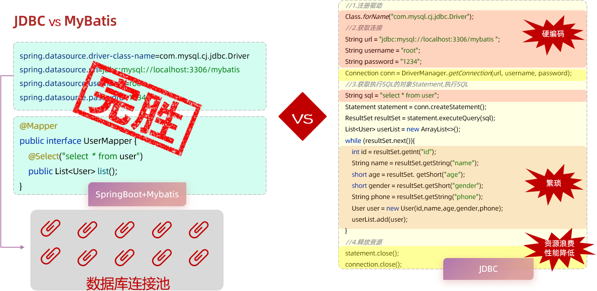

# JDBC 介绍

JDBC（Java DataBase Connectivity）就是使用 Java 语言，操作关系型数据库的一套 API。

JDBC 是 SUN 公司官方定义的一套，操作所有关系型数据库的规范，即接口。它没有提供具体的实现方式。

由各个数据库厂商，提供具体的实现。也称为 Java 程序的数据库驱动，即一个 Jar 包。

- MySQL 的 Java 驱动是 `mysql-connector-j`，

开发者，可以使用这套接口（JDBC）编程，而真正执行的代码是驱动 jar 包中的实现类。

Mybatis 框架，就是对原始的 JDBC 程序的封装。

## 一、JDBC 的实际应用

使用 JDBC 规范操作数据库，步骤如下：

1. 注册驱动
2. 获取连接对象
3. 执行SQL语句，返回执行结果
4. 处理执行结果
5. 释放资源

在 Maven 项目的 pom.xml 配置文件中，已引入 MySQL 驱动依赖 `mysql-connector-j`；

我们直接编写 JDBC 代码即可

demo-project/springbot-mybatis-quickstart/src/test/java/com/kkcf/JdbcTest.java

```java
package com.kkcf;

import com.kkcf.pojo.User;
import org.junit.jupiter.api.Test;

import java.sql.Connection;
import java.sql.DriverManager;
import java.sql.ResultSet;
import java.sql.Statement;
import java.util.ArrayList;
import java.util.List;

public class JdbcTest {
    @Test
    public void testJdbc() throws Exception {
        //1. 注册驱动
        Class.forName("com.mysql.cj.jdbc.Driver");

        //2. 获取数据库连接
        String url = "jdbc:mysql://localhost:3306/javawebdb";
        String username = "root";
        String password = "wee1219";
        Connection connection = DriverManager.getConnection(url, username, password);

        //3. 执行SQL
        Statement statement = connection.createStatement(); //操作SQL的对象
        String sql = "SELECT id,name,age,gender,phone FROM user";
        ResultSet rs = statement.executeQuery(sql);//SQL查询结果会封装在ResultSet对象中

        List<User> userList = new ArrayList<>();//集合对象（用于存储User对象）

        //4. 处理SQL执行结果
        while (rs.next()) {
            //取出一行记录中id、name、age、gender、phone下的数据
            int id = rs.getInt("id");
            String name = rs.getString("name");
            short age = rs.getShort("age");
            short gender = rs.getShort("gender");
            String phone = rs.getString("phone");
            //把一行记录中的数据，封装到User对象中
            User user = new User(id, name, age, gender, phone);
            userList.add(user);//User对象添加到集合
        }

        //5. 释放资源
        statement.close();
        connection.close();
        rs.close();

        //遍历集合
        for (User user : userList) {
            System.out.println(user);
        }
    }
}
```

`DriverManager` 类：数据库驱动管理类。作用：

- 注册驱动
- 创建 java 代码和数据库之间的连接，即获取 Connection 对象

`Connection` 接口：建立数据库连接的对象，作用：

- 用于建立 java 程序和数据库之间的连接

`Statement` 接口：数据库操作对象，执行 SQL 语句的对象。作用：

- 用于向数据库发送sql语句

`ResultSet` 接口：结果集对象，一张虚拟表。作用：

- SQL 语句的执行结果，会封装在 ResultSet 中

我们看到，直接基于 JDBC 规范来操作数据库，代码实现非常繁琐，

在实际开发中，很少直接使用 JDBC 操作数据库，而是会使用 Mybatis 这类的高级框架，简化数据库操作、提高开发效率。

## 二、JDBC 与 MyBatis 对比

原始的 JDBC 程序，存在以下问题：

1. 数据库连接的四要素：驱动、连接、用户名、密码，全部硬编码在 java 代码中。
2. 查询结果的解析及封装非常繁琐；
3. 每一次数据库操作，都需要先获取连接，再释放连接；造成资源浪费，性能降低。

MyBatis中，是如何解决这些问题的：

1. 数据库连接四要素：驱动、连接、用户名、密码，都配置在 Spring Boot 默认的配置文件 application.properties 中。

2. 查询结果的解析及封装，由 MyBatis 自动完成，开发者无需关注。

3. MyBatis 中，使用了数据库连接池技术，从而避免了频繁的创建连接、销毁连接，带来的资源浪费。



> Spring Boot 底层，会采用数据库连接池技术，统一管理分配这些连接。
>
> - 每次执行 SQL 时，只需要从连接池中获取连接，然后执行 SQL，执行完成后，再将连接归还给连接池。
> - 这样就形成了连接的复用，避免频繁的创建、释放连接造成的资源的浪费。

在 MyBatis 中，进行数据库操作，只需要关注两个方面：

- application.properties 配置文件

  ```properties
  spring.application.name=springbot-mybatis-quickstart
  # 驱动类名称
  spring.datasource.driver-class-name=com.mysql.cj.jdbc.Driver
  # 数据库连接 url
  spring.datasource.url=jdbc:mysql://localhost:3306/javawebdb
  # 连接数据库用户名
  spring.datasource.username=root
  # 连接数据库密码
  spring.datasource.password=xxxxxx
  ```

- Mapper 接口（编写 SQL 语句）

  ```java
  package com.kkcf.mapper;

  import com.kkcf.pojo.User;
  import org.apache.ibatis.annotations.Mapper;
  import org.apache.ibatis.annotations.Select;

  import java.util.List;

  @Mapper // 在程序运行时，MyBatis 框架会自动生成该接口的实现类对昂（代理对象），并且将该对象，交给 IOC 容器管理。
  public interface UserMapper {
      @Select("SELECT * FROM user")
      List<User> listUser();
  }
  ```
