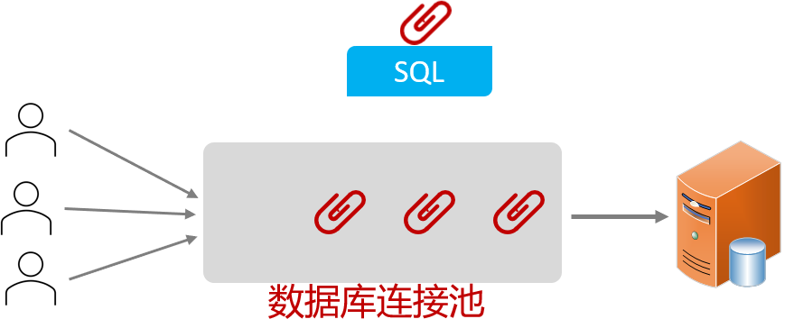

# 数据库连接池

没有连接池，客户端执行 SQL 语句的步骤如下：

1. 先创建一个连接对象；
2. 然后执行 SQL 语句；
3. 关闭连接对象，从而释放资源；

每次执行 SQL 时，都需要创建、销毁连接；频繁创建、销毁的过程，比较耗费计算机的资源。

数据库连接池，类似于线程池，是个容器，负责分配、管理数据库连接（Connection）

- 程序在启动时，会在数据库连接池（容器）中，创建一定数量的连接（Connection）对象。
- 它允许应用程序，重复使用一个现有的数据库连接（Connection），而不是再重新建立一个。
- 它会监控空闲时间超过最大空闲时间的连接，及时释放，避免数据库连接遗漏。
  1. 客户端获取到连接（Connection）对象，但是并没有去访问数据库，此时连接对象处于空闲。
  2. 数据库连接池发现：连接（Connection）对象的空闲时间 > 连接池中预设的最大空闲时间；
  3. 那么数据库连接池就会自动释放掉这个连接对象。



## 一、数据库连接池的优势

1. 资源重用。
2. 提升系统响应速度。
3. 避免数据库连接遗漏。

## 二、Java 中的数据库连接池

SUN 公司提供了标准的数据库连接池 `javax.sql.DataSource` 接口。

Java 程序中，所有的数据库连接池，都要实现该接口，并实现其中的一个核心方法 `getConnection` 用于获取连接。

常见的 Java 数据库连接池有：

- C3P0
- DBCP
- Druid
- Hikari (Spring Boot 项目中默认的数据库连接池)

 Druid（德鲁伊）是阿里巴巴开源的数据库连接池项目。

- 功能强大，性能优秀，是实际企业开发中常用的数据库连接池之一。

在由 Maven 构建的 Spring Boot 项目中，手动切换 Druid 连接池，步骤如下：

Ⅰ、引入 Druid  德鲁伊连接池的依赖：

demo-project/springbot-mybatis-quickstart/pom.xml

```xml
<dependency>
    <groupId>com.alibaba</groupId>
    <artifactId>druid-spring-boot-starter</artifactId>
    <version>1.2.23</version>
</dependency>

<!-- Spring Boot 3 用这个 👇 -->

<dependency>
    <groupId>com.alibaba</groupId>
    <artifactId>druid-spring-boot-3-starter</artifactId>
    <version>1.2.23</version>
</dependency>
```

Ⅱ、在 application.properties 配置文件中，进行配置：

demo-project/springbot-mybatis-quickstart/src/main/resources/application.properties

```properties
# 驱动类名称
spring.datasource.driver-class-name=com.mysql.cj.jdbc.Driver
# 数据库连接 url
spring.datasource.url=jdbc:mysql://localhost:3306/xxxxxx
# 连接数据库用户名
spring.datasource.username=xxxxxx
# 连接数据库密码
spring.datasource.password=xxxxxx
```

或者 👇

```properties
spring.datasource.druid.driver-class-name=com.mysql.cj.jdbc.Driver
spring.datasource.druid.url=jdbc:mysql://localhost:3306/xxxxxx
spring.datasource.druid.username=xxxxxx
spring.datasource.druid.password=xxxxxx
```
