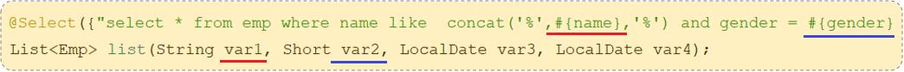

# MyBatis 基础操作

## 一、准备工作

Ⅰ、数据库准备初始化：执行 SQL 语句：

```mysql
-- 部门管理
DROP TABLE IF EXISTS dept;
CREATE TABLE dept
(
    id          INT UNSIGNED PRIMARY KEY AUTO_INCREMENT COMMENT '主键ID',
    name        VARCHAR(10) NOT NULL UNIQUE COMMENT '部门名称',
    create_time DATETIME    NOT NULL COMMENT '创建时间',
    update_time DATETIME    NOT NULL COMMENT '修改时间'
) COMMENT '部门表';
-- 部门表测试数据
INSERT INTO dept (id, name, create_time, update_time)
VALUES (1, '学工部', NOW(), NOW()),
       (2, '教研部', NOW(), NOW()),
       (3, '咨询部', NOW(), NOW()),
       (4, '就业部', NOW(), NOW()),
       (5, '人事部', NOW(), NOW());


-- 员工管理
DROP TABLE IF EXISTS emp;
CREATE TABLE emp
(
    id          INT UNSIGNED PRIMARY KEY AUTO_INCREMENT COMMENT 'ID',
    username    VARCHAR(20)      NOT NULL UNIQUE COMMENT '用户名',
    password    VARCHAR(32) DEFAULT '123456' COMMENT '密码',
    name        VARCHAR(10)      NOT NULL COMMENT '姓名',
    gender      TINYINT UNSIGNED NOT NULL COMMENT '性别, 说明: 1 男, 2 女',
    image       VARCHAR(300) COMMENT '图像',
    job         TINYINT UNSIGNED COMMENT '职位, 说明: 1 班主任,2 讲师, 3 学工主管, 4 教研主管, 5 咨询师',
    entrydate   DATE COMMENT '入职时间',
    dept_id     INT UNSIGNED COMMENT '部门ID',
    create_time DATETIME         NOT NULL COMMENT '创建时间',
    update_time DATETIME         NOT NULL COMMENT '修改时间'
) COMMENT '员工表';
-- 员工表测试数据
INSERT INTO emp (id, username, password, name, gender, image, job, entrydate, dept_id, create_time, update_time)
VALUES (1, 'jinyong', '123456', '金庸', 1, '1.jpg', 4, '2000-01-01', 2, NOW(), NOW()),
       (2, 'zhangwuji', '123456', '张无忌', 1, '2.jpg', 2, '2015-01-01', 2, NOW(), NOW()),
       (3, 'yangxiao', '123456', '杨逍', 1, '3.jpg', 2, '2008-05-01', 2, NOW(), NOW()),
       (4, 'weiyixiao', '123456', '韦一笑', 1, '4.jpg', 2, '2007-01-01', 2, NOW(), NOW()),
       (5, 'changyuchun', '123456', '常遇春', 1, '5.jpg', 2, '2012-12-05', 2, NOW(), NOW()),
       (6, 'xiaozhao', '123456', '小昭', 2, '6.jpg', 3, '2013-09-05', 1, NOW(), NOW()),
       (7, 'jixiaofu', '123456', '纪晓芙', 2, '7.jpg', 1, '2005-08-01', 1, NOW(), NOW()),
       (8, 'zhouzhiruo', '123456', '周芷若', 2, '8.jpg', 1, '2014-11-09', 1, NOW(), NOW()),
       (9, 'dingminjun', '123456', '丁敏君', 2, '9.jpg', 1, '2011-03-11', 1, NOW(), NOW()),
       (10, 'zhaomin', '123456', '赵敏', 2, '10.jpg', 1, '2013-09-05', 1, NOW(), NOW()),
       (11, 'luzhangke', '123456', '鹿杖客', 1, '11.jpg', 5, '2007-02-01', 3, NOW(), NOW()),
       (12, 'hebiweng', '123456', '鹤笔翁', 1, '12.jpg', 5, '2008-08-18', 3, NOW(), NOW()),
       (13, 'fangdongbai', '123456', '方东白', 1, '13.jpg', 5, '2012-11-01', 3, NOW(), NOW()),
       (14, 'zhangsanfeng', '123456', '张三丰', 1, '14.jpg', 2, '2002-08-01', 2, NOW(), NOW()),
       (15, 'yulianzhou', '123456', '俞莲舟', 1, '15.jpg', 2, '2011-05-01', 2, NOW(), NOW()),
       (16, 'songyuanqiao', '123456', '宋远桥', 1, '16.jpg', 2, '2010-01-01', 2, NOW(), NOW()),
       (17, 'chenyouliang', '123456', '陈友谅', 1, '17.jpg', NULL, '2015-03-21', NULL, NOW(), NOW());
```

Ⅱ、创建一个 Spring Boot 项目，引入 MyBatis 依赖，MySQL 驱动包。

demo-project/springbot-mybatis-quickstart/pom.xml

```xml
<!-- Spring Boot MyBatis 起步依赖-->
<dependency>
    <groupId>org.mybatis.spring.boot</groupId>
    <artifactId>mybatis-spring-boot-starter</artifactId>
    <version>3.0.3</version>
</dependency>
<dependency>
    <groupId>org.mybatis.spring.boot</groupId>
    <artifactId>mybatis-spring-boot-starter-test</artifactId>
    <version>3.0.3</version>
    <scope>test</scope>
</dependency>

<!-- MySQL 驱动包-->
<dependency>
    <groupId>com.mysql</groupId>
    <artifactId>mysql-connector-j</artifactId>
    <scope>runtime</scope>
</dependency>
```

Ⅲ、在 application.properties 配置文件中，配置数据库连接信息。

demo-project/springbot-mybatis-quickstart/src/main/resources/application.properties

```properties
# 驱动类名称
spring.datasource.driver-class-name=com.mysql.cj.jdbc.Driver
# 数据库连接 url
spring.datasource.url=jdbc:mysql://localhost:3306/xxxxxx
# 连接数据库用户名
spring.datasource.username=xxxxxx
# 连接数据库密码
spring.datasource.password=xxxxxx
```

创建一个实体（pojo）类 Emp，其中的属性，与表结构中的字段一一对应。

使用 Lombok 依赖提供的注解，为其生成 getter、setter、toString、equals、hashcode，空参构造、带参构造方法。

demo-project/springbot-mybatis-quickstart/src/main/java/com/kkcf/pojo/Emp.java

```java
package com.kkcf.pojo;

import lombok.AllArgsConstructor;
import lombok.Data;
import lombok.NoArgsConstructor;

import java.time.LocalDate;
import java.time.LocalDateTime;

@Data
@NoArgsConstructor
@AllArgsConstructor
public class Emp {
    private Integer id;
    private String username;
    private String password;
    private String name;
    private Short gender;
    private String image;
    private Short job;
    private LocalDate entrydate; // LocalDate 类型对应数据表中的 date 类型
    private Integer deptId;
    private LocalDateTime createTime; // LocalDateTime 类型对应数据表中的 datetime 类型
    private LocalDateTime updateTime;
}
```

- 数据库 `DATE` 类型，对应 JDK1.8 的 `LocalDate` 类型；
- 数据库的 `DATETIME` 类型，对应 JDK1.8 的 `LocalDateTime` 类型。
- 数据库字段名中的 `_` 下划线，在实体类中使用规范的驼峰命名代替。

创建一个 Mapper 接口 `EmpMapper`，

## 二、MyBatis 删除

根据主键（Id）删除记录。

创建一个 mapper 包（package），在其中创建一个 `EmpMapper` 接口

- 在接口中，定义一个方法 `deleteEmp`，为它使用 `@Delete` 注解，表示该方法用于执行 DELETE 语句。
- MyBatis 中，提供了 `#{}` 用于 SQL 语句中的占位符。

demo-project/springbot-mybatis-quickstart/src/main/java/com/kkcf/mapper/EmpMapper.java

```java
package com.kkcf.mapper;

import org.apache.ibatis.annotations.Delete;
import org.apache.ibatis.annotations.Mapper;

@Mapper
public interface EmpMapper {
    @Delete("DELETE FROM emp WHERE id = #{id};")
    void deleteEmp(Integer id);
}
```

> 如果 mapper 接口方法的形参，只有一个，那么 SQL 占位符中的变量名，可以用任意值。
>
> 但是建议两者保持一致，增强可读性。

单元测试：

demo-project/springbot-mybatis-quickstart/src/test/java/com/kkcf/SpringbotMybatisQuickstartApplicationTests.java

```java
package com.kkcf;

import com.kkcf.mapper.EmpMapper;
import org.junit.jupiter.api.Test;
import org.springframework.beans.factory.annotation.Autowired;
import org.springframework.boot.test.context.SpringBootTest;

import java.util.List;

@SpringBootTest // Spring Boot 整合单元测试的注解：类中的单元测试方法在运行时，会自动加载 Spring Boot 环菌，并创建 IOC 容器。
class SpringbotMybatisQuickstartApplicationTests {
    @Autowired
    private EmpMapper empMapper;

    @Test
    public void testDeleteEmp() {
        empMapper.deleteEmp(17);
    }
}
```

DELETE、INSERT、UPDATE 语句，都是有返回值的，表示操作影响的记录数。

在 MyBatis 框架中，拿到这个返回值：

- 修改 EmpMapper 接口中，方法的返回值类型。

demo-project/springbot-mybatis-quickstart/src/main/java/com/kkcf/mapper/EmpMapper.java

```java
package com.kkcf.mapper;

import org.apache.ibatis.annotations.Delete;
import org.apache.ibatis.annotations.Mapper;

@Mapper
public interface EmpMapper {
    @Delete("DELETE FROM emp WHERE id = #{id};")
    int deleteEmp(Integer id);
}
```

在单元测试中，拿到返回值：

demo-project/springbot-mybatis-quickstart/src/test/java/com/kkcf/SpringbotMybatisQuickstartApplicationTests.java

```java
@Test
public void testDeleteEmp() {
    int i = empMapper.deleteEmp(16);
    System.out.println(i);
}
```

## 三、Mybatis 配置日志输出

在 application.properties 配置文件中，打开 MyBatis 日志，并指定输出到控制台。

demo-project/springbot-mybatis-quickstart/src/main/resources/application.properties

```properties
# 打开 MyBatis 日志
mybatis.configuration.log-impl=org.apache.ibatis.logging.stdout.StdOutImpl
```

执行上方删除数据的单元测试，发现控制台输出了如下信息：

```sh
==> Preparing: DELETE FROM emp WHERE id = ?;
==> Parameters: 16(Integer)
<==    Updates: 0
```

- Preparing 表示执行的 SQL 语句，其中的 `?` 表示占位符。
- Parameters 表示填充 SQL 语句占位符的参数。

可知 MyBatis 在底层，执行的是**预编译** SQL 语句：

- MyBatis 会将 SQL 语句，与传入占位符的参数，一并发给数据库管理系统（DBMS）
- 数据库管理系统（DBMS）将占位符参数，替换掉 SQL 语句中的占位符后，再执行 SQL

## 四、预编译 SQL

预编译 SQL 的优势：

- 性能更高；
- 更加安全（防止 SQL 注入）

### 1.预编译 SQL 性能高

数据库在执行 SQL 语句时，会经历如下几步：

1. SQL 语法解析检查；
2. 优化 SQL；
3. 编译 SQL；
4. 执行 SQL

其中，前三步，会进行缓存，如下图所示：


由上图可知：

- 普通 SQL 语句，每次执行前，都要经历前三步；
- 预编译 SQL，执行一次之后，会将编译后的 SQL 语句缓存起来，再次执行时，不用再次编译。只是输入的参数不同。

### 2.预编译 SQL 更安全

预编译 SQL 更安全，能防止 SQL 注入，将敏感字进行转义，保障 SQL 的安全性。

SQL 注入：是通过操作输入的数据，来修改事先定义好的 SQL 语句，以达到执行代码对服务器进行攻击的方法。

- 因为没有对用户输入进行充分检查，而 SQL 又是拼接而成，
- 用户在输入参数时，添加一些 SQL 关键字，达到改变 SQL 运行结果的目的，可以完成恶意攻击。

> Java 运行 jar 包程序，执行命令：
>
> ```shell
> java -jar jar包名
> ```

## 五、MyBatis 占位符

在 Mybatis 中，提供的参数占位符有两种：

- `#{…}` 用于生成预编译 SQL：
  - 执行 SQL 时，会将预编译 SQL 中的 `?` 替换为 `#{…}` 传入的值，
  - 使用时机：参数传递，都使用 `#{…}`

- `${…}` 用于拼接 SQL。
  - 直接将参数拼接在 SQL 语句中，存在 SQL 注入风险。
  - 使用时机：对表名、字段名进行动态设置时使用。

## 六、MyBatis 新增

使用 MyBatis 框架，新增一条员工记录。

在 `EmpMapper` 接口中，新增抽象方法 `insertEmp`。

demo-project/springbot-mybatis-quickstart/src/main/java/com/kkcf/mapper/EmpMapper.java

```java
package com.kkcf.mapper;

import com.kkcf.pojo.Emp;
import org.apache.ibatis.annotations.Insert;
import org.apache.ibatis.annotations.Mapper;

@Mapper
public interface EmpMapper {
    @Insert("INSERT INTO emp(username, name, gender, image, job, entrydate, dept_id, create_time, update_time) VALUES (#{username}, #{name}, #{gender}, #{image}, #{job}, #{entrydate}, #{deptId}, #{createTime}, #{updateTime});")
    int insertEmp(Emp emp);
}
```

- `#{…}` 中，填入的属性名，就是接口方法形参实体对象中的属性名。

单元测试：

demo-project/springbot-mybatis-quickstart/src/test/java/com/kkcf/SpringbotMybatisQuickstartApplicationTests.java

```java
package com.kkcf;

import com.kkcf.mapper.EmpMapper;
import com.kkcf.pojo.Emp;
import org.junit.jupiter.api.Test;
import org.springframework.beans.factory.annotation.Autowired;
import org.springframework.boot.test.context.SpringBootTest;

import java.time.LocalDate;
import java.time.LocalDateTime;
import java.util.List;

@SpringBootTest // Spring Boot 整合单元测试的注解：类中的单元测试方法在运行时，会自动加载 Spring Boot 环菌，并创建 IOC 容器。
class SpringbotMybatisQuickstartApplicationTests {
    @Autowired
    private EmpMapper empMapper;

    @Test
    public void testInsertEmp() {
        Emp emp = new Emp();

        emp.setUsername("tom");
        emp.setName("汤姆");
        emp.setGender((short) 1);
        emp.setImage("1.jpb");
        emp.setJob((short) 1);
        emp.setEntrydate(LocalDate.of(2020, 1, 1));
        emp.setCreateTime(LocalDateTime.now());
        emp.setUpdateTime(LocalDateTime.now());
        emp.setDeptId(1);

        int i = empMapper.insertEmp(emp);
        System.out.println(i); // 1
    }
}
```

### 1.新增主键返回（@Options 注解）

概念：在数据添加成功后，需要获取插入数据库数据的主键。

插入记录后，主键返回的使用场景：

- 在有中间表的情况下，比如新增套餐后，还需要录入套餐中的菜品，它们的数据库表结构是多对多关系。
- 所以要拿到套餐、菜品的主键（Id），用于在中间表中，建立它们的关联关系。

默认情况下，执行插入操作时，不会返回主键值。

如果要拿到主键值，需要在 Mapper 接口的方法上：

- 添加一个 `@Options` 注解，
- 并在注解中；指定属性 `useGeneratedKeys=true` 和 `keyProperty="实体类属性名"`

demo-project/springbot-mybatis-quickstart/src/main/java/com/kkcf/mapper/EmpMapper.java

```java
package com.kkcf.mapper;

import com.kkcf.pojo.Emp;
import org.apache.ibatis.annotations.Insert;
import org.apache.ibatis.annotations.Mapper;
import org.apache.ibatis.annotations.Options;

@Mapper
public interface EmpMapper {
    @Options(useGeneratedKeys = true, keyProperty = "id")
    @Insert("INSERT INTO emp (username, name, gender, image, job, entrydate, dept_id, create_time, update_time) VALUES (#{username}, #{name}, #{gender}, #{image}, #{job}, #{entrydate}, #{deptId}, #{createTime}, #{updateTime});")
    int insertEmp(Emp emp);
}
```

- 将插入记录的主键（Id）值，放入 emp 对象的 id 属性中。

在 XML 映射文件中的写法：

```xml
<insert id="insert" useGeneratedKeys="true", keyProperty="id">
    ……
</insert>
```

单元测试：

demo-project/springbot-mybatis-quickstart/src/test/java/com/kkcf/SpringbotMybatisQuickstartApplicationTests.java

```java
package com.kkcf;

import com.kkcf.mapper.EmpMapper;
import com.kkcf.pojo.Emp;
import org.junit.jupiter.api.Test;
import org.springframework.beans.factory.annotation.Autowired;
import org.springframework.boot.test.context.SpringBootTest;

import java.time.LocalDate;
import java.time.LocalDateTime;
import java.util.List;

@SpringBootTest // Spring Boot 整合单元测试的注解：类中的单元测试方法在运行时，会自动加载 Spring Boot 环菌，并创建 IOC 容器。
class SpringbotMybatisQuickstartApplicationTests {
    @Autowired
    private EmpMapper empMapper;

    @Test
    public void testInsertEmp() {
        Emp emp = new Emp();
        emp.setUsername("tom2");
        emp.setName("汤姆2");
        emp.setGender((short) 1);
        emp.setImage("1.jpb");
        emp.setJob((short) 1);
        emp.setEntrydate(LocalDate.of(2020, 1, 1));
        emp.setCreateTime(LocalDateTime.now());
        emp.setUpdateTime(LocalDateTime.now());
        emp.setDeptId(1);

        int i = empMapper.insertEmp(emp);
        System.out.println(i);
        System.out.println(emp.getId()); // 19
    }
}
```

- `emp.getId()` 获取插入记录的主键（id）值。

## 七、MyBatis 更新

根据主键（id），修改记录的信息。

在 `EmpMapper` 接口中，定义一个方法 `updateEmp` 用于更新 emp 记录。

demo-project/springbot-mybatis-quickstart/src/main/java/com/kkcf/mapper/EmpMapper.java

```java
package com.kkcf.mapper;

import com.kkcf.pojo.Emp;
import org.apache.ibatis.annotations.*;

@Mapper
public interface EmpMapper {
    @Update("UPDATE emp SET username = #{username}, name = #{name}, gender = #{gender}, image = #{image}, job = #{job}, entrydate = #{entrydate}, dept_id = #{deptId}, update_time = #{updateTime} WHERE id = #{id};")
    int updateEmp(Emp emp);
}
```

单元测试：

demo-project/springbot-mybatis-quickstart/src/test/java/com/kkcf/SpringbotMybatisQuickstartApplicationTests.java

```java
package com.kkcf;

import com.kkcf.mapper.EmpMapper;
import com.kkcf.pojo.Emp;
import org.junit.jupiter.api.Test;
import org.springframework.beans.factory.annotation.Autowired;
import org.springframework.boot.test.context.SpringBootTest;

import java.time.LocalDate;
import java.time.LocalDateTime;
import java.util.List;

@SpringBootTest // Spring Boot 整合单元测试的注解：类中的单元测试方法在运行时，会自动加载 Spring Boot 环菌，并创建 IOC 容器。
class SpringbotMybatisQuickstartApplicationTests {
    @Autowired
    private EmpMapper empMapper;

    @Test
    public void testUpdateEmp() {
        Emp emp = new Emp();

        emp.setId(18);
        emp.setUsername("linghushaoxiao");
        emp.setName("令狐少校");
        emp.setGender((short) 1);
        emp.setImage("2.jpb");
        emp.setEntrydate(LocalDate.of(2021, 1, 1));
        emp.setDeptId(1);
        emp.setUpdateTime(LocalDateTime.now());

        int i = empMapper.updateEmp(emp);
        System.out.println(i); // 1
    }
}
```

## 八、MyBatis 查询

根据 Id，查询记录，在页面中回显展示。

- 返回的是一条记录，可以直接用实体（pojo）对象接收。

实体类 Emp 中，有三个字段 `deptId`、`createTime`、`updateTime` 分别对应数据库 emp 表中的三个字段 `dept_id`、`create_time`、`update_time`。

在使用 Mybatis 执行查询操作时，会得到如下结果，即无法将上述三个字段，进行映射。

```sh
Emp(id=18, username=linghushaoxiao, password=123456, name=令狐少校, gender=1, image=2.jpb, job=null, entrydate=2021-01-01, deptId=null, createTime=null, updateTime=null)
```

MyBatis 查询操作的数据封装

- 实体（pojo）类属性名，与数据库表查询返回的字段名一致，Mybatis 会自动封装。
- 实体（pojo）类属性名，与数据库表查询返回的字段名不一致，不能自动封装。

解决方案有三种：

### 1.MyBatis 查询起别名

在 Mapper 接口抽象方法上的注解中，为 SQL 语句中的字段，起别名。

demo-project/springbot-mybatis-quickstart/src/main/java/com/kkcf/mapper/EmpMapper.java

```java
package com.kkcf.mapper;

import com.kkcf.pojo.Emp;
import org.apache.ibatis.annotations.*;

@Mapper
public interface EmpMapper {
    @Select("SELECT id, username, password, name, gender, image, job, entrydate, dept_id deptId, create_time createTime, update_time updateTime FROM emp WHERE id = #{id};")
    Emp selectEmpById(Integer id);
}
```

### 2.MyBatis 查询 @Results、@Result 注解使用

在 Mapper 接口抽象方法上，使用 `@Results` 和 `@Result` 注解，手动映射封装。

demo-project/springbot-mybatis-quickstart/src/main/java/com/kkcf/mapper/EmpMapper.java

```java
package com.kkcf.mapper;

import com.kkcf.pojo.Emp;
import org.apache.ibatis.annotations.*;

@Mapper
public interface EmpMapper {
    @Results({
            @Result(column = "create_time", property = "createTime"),
            @Result(column = "update_time", property = "updateTime"),
            @Result(column = "dept_id", property = "deptId"),
    })
    @Select("SELECT id, username, password, name, gender, image, job, entrydate, dept_id, create_time, update_time FROM emp WHERE id = #{id};")
    Emp selectEmpById(Integer id);
}
```

### 3.MyBatis 查询驼峰命名映射开启

在 application.properties 配置文件中，进行配置；

开启 MyBatis 驼峰命名自动映射的开关；

这种做法，对实体（pojo）类属性命名，与表中字段命名，有严格要求：

- 比如：当表中字段名为 abc_xyz 时；实体类中属性名必须是 abcXyz。否则无法进行映射。

demo-project/springbot-mybatis-quickstart/src/main/resources/application.properties

```properties
# 打开 MyBatis 驼峰命名映射
mybatis.configuration.map-underscore-to-camel-case=true
```

单元测试：

```java
package com.kkcf;

import com.kkcf.mapper.EmpMapper;
import com.kkcf.pojo.Emp;
import org.junit.jupiter.api.Test;
import org.springframework.beans.factory.annotation.Autowired;
import org.springframework.boot.test.context.SpringBootTest;

import java.time.LocalDate;
import java.time.LocalDateTime;
import java.util.List;

@SpringBootTest // Spring Boot 整合单元测试的注解：类中的单元测试方法在运行时，会自动加载 Spring Boot 环菌，并创建 IOC 容器。
class SpringbotMybatisQuickstartApplicationTests {
    @Autowired
    private EmpMapper empMapper;

    @Test
    public void testSelectEmpById() {
        Emp emp = empMapper.selectEmpById(18);

        System.out.println(emp);
    }
}
```

## 九、MyBatis 条件查询

根据条件，查询员工信息，条件包括：姓名、性别、入职时间。

- 姓名：要求支持模糊匹配
- 性别：要求精确匹配
- 入职时间：要求进行范围查询。
- 根据最后修改时间进行降序排序

SQL 语句如下：

```mysql
SELECT id,
       username,
       password,
       name,
       gender,
       image,
       job,
       entrydate,
       dept_id,
       create_time,
       update_time
FROM emp
WHERE name LIKE '%张%'
  AND gender = 1
  AND entrydate BETWEEN '2010-01-01' AND '2028-01-01'
ORDER BY entrydate DESC;
```

在 Mapper 接口中，定义抽象方法 `selectEmpByCondition`

查询条件中的字符串拼接，有两种方式：

### 1.${…} 的使用

方式一：使用 `${…}` 拼接姓名（性能低，有安全风险，不推荐）

demo-project/springbot-mybatis-quickstart/src/main/java/com/kkcf/mapper/EmpMapper.java

```java
package com.kkcf.mapper;

import com.kkcf.pojo.Emp;
import org.apache.ibatis.annotations.*;

import java.time.LocalDate;
import java.util.List;

@Mapper
public interface EmpMapper {
    @Select("SELECT id,\n" +
            "       username,\n" +
            "       password,\n" +
            "       name,\n" +
            "       gender,\n" +
            "       image,\n" +
            "       job,\n" +
            "       entrydate,\n" +
            "       dept_id,\n" +
            "       create_time,\n" +
            "       update_time\n" +
            "FROM emp\n" +
            "WHERE name LIKE '%${name}%'\n" +
            "  AND gender = #{gender}\n" +
            "  AND entrydate BETWEEN #{startDate} AND #{endDate}\n" +
            "ORDER BY entrydate DESC;")
    List<Emp> selectEmpByCondition(String name, Short gender, LocalDate startDate, LocalDate endDate);
}
```

### 2.MySQL CONCAT 函数

方式二：使用 MySQL 提供的函数 `CONCAT()`

SQL 语句优化如下：

```mysql
SELECT id,
       username,
       password,
       name,
       gender,
       image,
       job,
       entrydate,
       dept_id,
       create_time,
       update_time
FROM emp
WHERE name LIKE CONCAT('%', '张', '%')
  AND gender = 1
  AND entrydate BETWEEN '2010-01-01' AND '2028-01-01'
ORDER BY entrydate DESC;
```

Mapper 接口中的抽象方法如下：

demo-project/springbot-mybatis-quickstart/src/main/java/com/kkcf/mapper/EmpMapper.java

```java
package com.kkcf.mapper;

import com.kkcf.pojo.Emp;
import org.apache.ibatis.annotations.*;

import java.time.LocalDate;
import java.util.List;

@Mapper
public interface EmpMapper {
    @Select("SELECT id,\n" +
            "       username,\n" +
            "       password,\n" +
            "       name,\n" +
            "       gender,\n" +
            "       image,\n" +
            "       job,\n" +
            "       entrydate,\n" +
            "       dept_id,\n" +
            "       create_time,\n" +
            "       update_time\n" +
            "FROM emp\n" +
            "WHERE name LIKE CONCAT('%', #{name}, '%')\n" +
            "  AND gender = #{gender}\n" +
            "  AND entrydate BETWEEN #{startDate} AND #{endDate}\n" +
            "ORDER BY entrydate DESC;")
    List<Emp> selectEmpByCondition(String name, Short gender, LocalDate startDate, LocalDate endDate);
}
```

单元测试：

demo-project/springbot-mybatis-quickstart/src/test/java/com/kkcf/SpringbotMybatisQuickstartApplicationTests.java

```java
package com.kkcf;

import com.kkcf.mapper.EmpMapper;
import com.kkcf.pojo.Emp;
import org.junit.jupiter.api.Test;
import org.springframework.beans.factory.annotation.Autowired;
import org.springframework.boot.test.context.SpringBootTest;

import java.time.LocalDate;
import java.time.LocalDateTime;
import java.util.List;

@SpringBootTest // Spring Boot 整合单元测试的注解：类中的单元测试方法在运行时，会自动加载 Spring Boot 环菌，并创建 IOC 容器。
class SpringbotMybatisQuickstartApplicationTests {
    @Autowired
    private EmpMapper empMapper;

    @Test
    public void testSelectEmpByCondition() {
        List<Emp> emps = empMapper.selectEmpByCondition("张", (short) 1, LocalDate.of(2010, 1, 1), LocalDate.of(2020, 1, 1));

        emps.forEach(System.out::println);
    }
}
```

## 十、Mapper 接口方法参数说明

在上面编写的条件查询功能中，要保证接口方法的形参名，和 SQL 语句中的参数占位符 `#{…}` 相同。

这是因为 Spring Boot 2.X 及以上版本，内置了编译插件。

- Spring Boot 父工程对 Compiler 编译插件，进行了默认的参数（Parameters）配置；
- 使得在程序编译时，会在生成的字节码文件中，保留原方法形参的名称；
- 所以 `#{…}` 里面，可以直接通过形参名，获取对应的值


### 1.@Param 注解

Spring Boot 1.X 版本，或单独使用 MyBatis 框架时

- 在程序编译时，生成的字节码文件中，不会保留 Mapper 接口方法的形参名称；
- 而是使用 var1、var2、... 这样的形参名字；



此时要获取参数值时，就要通过 `@Param` 注解来指定 SQL 语句中占位符用的参数名

```java
@Select("SELECT id,\n" +
        "       username,\n" +
        "       password,\n" +
        "       name,\n" +
        "       gender,\n" +
        "       image,\n" +
        "       job,\n" +
        "       entrydate,\n" +
        "       dept_id,\n" +
        "       create_time,\n" +
        "       update_time\n" +
        "FROM emp\n" +
        "WHERE name LIKE CONCAT('%', #{name}, '%')\n" +
        "  AND gender = #{gender}\n" +
        "  AND entrydate BETWEEN #{startDate} AND #{endDate}\n" +
        "ORDER BY entrydate DESC;")
List<Emp> selectEmpByCondition(@Param("name") String name, @Param("gender") Short gender, @Param("startDate") LocalDate startDate, @Param("endDate") LocalDate endDate);
```
