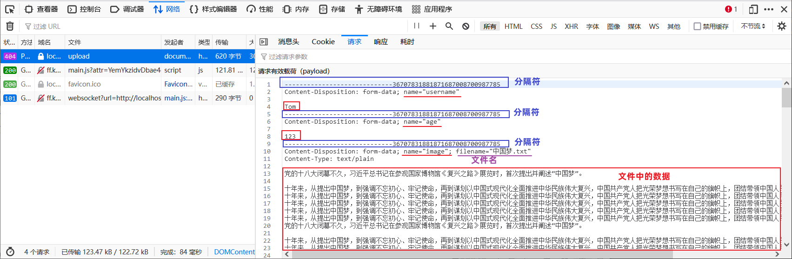
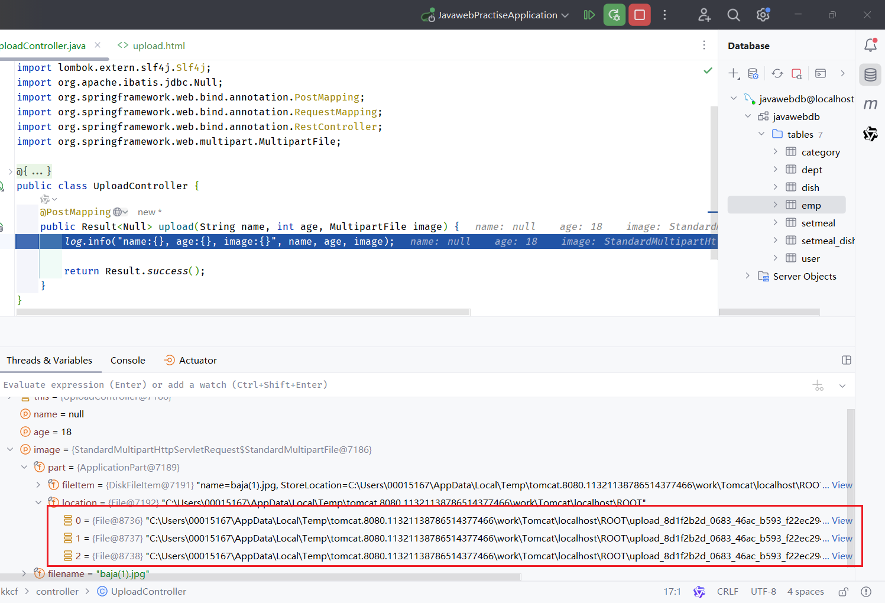

# 案例练习之员工管理

## 一、员工新增

### 1.员工新增基本信息

> 请求路径：/emps
>
> 请求方式：POST
>
> 接口描述：该接口用于添加员工的信息

### 2.员工新增请求参数

参数格式：application/json

参数说明：

| 名称      | 类型   | 是否必须 | 备注                                                         |
| --------- | ------ | -------- | ------------------------------------------------------------ |
| username  | string | 必须     | 用户名                                                       |
| name      | string | 必须     | 姓名                                                         |
| gender    | number | 必须     | 性别, 说明: 1 男, 2 女                                       |
| image     | string | 非必须   | 图像                                                         |
| deptId    | number | 非必须   | 部门id                                                       |
| entrydate | string | 非必须   | 入职日期                                                     |
| job       | number | 非必须   | 职位, 说明: 1 班主任,2 讲师, 3 学工主管, 4 教研主管, 5 咨询师 |

请求数据样例：

```json
{
  "image": "https://web-framework.oss-cn-hangzhou.aliyuncs.com/2022-09-03-07-37-38222.jpg",
  "username": "linpingzhi",
  "name": "林平之",
  "gender": 1,
  "job": 1,
  "entrydate": "2022-09-18",
  "deptId": 1
}
```

### 3.员工新增响应数据

参数格式：application/json

参数说明：

| 参数名 | 类型   | 是否必须 | 备注                           |
| ------ | ------ | -------- | ------------------------------ |
| code   | number | 必须     | 响应码，1 代表成功，0 代表失败 |
| msg    | string | 非必须   | 提示信息                       |
| data   | object | 非必须   | 返回的数据                     |

响应数据样例：

```json
{
    "code":1,
    "msg":"success",
    "data":null
}
```

### 4.员工新增接口开发

在 EmpController 中，新增 addEmp 方法。

demo-project/javaweb-practise/src/main/java/com/kkcf/controller/EmpController.java

```java
package com.kkcf.controller;

import com.kkcf.pojo.Emp;
import com.kkcf.pojo.Result;
import com.kkcf.service.EmpService;
import lombok.extern.slf4j.Slf4j;
import org.apache.ibatis.jdbc.Null;
import org.springframework.beans.factory.annotation.Autowired;
import org.springframework.format.annotation.DateTimeFormat;
import org.springframework.web.bind.annotation.*;

import java.time.LocalDate;

@Slf4j
@RestController
@RequestMapping("/emps")
public class EmpController {
    @Autowired
    private EmpService empService;

    @PostMapping
    public Result<Null> addEmp(@RequestBody Emp emp) {
        log.info("新增员工，员工信息：{}", emp);

        return empService.addEmp(emp) > 0 ? Result.success() : Result.error("新增失败");
    }
}
```

在 Service 层的 EmpService 接口中，新增 `addEmp` 方法。

demo-project/javaweb-practise/src/main/java/com/kkcf/service/EmpService.java

```java
package com.kkcf.service;

import com.kkcf.pojo.Emp;
import com.kkcf.pojo.EmpPageBean;

import java.time.LocalDate;

public interface EmpService {
    int addEmp(Emp emp);
}
```

在 Service 层的 `EmpServiceImpl` 实现类中，实现 `addEmp` 方法。

demo-project/javaweb-practise/src/main/java/com/kkcf/service/impl/EmpServiceImpl.java

```java
package com.kkcf.service.impl;

import com.kkcf.mapper.EmpMapper;
import com.kkcf.pojo.Emp;
import com.kkcf.service.EmpService;
import org.springframework.beans.factory.annotation.Autowired;
import org.springframework.stereotype.Service;

import java.time.LocalDate;
import java.time.LocalDateTime;

@Service
public class EmpServiceImpl implements EmpService {
    @Autowired
    private EmpMapper empMapper;

    @Override
    public int addEmp(Emp emp) {
        // 补充基础属性
        emp.setCreateTime(LocalDateTime.now());
        emp.setUpdateTime(LocalDateTime.now());

        return empMapper.insertEmp(emp);
    }
}
```

在 EmpMapper 接口中，新增 `insertEmp` 方法，使用注解的方式，处理 SQL 语句。

demo-project/javaweb-practise/src/main/java/com/kkcf/mapper/EmpMapper.java

```java
package com.kkcf.mapper;

import com.kkcf.pojo.Emp;
import org.apache.ibatis.annotations.Insert;
import org.apache.ibatis.annotations.Mapper;

@Mapper
public interface EmpMapper {
    @Insert("INSERT INTO emp(username, password, name, gender, image, job, entrydate, dept_id, create_time, update_time) VALUES (#{username}, #{password}, #{name}, #{gender}, #{image}, #{job}, #{entrydate}, #{deptId}, #{createTime}, #{updateTime});")
    int insertEmp(Emp emp);
}
```

## 二、文件上传

### 1.文件上传是什么

文件上传，是指将本地图片、视频、音频等等文件，上传到服务器，供其他用户浏览或下载的过程。

文件上传，在项目中应用非常广泛，比如发微博、发微信朋友圈，都用到了文件上传功能。

完成文件上传功能，涉及到两个部分：

1. 前端程序
2. 服务端程序

### 2.文件上传前端三要素

在前端程序的代码如下：

```html
<form action="/upload" method="post" enctype="multipart/form-data">
    姓名: <input type="text" name="username"><br>
    年龄: <input type="text" name="age"><br>
    头像: <input type="file" name="image"><br>
    <input type="submit" value="提交">
</form>
```

上传文件的原始 form 表单，要求必须具备以下三点要素：

- 要素一：表单必须有 file 域，用于选择要上传的文件。

  ```html
  <input type="file" name="image"/>
  ```

- 要素二：表单提交方式必须为 POST

- 要素三：表单的编码类型属性 `enctype` 必须设置为：`multipart/form-data`

  - 默认的编码格式，不适合传输较大的二进制数据。

将 uploadfile.html 文件，放到 resources/static 目录下。

demo-project/javaweb-practise/src/main/resources/static/upload.html

```html
<!DOCTYPE html>
<html lang="en">
<head>
    <meta charset="UTF-8">
    <title>上传文件</title>
</head>
<body>

<form action="/upload" method="post" enctype="multipart/form-data">
    姓名: <input type="text" name="username"><br>
    年龄: <input type="text" name="age"><br>
    头像: <input type="file" name="image"><br>
    <input type="submit" value="提交">
</form>

</body>
</html>
```

一旦 `<form>` 表单的 `enctype` 属性设为 `multipart/form-data` 后，前端请求体的格式如下所示



> 上图为 FireFox 浏览器的测试截图
>
> Chrome 浏览器对上图中的数据进行了包装，不能看到。

### 3.文件上传后端程序

在案例中，新增员工的时，要上传员工的头像，此时就会涉及到文件上传的功能。

在 Controller 层，创建 `UploadController` 控制器类，在其中定义方法 `upload`。

```java
package com.kkcf.controller;

import com.kkcf.pojo.Result;
import lombok.extern.slf4j.Slf4j;
import org.apache.ibatis.jdbc.Null;
import org.springframework.web.bind.annotation.PostMapping;
import org.springframework.web.bind.annotation.RequestMapping;
import org.springframework.web.bind.annotation.RestController;
import org.springframework.web.multipart.MultipartFile;

@Slf4j
@RestController
@RequestMapping("/upload")
public class UploadController {
    @PostMapping
    public Result<Null> upload(String name, int age, MultipartFile image) {
        log.info("name:{}, age:{}, image:{}", name, age, image);

        return Result.success();
    }
}
```

- 普通的字段，还是使用形参的方式来接收。
- 文件数据，使用 Spring 提供的 API `MultipartFile` 来接收；
  - 形参名要与表单中提交文件的 `<input>` 输入框的 `name` 属性名一致。
  - 如果不一致，要使用 `@RequestParam` 注解，指定前端 `<input>` 输入框的 `name` 属性名。
- 在 `log.info` 处，打上断点，然后在 upload.html 页面中，选择一张本地图片，点击提交。
  1. 会发现，在请求处理过程中，文件数据，作为一个临时文件，保存在了本地。
  2. 放行代码后，请求处理完毕，临时文件也就消失了。

#### 1.文件本地存储

在后端程序中，进行处理，将请求接收到的文件，存储在本地。

demo-project/javaweb-practise/src/main/java/com/kkcf/controller/UploadController.java

```java
package com.kkcf.controller;

import com.kkcf.pojo.Result;
import lombok.extern.slf4j.Slf4j;
import org.apache.ibatis.jdbc.Null;
import org.springframework.web.bind.annotation.PostMapping;
import org.springframework.web.bind.annotation.RequestMapping;
import org.springframework.web.bind.annotation.RestController;
import org.springframework.web.multipart.MultipartFile;

import java.io.File;
import java.io.IOException;
import java.util.UUID;

@Slf4j
@RestController
@RequestMapping("/upload")
public class UploadController {
    @PostMapping
    public Result<Null> upload(String name, int age, MultipartFile image) throws IOException {
        log.info("name:{}, age:{}, image:{}", name, age, image);

        // 获取原始文件名
        String originalFilename = image.getOriginalFilename();

        // 将文件存储在服务器的磁盘目录中
        assert originalFilename != null;
        String extName = originalFilename.substring(originalFilename.lastIndexOf(".")); // 获取文件后缀名
        String fileName = UUID.randomUUID() + extName; // 获取文件全名
        log.info("服务器文件名:{}", fileName);

        image.transferTo(new File("E:\\Repository\\" + fileName));

        return Result.success();
    }
}
```

- 使用 UUID 类，优化本地存储的文件名。

> MultipartFile 常见方法：
>
> - `String getOriginalFilename()`，获取原始文件名
> - `void transferTo(File dest)`，将接收的文件转存到磁盘文件中
> - `long getSize()`，获取文件的大小，单位：字节
> - `byte[] getBytes()`，获取文件内容的字节数组
> - `InputStream getInputStream()`，获取接收到的文件内容的输入流

在 Spring Boot 中，默认单个文件上传最大文 1M；如果需要上传大文件，要进行如下配置：

demo-project/javaweb-practise/src/main/resources/application.properties

```properties
# 单个文件上传大小，最大为 10M
spring.servlet.multipart.max-file-size=10MB
# 单个请求中上传的最大值为 100MB（一个请求中可能包含多个文件）
spring.servlet.multipart.max-request-size=100MB
```

文件上传的本地存储已完成了。但是这种方式还存在一些问题：

- 不安全：磁盘如果损坏，所有的文件就会丢失。
- 容量有限：如果存储大量的图片，磁盘空间有限（磁盘不可能无限制扩容）。
- 无法直接访问。

为解决上述问题，通常有两种方案：

- 自己搭建存储服务器，比如：fastDFS 、MinIO 这种分布式服务。
- 使用现成的云服务，比如：阿里云，腾讯云，华为云…

#### 2.文件阿里云OSS存储

阿里云是国内最大的云服务提供商 ，它提供了很多现成的服务：


阿里云对象存储 OSS（Object Storage Service）是一款海量、安全、低成本、高可靠的云存储服务。

使用 OSS，可以通过网络，随时存储和调用包括文本、图片、音频和视频等各种文件。

在使用了阿里云 OSS 对象存储服务之后，前端进行文件上传发送请求到服务端，服务器将接收到的文件上传到 OSS，由 OSS 存储和管理，


在项目中，使用第三方服务的通用思路，如下图所示：

> SDK（Software Development Kit）软件开发工具包，包括辅助软件开发的依赖（比如 jar 包）、代码示例等等；。
>


阿里云 OSS 对象存储服务，具体的使用步骤如下：


- Bucket 存储空间，是用户用于存储对象（Object），就是文件的容器，所有的对象，都必须隶属于某个存储空间。

参考阿里云[快速入门上传文件文档](https://help.aliyun.com/zh/oss/developer-reference/getting-started?spm=a2c4g.11186623.0.0.322c4a74DgKmiK#section-ca1-db7-0e4)，编写测试用例：

demo-project/javaweb-practise/src/test/java/com/kkcf/AliyunOSSDemo.java

```java
package com.kkcf;

import com.aliyun.oss.ClientException;
import com.aliyun.oss.OSS;
import com.aliyun.oss.OSSClientBuilder;
import com.aliyun.oss.OSSException;
import com.aliyun.oss.common.auth.CredentialsProvider;
import com.aliyun.oss.common.auth.DefaultCredentialProvider;

import java.io.FileInputStream;
import java.io.IOException;
import java.io.InputStream;
import java.util.Properties;

public class AliyunOSSDemo {

    public static CredentialsProvider getCredential() throws IOException {
        Properties properties = new Properties();
        // 设置config.ini文件路径
        String configFilePath = "config.ini";
        InputStream is = AliyunOSSDemo.class.getClassLoader().getResourceAsStream(configFilePath);

        // 读取配置文件
        //FileInputStream input = new FileInputStream(configFilePath);
        properties.load(is);
        assert is != null;
        is.close();

        // 从配置文件中获取AK和SK
        String accessKeyId = properties.getProperty("alibaba_cloud_access_key_id");
        String accessKeySecret = properties.getProperty("alibaba_cloud_access_key_secret");
        System.out.println("accessKeyId: " + accessKeyId);
        System.out.println("accessKeySecret: " + accessKeySecret);

        return new DefaultCredentialProvider(accessKeyId, accessKeySecret);
    }

    public static void main(String[] args) throws Exception {
        // 不同 Region endpoint 不同
        String endpoint = "https://oss-cn-shenzhen.aliyuncs.com";

        // 从环境变量中获取访问凭证。运行本代码示例之前，请确保已设置环境变量 OSS_ACCESS_KEY_ID 和 OSS_ACCESS_KEY_SECRET。
        CredentialsProvider credentialsProvider = getCredential();

        // 填写 Bucket 名称，例如 examplebucket。
        String bucketName = "zetian-bucket";

        // 填写 Object 完整路径，例如 exampledir/exampleobject.txt。Object 完整路径中不能包含 Bucket名 称。
        String objectName = "baja(2).jpg";

        // 创建OSSClient实例。
        OSS ossClient = new OSSClientBuilder().build(endpoint, credentialsProvider);

        try {
            ossClient.putObject(bucketName, objectName, new FileInputStream("C:\\Users\\00015167\\Downloads\\baja(1).jpg"));
        } catch (OSSException oe) {
            System.out.println("Caught an OSSException, which means your request made it to OSS, "
                    + "but was rejected with an error response for some reason.");
            System.out.println("Error Message:" + oe.getErrorMessage());
            System.out.println("Error Code:" + oe.getErrorCode());
            System.out.println("Request ID:" + oe.getRequestId());
            System.out.println("Host ID:" + oe.getHostId());
        } catch (ClientException ce) {
            System.out.println("Caught an ClientException, which means the client encountered "
                    + "a serious internal problem while trying to communicate with OSS, "
                    + "such as not being able to access the network.");
            System.out.println("Error Message:" + ce.getMessage());
        } finally {
            if (ossClient != null) {
                ossClient.shutdown();
            }
        }
    }
}
```

## 三、员工头像上传

### 1.员工头像上传基本信息

> 请求路径：/upload
>
> 请求方式：POST
>
> 接口描述：上传图片接口

### 2.员工头像上传请求参数

参数格式：multipart/form-data

参数说明：

| 参数名称 | 参数类型 | 是否必须 | 示例 | 备注 |
| -------- | -------- | -------- | ---- | ---- |
| image    | file     | 是       |      |      |

### 3.员工头像上传响应数据

参数格式：application/json

参数说明：

| 参数名 | 类型   | 是否必须 | 备注                           |
| ------ | ------ | -------- | ------------------------------ |
| code   | number | 必须     | 响应码，1 代表成功，0 代表失败 |
| msg    | string | 非必须   | 提示信息                       |
| data   | object | 非必须   | 返回的数据，上传图片的访问路径 |

响应数据样例：

```json
{
    "code": 1,
    "msg": "success",
    "data": "https://web-framework.oss-cn-hangzhou.aliyuncs.com/2022-09-02-00-27-0400.jpg"
}
```

### 4.员工头像上传接口开发

引入阿里云 OSS 工具类，用于上传文件阿里云服务器。

demo-project/javaweb-practise/src/main/java/com/kkcf/utils/AliyunOSSUtil.java

```java
package com.kkcf.utils;

import com.aliyun.oss.ClientException;
import com.aliyun.oss.OSS;
import com.aliyun.oss.OSSClientBuilder;
import com.aliyun.oss.OSSException;
import com.aliyun.oss.common.auth.CredentialsProvider;
import com.aliyun.oss.common.auth.DefaultCredentialProvider;

import java.io.IOException;
import java.io.InputStream;
import java.util.Properties;

public class AliyunOSSUtil {

    private static CredentialsProvider getCredential() throws IOException {
        Properties properties = new Properties();
        // 设置config.ini文件路径
        InputStream is = AliyunOSSUtil.class.getClassLoader().getResourceAsStream("config.ini");

        // 读取配置文件
        //FileInputStream input = new FileInputStream(configFilePath);
        properties.load(is);
        assert is != null;
        is.close();

        // 从配置文件中获取AK和SK
        String accessKeyId = properties.getProperty("alibaba_cloud_access_key_id");
        String accessKeySecret = properties.getProperty("alibaba_cloud_access_key_secret");
        System.out.println("accessKeyId: " + accessKeyId);
        System.out.println("accessKeySecret: " + accessKeySecret);

        return new DefaultCredentialProvider(accessKeyId, accessKeySecret);
    }

    /**
     * 此方法用于：上传文件到阿里云 OSS 对象存储服务器
     *
     * @param objectName 要存储的文件名
     * @param is         原文件的输入流路径
     * @throws Exception 异常
     */
    public static void uploadFileToAliOSS(String objectName, InputStream is) throws Exception {
        // 不同 Region endpoint 不同
        String endpoint = "https://oss-cn-shenzhen.aliyuncs.com";

        // 从环境变量中获取访问凭证。运行本代码示例之前，请确保已设置环境变量 OSS_ACCESS_KEY_ID 和 OSS_ACCESS_KEY_SECRET。
        CredentialsProvider credentialsProvider = getCredential();

        // 填写 Bucket 名称，例如 examplebucket。
        String bucketName = "zetian-bucket";

        // 填写 Object 完整路径，例如 exampledir/exampleobject.txt。Object 完整路径中不能包含 Bucket名 称。
        //String objectName = "baja(2).jpg";

        // 创建OSSClient实例。
        OSS ossClient = new OSSClientBuilder().build(endpoint, credentialsProvider);

        try {
            ossClient.putObject(bucketName, objectName, is);
        } catch (OSSException oe) {
            System.out.println("Caught an OSSException, which means your request made it to OSS, "
                    + "but was rejected with an error response for some reason.");
            System.out.println("Error Message:" + oe.getErrorMessage());
            System.out.println("Error Code:" + oe.getErrorCode());
            System.out.println("Request ID:" + oe.getRequestId());
            System.out.println("Host ID:" + oe.getHostId());
        } catch (ClientException ce) {
            System.out.println("Caught an ClientException, which means the client encountered "
                    + "a serious internal problem while trying to communicate with OSS, "
                    + "such as not being able to access the network.");
            System.out.println("Error Message:" + ce.getMessage());
        } finally {
            if (ossClient != null) {
                ossClient.shutdown();
            }
        }
    }
}
```

修改 UploadController 控制器类的方法 `upload`

demo-project/javaweb-practise/src/main/java/com/kkcf/controller/UploadController.java

```java
package com.kkcf.controller;

import com.kkcf.pojo.Result;
import com.kkcf.utils.AliyunOSSUtil;
import lombok.extern.slf4j.Slf4j;
import org.apache.ibatis.jdbc.Null;
import org.springframework.web.bind.annotation.PostMapping;
import org.springframework.web.bind.annotation.RequestMapping;
import org.springframework.web.bind.annotation.RestController;
import org.springframework.web.multipart.MultipartFile;

import java.io.InputStream;
import java.util.UUID;

@Slf4j
@RestController
@RequestMapping("/upload")
public class UploadController {
    @PostMapping
    public Result<Null> upload(MultipartFile image) throws Exception {
        log.info("image:{}", image);

        // 获取原始文件名
        String originalFilename = image.getOriginalFilename();
        log.info("原始文件名:{}", originalFilename);

        // 将文件存储在服务器的磁盘目录中
        assert originalFilename != null;
        String extName = originalFilename.substring(originalFilename.lastIndexOf(".")); // 获取文件后缀名
        String fileName = UUID.randomUUID() + extName; // 获取文件全名
        log.info("服务器文件名:{}", fileName);

        InputStream is = image.getInputStream();

        AliyunOSSUtil.uploadFileToAliOSS(fileName, is);

        return Result.success();
    }
}
```

> 前端 `` 标签，会根据 url 属性，下载图片，并展示在页面上。
