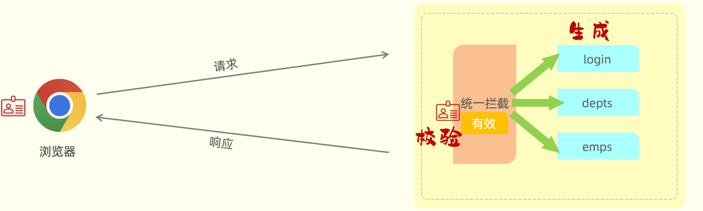

# Cookie、Session、JWT令牌

## 一、Cookie 客户端会话跟踪技术

Cookie 是客户端会话跟踪技术，它是存储在客户端（浏览器）的，

客户端（浏览器）第一次发起请求后，在服务器端，设置一个 Cookie 返回给客户端（浏览器）。比如：

- 第一次请求了登录接口，服务器就可以设置一个 Cookie 并返回给客户端（浏览器）；
- 在其中，存储用户相关的一些数据信息。比如用户名，用户的 ID……。

### 1.Http 协议与 Cookie

Cookie 是 HTTP 协议支持的技术。

各大浏览器厂商都支持了这一标准，主流 Web 服务器也支持这一标准。

主要体现在：

1. 服务器端，在给客户端响应数据的时，可**自动**将 Cookie 响应给浏览器；
2. 客户端（浏览器）接收到响应回来的 cookie 之后，会**自动**的将 Cookie 的值存储在浏览器本地；
3. 客户端（浏览器）后续的每一次请求当中，都会将浏览器本地所存储的 Cookie **自动**地携带到服务端。

HTTP 协议，提供了一个标准的：

- 响应头 Set-Cookie ：用于在响应中设置 Cookie 数据；
  - Tomcat 这类 Web 服务器，提供了设置 Cookie 的 API；

  - 客户端（浏览器）会自动解析响应中的 Cookie，并存储在本地。

- 请求头 Cookie：用于在请求中携带 Cookie 数据，
  - 客户端（浏览器）会自动携带 Cookie 发送请求给服务器；
  - 服务器端要解析。


### 2.服务器端设置和解析 Cookie

在 Controller 层，创建 `CookieController` 控制器类，用于

demo-project/javaweb-practise/src/main/java/com/kkcf/controller/CookieController.java

```java
package com.kkcf.controller;

import com.kkcf.pojo.Result;
import jakarta.servlet.http.Cookie;
import jakarta.servlet.http.HttpServletRequest;
import jakarta.servlet.http.HttpServletResponse;
import lombok.extern.slf4j.Slf4j;
import org.apache.ibatis.jdbc.Null;
import org.springframework.web.bind.annotation.GetMapping;
import org.springframework.web.bind.annotation.RestController;

@Slf4j
@RestController
public class CookieController {

    /**
     * 此方法用于：服务器端设置 Cookie
     *
     * @param res 响应
     * @return Result<Null 》
     */
    @GetMapping("/c1")
    public Result<Null> cookie1(HttpServletResponse res) {
        res.addCookie(new Cookie("username", "kkcf"));
        return Result.success();
    }

    /**
     * 此方法用于，服务器端解析 Cookie
     *
     * @param req 请求
     * @return Result<Null 》
     */
    @GetMapping("/c2")
    public Result<Null> cookie2(HttpServletRequest req) {
        Cookie[] cookies = req.getCookies();
        for (Cookie cookie : cookies) {
            if ("username".equals(cookie.getName())) {
                log.info("username: {}", cookie.getValue());
            }
        }

        return Result.success();
    }
}
```

1. 在浏览器访问 `http://localhost:8080/c1`，打开开发者工具：
   - 观察响应标头中 `Set-Cookie` 属性（服务器设置的 Cookie 返回给浏览器）
2. 在浏览器访问 `http://localhost:8080/c2`，打开开发者工具，
   - 观察请求标头中的 `Cookie` 属性（浏览器携带的 Cookie）


### 3.Cookie 的优缺点

Cookei 优点：

- HTTP 协议支持的技术，使用起来非常方便。

Cookie 缺点：

- 移动端 APP（Android、IOS），无法使用。
- 明文传输数据不安全；
- 用户可以自行禁用。
- 不能跨域。

## 二、Session 服务端会话跟踪技术

Session 是服务器端会话跟踪技术，它是存储在服务器端的。

Session 的底层，是基于 Cookie 来实现的。

### 1.服务器端设置和解析 Session

基于 Session 来进行会话跟踪，实现步骤如下：

1. 客户端（浏览器）在第一次请求服务器时，获取到f服务器响应的会话对象 Session。
   - 第一次请求 Session ，会话对象是不存在的，这时服务器会自动的创建一个会话对象 Session；
   - 每一个会话对象 Session，都有一个 ID（下图中 JSESSIONID 后面括号中的 1，就表示  ID）。
2. 服务器端在给浏览器响应数据时，会将 Session 的 ID 通过 Cookie 响应给浏览器。
   - 即在响应头当中，增加了一个 Set-Cookie 响应头。
   - 这个 Cookie 的名字，是固定的 `JSESSIONID`，代表服务器端会话对象 Session 的 ID。
   - 浏览器会识别这个  Set-Cookie 响应头，然后自动将 Cookie 存储在浏览器本地。
3. 后续浏览器的每一次请求中，都会将 Cookie 的数据携带到服务端。
4. 服务器拿到 `JSESSIONID` 这个 Cookie 的值，也就是 Session 的 ID。再从众多的 Session 当中，找到当前请求对应的会话对象Session。


在 Controller 层，创建 `SessionController` 控制器类。

demo-project/javaweb-practise/src/main/java/com/kkcf/controller/SessionController.java

```java
package com.kkcf.controller;

import com.kkcf.pojo.Result;
import jakarta.servlet.http.HttpServletRequest;
import jakarta.servlet.http.HttpSession;
import lombok.extern.slf4j.Slf4j;
import org.apache.ibatis.jdbc.Null;
import org.springframework.web.bind.annotation.GetMapping;
import org.springframework.web.bind.annotation.RestController;

@Slf4j
@RestController
public class SessionController {
    /**
     * 此方法用于：服务器端生成 Session
     *
     * @param session session 对象
     * @return Result<Null>
     */
    @GetMapping("/s1")
    public Result<Null> generateSession(HttpSession session) {
        log.info("session hashcode: {}", session.hashCode());

        session.setAttribute("loginUser", "tom"); // 在 session 中存储数据
        return Result.success();
    }

    /**
     * 此方法用于：服务器端解析 Session，从 Session 中获取数据
     *
     * @param req 请求对象
     * @return Result<String>
     */
    @GetMapping("/s2")
    public Result<String> parseSession(HttpServletRequest req) {
        HttpSession session = req.getSession();
        log.info("session hashcode: {}", session.hashCode());

        Object loginUser = session.getAttribute("loginUser"); // 从 session 中获取数据
        log.info("loginUser: {}", loginUser);
        return Result.success((String) loginUser);
    }
}
```

在浏览器中，访问 `http://localhost:8080/s1`，打开开发者工具，观察响应标头：

```sh
HTTP/1.1 200
Set-Cookie: JSESSIONID=4848BA0F0BB2CA6F50D9A1CDD34D494D; Path=/; HttpOnly
Content-Type: application/json
Transfer-Encoding: chunked
Date: Wed, 25 Sep 2024 05:46:22 GMT
Keep-Alive: timeout=60
Connection: keep-alive
```

- 发现服务器端，返回了一个 Session，存储在了 Set-Cookie 请求头中。

在浏览器中，访问 `http://localhost:8080/s2`，打开开发者工具，观察请求标头：

```sh
GET /s2 HTTP/1.1
Accept: text/html,application/xhtml+xml,application/xml;q=0.9,image/avif,image/webp,image/apng,*/*;q=0.8,application/signed-exchange;v=b3;q=0.7
Accept-Encoding: gzip, deflate, br, zstd
Accept-Language: zh-CN,zh;q=0.9
Connection: keep-alive
Cookie: JSESSIONID=4848BA0F0BB2CA6F50D9A1CDD34D494D
……
```

- 发现浏览器请求时携带了 Cookie，其中携带了 Session。

服务端控制台输出如下：

```sh
2024-09-25T13:46:22.458+08:00  INFO 31428 --- [javaweb-practise] [nio-8080-exec-4] com.kkcf.controller.SessionController    : session hashcode: 229412214
2024-09-25T13:48:25.141+08:00  INFO 31428 --- [javaweb-practise] [nio-8080-exec-7] com.kkcf.controller.SessionController    : session hashcode: 229412214
2024-09-25T13:48:25.142+08:00  INFO 31428 --- [javaweb-practise] [nio-8080-exec-7] com.kkcf.controller.SessionController    : loginUser: tom
```

- 发现两次请求，获取到的 Session 会话对象的 hashcode 是一样的，就说明是同一个 Session 会话对象。
- 第一次请求时，往 Session 会话对象中存储的值，在第二次请求时，也获取到了。 说明可以通过 Session 会话对象，在同一个会话的多次请求之间来进行数据共享了。

### 2.Session 的优缺点

Session  优点：

- 存储在服务端的，相对安全。

Session  缺点：

- 服务器集群环境下无法直接使用
- 移动端 APP（Android、IOS）中无法使用
- 用户可以自己禁用
- 不能跨域

Session 底层基于 Cookie 实现，如果 Cookie 不可用，则该方案也就失效了.

## 三、JWT 令牌

前面介绍了基于 Cookie、Session 来实现会话追踪。其中携带的数据，就是用户身份的标识，其本质是一个字符串。

令牌的形式有很多，比如 JWT 令牌，

### 1.JWT 令牌是什么

[JWT（JSON Web Token）](https://jwt.io/)定义了一种简洁的、自包含的格式，用于以 json 格式在通信双方之间安全的传输信息。

- 简洁：指 jwt 是一个简单的字符串。可以在请求参数，或者是请求头当中直接传递。
- 自包含：指的是 jwt 令牌，看似是一个随机的字符串，但是可以根据需求在其中存储自定义的数据内容；
  - 比如：可以直接在 jwt 令牌中，存储用户的相关信息。

简单来讲，jwt 就是将原始的 json 数据格式，进行了安全的封装，以实现安全的信息传输。

由于数字签名的存在，这些信息是安全可靠的。

### 2.JWT 令牌的组成

JWT 令牌，由三个部分组成，三个部分之间使用英文的点来分割

- 第一部分：Header（头），记录令牌类型、签名算法等。比如：{"alg":"HS256", "type":"JWT"}；

- 第二部分：Payload（有效载荷），携带一些自定义信息、默认信息等。 比如：{"id":"1", "username":"Tom"}

- 第三部分：Signature（签名），防止 Token 被篡改、确保安全性。将 header、payload，指定秘钥，通过签名算法计算得到。
  - 签名的目的，就是为了防止 jwt 令牌被篡改；
  - 正是因为 jwt 令牌最后部分数字签名的存在，整个 jwt 令牌是非常安全可靠的。
  - 一旦 jwt 令牌当中，任何一个部分、任何一个字符被篡改了，整个令牌在校验的时候都会失败，所以它是非常安全可靠的。


### 3.JWT 令牌原理

JWT 是将原始的 JSON 格式数据，转变为字符串。

其实在生成 JWT 令牌时，会对 JSON 格式的数据进行一次 Base64 编码

> Base64 是一种基于 64 个可打印的字符来表示二进制数据的编码方式。
>
> - 使用的 64 个字符分别是 A-Z、a-z、0-9，一个加号（+），一个斜杠（/）；还有一个等号。它是一个补位的符号
> - 任何数据经过 base64 编码之后，最终就会通过这 64 个字符表示。
>
> 既然能编码，就意味着能解码。
>
> 需要注意的是 Base64 是编码方式，而不是加密方式。

生成 JWT 时，会对第一、第二部分的 JSON 格式的数据，进行 Base64 编码。反之它们可以通过 Base64 解码得到。

第三部分，会进行签名算法计算得到。无法被 Base64 解码。

### 4.JWT 的使用场景

JWT 令牌，最典型的应用场景，就是登录认证：

1. 客户端发起请求执行登录操作，访问服务端的登录接口，如果登录成功，服务端需要生成一个 jwt 令牌，返回给客户端端。
2. 客户端拿到 jwt 令牌之后，将它存储在本地。在后续的每一次请求中，都将 jwt 令牌携带到服务端。
3. 服务端统一拦截请求，先来判断该请求是否携带令牌；否，直接拒绝访问；是，还要校验一下令牌是否是有效；是，就放行请求；否则拒绝访问。


