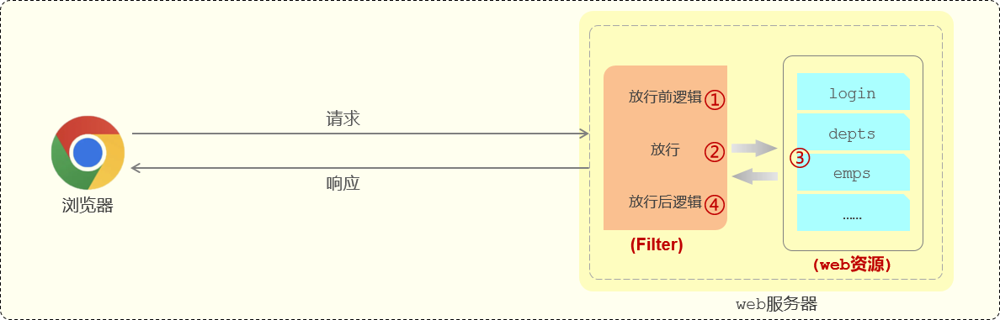
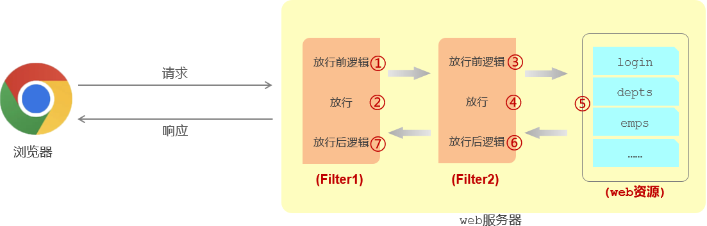
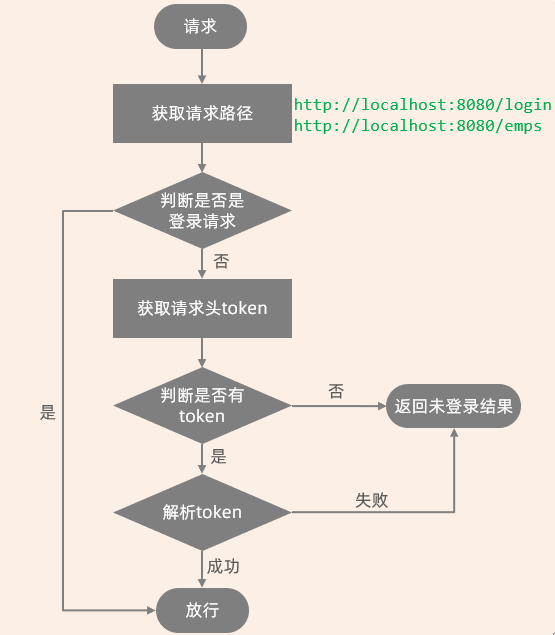

# JavaWeb Servlet 规范 Filter 过滤器

登录后收到服务器发放的 token 令牌后：

- 客户端（浏览器）后续的请求，都会在请求头中携带 JWT 令牌到服务端，
- 而服务端需要统一拦截所有的请求，来判断是否携带了合法的 JWT 令牌。

在 Spring Boot 项目中，统一拦截所有请求，有两种解决方案：

1. Filter 过滤器
2. Interceptor 拦截器

## 一、Filter 过滤器是什么

Filter 过滤器，是 JavaWeb 三大组件（Servlet、Filter、Listener）之一，它并不是 Spring 框架中的组件。

- Filter 过滤器，可以拦截经由 Web 服务器的所有对资源的请求；
- 使用了 Fileter 过滤器后，要想访问 web 服务器上的资源，必须先经过滤器，过滤器处理完毕之后，才可以访问对应的资源。
- 过滤器一般完成一些通用的操作，比如：
  - 登录校验；
  - 统一编码处理；
  - 敏感字符处理等。


下面我们通过Filter快速入门程序掌握过滤器的基本使用操作：

- 第1步，定义过滤器 ：1.定义一个类，实现 Filter 接口，并重写其所有方法。
- 第2步，配置过滤器：Filter类上加 @WebFilter 注解，配置拦截资源的路径。引导类上加 @ServletComponentScan 开启Servlet组件支持。

## 二、Filter 过滤器的使用

过滤器的实现，分为两步：

1. 定义 Filter，定义一个过滤器类，实现 `javax.servlet.Fileter` 接口。并重写其所有方法。
2. 配置 Filter，
   1. 在过滤器类上加 `@WebFilter` 注解。指定属性 `urlPatterns` 配置拦截资源的路径。
      - `/*` 表示拦截浏览器的所有请求；
      - 注释掉 `@WebFilter` 注解，Filter 也就失效了。
   2. 再在引导类（启动类）加上 `@ServletComponentScan` 注解
      - JavaWeb 三大组件，不属于 Spring Boor 组件，要加上该注解表示在当前项目中支持 Servlet 组件。

定义过滤器类 DemoFilter。

demo-project/javaweb-practise/src/main/java/com/kkcf/filter/DemoFilter.java

```java
package com.kkcf.filter;

import jakarta.servlet.*;
import jakarta.servlet.annotation.WebFilter;

import java.io.IOException;

@WebFilter(urlPatterns = "/*")
public class DemoFilter implements Filter {
    /**
     * 此方法用于：初始化拦截器，只会调用一次
     */
    @Override
    public void init(FilterConfig filterConfig) throws ServletException {
        System.out.println("init 初始化方法执行了");
        Filter.super.init(filterConfig);
    }


    /**
     * 此方法用于：拦截请求，调用多次
     */
    @Override
    public void doFilter(ServletRequest servletRequest, ServletResponse servletResponse, FilterChain filterChain) throws IOException, ServletException {
        System.out.println("拦截到了请求，放行前的逻辑……");
        // 放行
        filterChain.doFilter(servletRequest, servletResponse);
        System.out.println("拦截到了请求，放行后的逻辑……");
    }

    /**
     * 此方法用于：销毁拦截器，只会调用一次
     */
    @Override
    public void destroy() {
        System.out.println("destroy 销毁方法执行了");
        Filter.super.destroy();
    }
}
```

- JavaWeb 服务器启动时，会自动创建 Filter 过滤器对象；该对象创建完毕后，会自动调用 `init` 方法
  - 通常会在 `init` 方法中，完成一些资源和环境的准备操作。

- JavaWeb 服务器关闭时，会自动调用 `destroy` 方法，该方法只会被调用一次。
  - 通常会在 `destroy` 方法中，做一些资源的释放。资源清理的工作。
- `init`、`destroy` 方法一般有固定的逻辑，所以 `Filter` 接口中，提供了默认实现。
- `doFilter`  方法，是每次拦截到请求后，都会调用的方法。

在引导（启动）类，加上一个注解 `@ServletComponentScan`，来开启 Spring Boot 项目，对于 Servlet 组件的支持。

demo-project/javaweb-practise/src/main/java/com/kkcf/JavawebPractiseApplication.java

```java
package com.kkcf;

import org.springframework.boot.SpringApplication;
import org.springframework.boot.autoconfigure.SpringBootApplication;
import org.springframework.boot.web.servlet.ServletComponentScan;

@ServletComponentScan // 当前项目开启了对 JavaWeb（Servlet）组件的支持。
@SpringBootApplication
public class JavawebPractiseApplication {

    public static void main(String[] args) {
        SpringApplication.run(JavawebPractiseApplication.class, args);
    }
}
```

启动 Web 服务器，发现控制台中有如下输出：

```sh
init 初始化方法执行了
```

使用接口测试工具，访问 Web 服务器中的资源 `localhost:8080/login`，发现控制台中有如下输出：

```sh
拦截到了请求，放行前的逻辑……
拦截到了请求，放行后的逻辑……
```

关闭 Web 服务器，发现控制台中有如下输出：

```sh
destroy 销毁方法执行了
```

## 三、Filter 过滤器的执行流程

过滤器拦截到请求后，要让请求继续访问后面的 web 资源，就要执行放行操作；

放行就是调用 `FilterChain` 对象的 `doFilter()` 方法：

- 在调用该方法前，编写的代码属于放行之前的逻辑。
- 在调用该方法后，编写的代码属于放行之后的逻辑。

在放行并访问完 web 资源之后，还会回到过滤器中，执行放行之后的逻辑。



## 四、Filter 过滤器拦截路径

Filter 过滤器的拦截路径，可根据需求，进行配置。

三种配置规则如下：

| 拦截路径     | urlPatterns值 | 含义                                  |
| ------------ | ------------- | ------------------------------------- |
| 拦截具体路径 | /login        | 只有访问 `/login` 路径时，才会被拦截  |
| 目录拦截     | /emps/*       | 访问 `/emps` 下的所有资源，都会被拦截 |
| 拦截所有     | /*            | 访问所有资源，都会被拦截              |

## 五、Filter 过滤器链

过滤器链，指的是在一个 web 服务器中，可以配置多个过滤器，多个过滤器就形成了一个过滤器链。

- 比如：在我们 web 服务器中，定义了两个过滤器，这两个过滤器就形成了一个过滤器链。

这个链上的过滤器，在执行的时候，会一个一个的执行：

1. 先执行第一个 Filter 过滤器，放行之后再来执行第二个Filter。
2. 执行完最后一个过滤器放行之后，才会访问对应的 web 资源。

访问完 web 资源之后，按照我们刚才所介绍的过滤器的执行流程，还会回到过滤器当中，来执行过滤器放行后的逻辑；

在执行放行后的逻辑的时候，顺序是反着的。



在案例中，使用过滤器进行 token 校验；实现步骤：

1. 在 Filter 包下，再来新建一个 Filter 过滤器类 `AbcFilter`
2. 在 `AbcFilter` 过滤器中，编写放行前和放行后逻辑
3. 配置 AbcFilter 过滤器拦截请求路径为 `/*`
4. 重启 Spring Boot 服务，查看 DemoFilter、AbcFilter 的执行日志

demo-project/javaweb-practise/src/main/java/com/kkcf/filter/AbcFilter.java

```java
package com.kkcf.filter;

import jakarta.servlet.*;
import jakarta.servlet.annotation.WebFilter;

import java.io.IOException;

@WebFilter(urlPatterns = "/*")
public class AbcFilter implements Filter {
    @Override
    public void doFilter(ServletRequest servletRequest, ServletResponse servletResponse, FilterChain filterChain) throws IOException, ServletException {
        System.out.println("abc，放行前的逻辑……");

        filterChain.doFilter(servletRequest, servletResponse);

        System.out.println("abc，放行后的逻辑……");
    }
}
```

- 发现该过滤器在 DemoFilter 之前执行了。因为，以注解方式配置的 Filter 过滤器，默认会按照名称首字母顺序执行。

如果想让 DemoFilter 先执行，就要修改类名。

## 六、Filter 过滤器登录校验实现

Web 服务器的所有请求，都要被 Filter 过滤器拦截，登录请求列外。

拦截到请求后，有令牌，且令牌校验通过（合法）；否则都返回未登录错误结果。

流程如下图所示：



demo-project/javaweb-practise/src/main/java/com/kkcf/filter/CheckLoginFilter.java

```java
package com.kkcf.filter;

import com.alibaba.fastjson.JSONObject;
import com.kkcf.pojo.Result;
import com.kkcf.utils.JwtUtil;
import jakarta.servlet.*;
import jakarta.servlet.annotation.WebFilter;
import jakarta.servlet.http.HttpServletRequest;
import jakarta.servlet.http.HttpServletResponse;
import lombok.extern.slf4j.Slf4j;
import org.springframework.util.StringUtils;

import java.io.IOException;

@Slf4j
@WebFilter(urlPatterns = "/*")
public class CheckLoginFilter implements Filter {
    @Override
    public void doFilter(ServletRequest servletRequest, ServletResponse servletResponse, FilterChain filterChain) throws IOException, ServletException {
        HttpServletRequest req = (HttpServletRequest) servletRequest;
        HttpServletResponse res = (HttpServletResponse) servletResponse;

        // 1.获取请求 url
        String url = req.getRequestURL().toString();
        log.info("请求的 URL 地址是：{}", url);

        // 2.判断请求 url 中是否有 login，如果包含，说明是登录请求，可直接方向
        if (url.contains("login")) {
            log.info("登录请求，放行...");
            filterChain.doFilter(req, res);
            return;
        }

        // 3.获取请求头中的令牌 (token)
        String token = req.getHeader("token");

        // 4.判断令牌是否存在。如果不存在，返回错误结果（未登录）
        if (!StringUtils.hasLength(token)) {
            log.info("请求头中 token 为空，返回未登录信息...");
            Result<String> result = Result.error("NOT_LOGIN");
            // 手动将 Java 实例对象，转为 JSON 格式的数据，使用 Alibaba 提供的 fastJSON 工具包。
            String jsonStr = JSONObject.toJSONString(result);
            // 返回 JSON 数据
            res.getWriter().write(jsonStr);
            return;
        }

        // 5.解析 token，如果解析失败，返回错误结果（未登录）
        try {
            JwtUtil.parseToken(token);
        } catch (Exception e) {
            log.info("解析令牌失败，返回未登录信息...");
            Result<String> result = Result.error("NOT_LOGIN");
            // 手动将 Java 实例对象，转为 JSON 格式的数据，使用 Alibaba 提供的 fastJSON 工具包。
            String jsonStr = JSONObject.toJSONString(result);
            // 返回 JSON 数据
            res.getWriter().write(jsonStr);
            return;
        }

        // 6.放行
        log.info("令牌合法，放行...");
        filterChain.doFilter(req, res);
    }
}
```

> 过滤器被注释掉，表示让过滤器失效。

返回响应时，要将 Java 对象，转为 JSON 对象，要引入一个依赖 fastjson

demo-project/javaweb-practise/pom.xml

```xml
<!-- fastjson -->
<dependency>
    <groupId>com.alibaba</groupId>
    <artifactId>fastjson</artifactId>
    <version>2.0.49</version>
</dependency>
```
