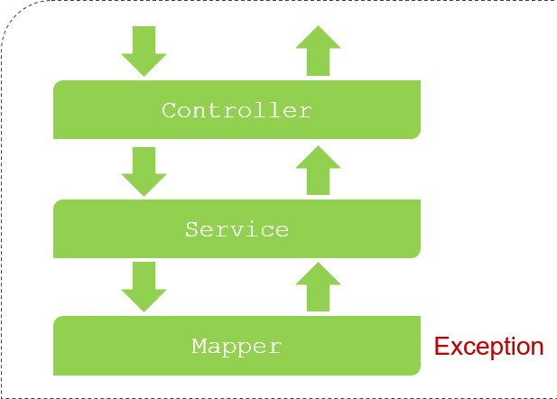
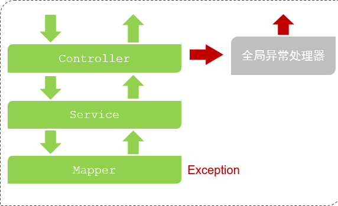

# Spring Boot 异常处理

## 一、Spring Boot 默认异常处理

在 Spring Boot 项目中，开发者未手动处理异常，默认会响应给客户端一个固定格式的错误信息。

在接口测试工具中，发送请求，新增一个已经存在的部门，服务器返回的响应数据如下：

```json
{
    "timestamp": "2024-09-28T07:22:16.769+00:00",
    "status": 500,
    "error": "Internal Server Error",
    "path": "/depts"
}
```

可以看到，响应回来的 JSON 格式数据。不是项目开发规范中约定的统一响应结果 `Result`。

在 Spring Boot 项目中，没有做任何的异常处理时，三层架构处理异常的方式举例如下：

1. Mapper 接口操作数据库时出错，异常会往上抛给 Service 层。
2. Service 层，没有做任何异常处理，会抛给 Controller 层。
3. Controller 层也没有做任何的异常处理，再往上抛。最终抛给 Spring Boot 框架
4. Spring Boot 框架会返回一个 JSON 格式的数据，里面封装的就是错误的信息。
   - 该 JSON 格式的数据，并不符合项目约定的开发规范。



## 二、Spring‘ Boot 异常处理方案

在 Spring Boot 项目的三层构架中，出现了异常，有两种处理方案：

- 方案一：在所有 Controller 控制器类的所有方法中，进行 try…catch 处理（代码臃肿）。
- 方案二：全局异常处理器（简单、优雅）如下图所示。



## 三、Spring Boot 全局异常处理

### 1.@RestControllerAdvice、@ExceptionHandler 注解

Spring Boot 全局异常处理器的使用：

1. 定义一个类，在类上加上注解 `@RestControllerAdvice`，表示全局异常处理器。
2. 在该处理器类中，定义一个方法，来捕获异常；
3. 在该方法上，加上注解 `@ExceptionHandler`，并通过 `value` 属性，来指定要捕获的异常类型。

> @RestControllerAdvice = @ControllerAdvice + @ResponseBody
>
> 所以，处理异常的方法，返回值会转换为 JSON 格式后再响应给客户端。

在项目中，创建 exception 包，在其中创建全局异常处理器类 `GlobalExceptionHandler`。

demo-project/javaweb-practise/src/main/java/com/kkcf/exception/GlobalExceptionHandler.java

```java
package com.kkcf.exception;

import com.kkcf.pojo.Result;
import org.springframework.web.bind.annotation.ExceptionHandler;
import org.springframework.web.bind.annotation.RestControllerAdvice;

/**
 * 全局异常处理类
 */
@RestControllerAdvice
public class GlobalExceptionHandler {
    @ExceptionHandler(Exception.class)
    public Result<String> ex(Exception ex) {
        ex.printStackTrace();
        return Result.error("服务器异常：" + ex.getMessage());
    }
}
```

在接口测试工具中，发送请求，新增一个已经存在的部门来模拟异常，响应结果如下：

```json
{
    "code": 0,
    "msg": "服务器异常：\r\n### Error updating database.  Cause: java.sql.SQLIntegrityConstraintViolationException: Duplicate entry '学工部' for key 'dept.name'\r\n### The error may exist in com/kkcf/mapper/DeptMapper.java (best guess)\r\n### The error may involve com.kkcf.mapper.DeptMapper.insertDept-Inline\r\n### The error occurred while setting parameters\r\n### SQL: INSERT INTO dept(name, create_time, update_time) VALUES (?, ?, ?);\r\n### Cause: java.sql.SQLIntegrityConstraintViolationException: Duplicate entry '学工部' for key 'dept.name'\n; Duplicate entry '学工部' for key 'dept.name'",
    "data": null
}
```
