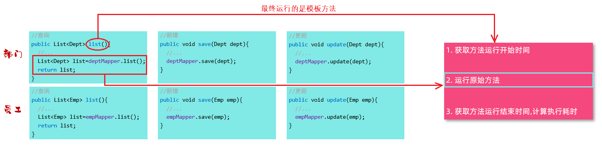

# Spring Aop

AOP 是 Spring 框架的第二大核心，

## 一、Aop 是什么

AOP（Aspect Oriented Programming）面向切面编程，事实上，就是面向特定方法编程。

- 面向一个，或多个方法进行编程。

场景：项目中开发了很多的业务功能，计算每一个业务方法的耗时。有两种解决方案；

- 方案一：为每一个业务方法，添加计时的逻辑。这种做法繁琐，会让代码显得臃肿。
- 方案二：AOP 面向切面编程。

AOP 面向方法编程，可在程序运行期间，在不修改源代码的基础上，对已有方法，进行无侵入性的增强（解耦）。

将记录方法执行耗时这一部分公共的逻辑代码，定义在模板方法当中，

- 在方法开始运行之前，记录开始时间；
- 中间就来运行原始的业务方法。
- 在方法结束运行后，记录结束时间；

中间运行的原始业务方法，可能是其中的一个业务方法：

- 只想统计部门管理的 `list` 方法的执行耗时，那就只有这一个方法是原始业务方法。
- 想统计所有部门管理的业务方法执行耗时，那么所有的部门管理的业务方法都是 原始业务方法。

面向指定的一个或多个方法进行编程，称之为 面向切面编程。

不论运行的是哪个业务方法，最后其实运行的就是定义的模板方法，

而在模板方法中，就完成了原始方法执行耗时的统计操作 。



这个流程，似曾相识，与**动态代理**技术是类似的：

- 所谓模板方法，就是代理对象中所定义的方法；
- 当运行原始业务方法时，就会运行代理对象中的方法。

AOP 面向切面编程，与 OOP 面向对象编程一样，都是一种编程思想，动态代理技术是这种思想最主流的实现方式。

Spring 的 AOP 框架的高级技术，旨在管理 bean 对象的过程中，底层使用动态代理机制，对特定的方法进行编程（功能增强）。

## 二、Spring AOP 的使用

案例理解：使用 Spring AOP，统计各个业务方法的耗时。

1.引入依赖

demo-project/javaweb-practise/pom.xml

```xml
<!-- Spring Boot AOP-->
<dependency>
    <groupId>org.springframework.boot</groupId>
    <artifactId>spring-boot-starter-aop</artifactId>
</dependency>
```

### 1.@Aspect 注解

2.编写 AOP 程序，针对特定方法，根据业务需求进行编程。

demo-project/javaweb-practise/src/main/java/com/kkcf/aop/TimeAspect.java

```java
package com.kkcf.aop;

import lombok.extern.slf4j.Slf4j;
import org.aspectj.lang.ProceedingJoinPoint;
import org.aspectj.lang.annotation.Around;
import org.aspectj.lang.annotation.Aspect;
import org.springframework.stereotype.Component;

@Slf4j
@Component
@Aspect
public class TimeAspect {
    @Around("execution(* com.kkcf.service.*.*(..))") // 切入点表达式。
    public Object recordTime(ProceedingJoinPoint pjp) throws Throwable {
        // 1.记录开始时间
        long start = System.currentTimeMillis();

        // 2.执行目标方法
        Object result = pjp.proceed();

        // 3.记录结束时间
        long end = System.currentTimeMillis();
        log.info("{} 方法耗时：{} ms", pjp.getSignature(), end - start);

        return result;
    }
}
```

重启服务，在接口测试工具中，调用登录接口。

观察控制台输出：

```sh
2024-09-29T14:07:01.207+08:00  INFO 20504 --- [javaweb-practise] [nio-8080-exec-1] com.kkcf.aop.TimeAspect: Emp com.kkcf.service.impl.EmpServiceImpl.loginEmp(Emp) 方法耗时：658 ms
```

## 三、AOP 应用场景

AOP 可以有很多应用场景，比如：

- 记录操作日志；
- 权限控制；
- 事务管理
- ……

> Spring 事务管理，底层就是使用 AOP 来实现的。
>
> 添加 @Transactional 注解后，AOP 程序会自动会：
>
> 1. 在原始方法运行前，开启事务；
> 2. 在原始方法运行完毕后，提交或回滚事务。

## 四、AOP 的优势

AOP的优势：

- 代码无侵入，没有修改原始业务方法，就已经对原始的业务方法进行了功能的增强。
- 减少重复代码；
- 提高开发效率；
- 维护方便。

## 五、AOP 核心概念

AOP 有五个核心概念：

### 1.JoinPoint 连接点

JoinPoint 连接点，指的是可以被 AOP 控制的方法（暗含方法执行时的相关信息）

- 比如：入门程序当中，所有的业务方法都可以被 AOP 控制，所有方法都是连接点。

> Spring AOP 提供的 JoinPoint 当中，封装了连接点方法在执行时的相关信息（后面会有具体的讲解）


### 2.Advice 通知

Advice 通知，指那些重复的逻辑，也就是共性功能（最终体现为一个方法）

在入门程序中。统计了各个业务方法的执行耗时，

1. 需要在业务方法运行开始前，先记录开始时间，
2. 在业务方法运行结束后，再来记录结束时间。

在 AOP 面向切面编程当中，我们只需要将这部分重复的代码逻辑，抽取出来单独定义。

抽取出来的这一部分重复的逻辑，也就是共性的功能。


### 3.PointCut 切入点

PointCut 切入点，指的是匹配连接点的条件。通知仅会在切入点方法执行时被应用。

在通知当中，定义的共性功能，要应用在哪些方法上；此时就涉及到了切入点 PointCut 概念。

在 AOP 的开发当中，通常会通过一个**切入点表达式**，来描述切入点（后面会有详解）。


上图切入点表达式改为 `DeptServiceImpl.list()`，就代表：

- 只有 list 方法这一个切入点；
- 只有 `list()` 方法在运行时候才会应用通知。

### 4.Aspect 切面

Aspect 切面，描述通知与切入点的对应关系（通知 + 切入点）

当通知和切入点，结合在一起，就形成了一个切面；

通过切面，就能够描述当前 AOP 程序，要针对哪个原始方法，在什么时候执行什么样的操作。即通知与切人点的对应关系。


切面所在的类，一般称为**切面类**（被 `@Aspect` 注解标识的类）。

### 5.Target 目标对象

Target 目标对象，表示通知（Advice）应用的对象，


## 六、AOP 的执行流程

Spring 的 AOP 底层，是基于动态代理技术实现的；

在程序运行的时候，会自动的基于动态代理技术，为目标对象，生成一个对应的代理对象。

在代理对象中，就会对目标对象当中的原始方法，进行功能的增强。


> Spring 底层，用到的代理技术是 CGLIB 动态代理。

## 七、AOP 的通知类型

Spring 中 AOP 的通知类型有：

### 1.@Around 注解

环绕通知，通知方法在目标方法前、后都被执行；

### 2.@Before 注解

前置通知，通知方法在目标方法前被执行；

### 3.@After 注解

后置通知（也称最终通知），通知方法在目标方法后被执行，无论是否有异常都会执行；

### 4.@AfterReturning 注解

返回后通知，通知方法在目标方法后被执行，有异常不会执行；

### 5.@AfterThrowing 注解

异常后通知，通知方法发生异常后执行。

在程序中，进行验证：

demo-project/javaweb-practise/src/main/java/com/kkcf/aop/MyAspect.java

```java
package com.kkcf.aop;

import lombok.extern.slf4j.Slf4j;
import org.aspectj.lang.ProceedingJoinPoint;
import org.aspectj.lang.annotation.*;
import org.springframework.stereotype.Component;

@Slf4j
@Component
@Aspect
public class MyAspect {
    @Around("execution(* com.kkcf.service.impl.DeptServiceImpl.*(..))")
    public Object around(ProceedingJoinPoint pjp) throws Throwable {
        log.info(" AOP ADVICE around before...");

        Object result = pjp.proceed();

        log.info(" AOP ADVICE around after...");

        return result;
    }

    @Before("execution(* com.kkcf.service.impl.DeptServiceImpl.*(..))")
    public void before() {
        log.info(" AOP ADVICE before...");
    }

    @After("execution(* com.kkcf.service.impl.DeptServiceImpl.*(..))")
    public void after() {
        log.info(" AOP ADVICE after...");
    }

    @AfterReturning("execution(* com.kkcf.service.impl.DeptServiceImpl.*(..))")
    public void afterReturning() {
        log.info(" AOP ADVICE afterReturning...");
    }

    @AfterThrowing("execution(* com.kkcf.service.impl.DeptServiceImpl.*(..))")
    public void afterThrowing() {
        log.info(" AOP ADVICE afterThrowing...");
    }
}
```

观察控制台日志输出：

```sh
2024-09-30T10:15:03.714+08:00  INFO 25116 --- [javaweb-practise] [nio-8080-exec-5] com.kkcf.aop.MyAspect                    :  AOP ADVICE around before...
2024-09-30T10:15:03.715+08:00  INFO 25116 --- [javaweb-practise] [nio-8080-exec-5] com.kkcf.aop.MyAspect                    :  AOP ADVICE before...
2024-09-30T10:15:03.767+08:00  INFO 25116 --- [javaweb-practise] [nio-8080-exec-5] com.kkcf.aop.MyAspect                    :  AOP ADVICE afterReturning...
2024-09-30T10:15:03.767+08:00  INFO 25116 --- [javaweb-practise] [nio-8080-exec-5] com.kkcf.aop.MyAspect                    :  AOP ADVICE after...
2024-09-30T10:15:03.767+08:00  INFO 25116 --- [javaweb-practise] [nio-8080-exec-5] com.kkcf.aop.MyAspect                    :  AOP ADVICE around after...
```

@AfterThrowing 和 @AfterRunning 是互斥的。

- 当连接带你中出现异常时，@AfterReturning 标识的通知方法不会执行，@AfterThrowing 标识的通知方法执行了

- @Around 环绕通知的连接点出现异常，环绕后的代码逻辑也不会再执行了 （因为原始方法调用已经出异常了）

使用通知类型时的注意事项：

- @Around 环绕通知需要自己调用 ProceedingJoinPoint.proceed() 来让原始方法执行，其他通知不需要考虑目标方法执行
- @Around 环绕通知方法的返回值，必须指定为Object，来接收原始方法的返回值，否则原始方法执行完毕，是获取不到返回值的。

## 八、@PointCut 注解-切入点表达式抽取

使用 @PointCut 注解，将切入点表达式抽取出来：

- 可以在本类，或其它类中，使用抽取出来的切入点表达式。

```java
package com.kkcf.aop;

import lombok.extern.slf4j.Slf4j;
import org.aspectj.lang.ProceedingJoinPoint;
import org.aspectj.lang.annotation.*;
import org.springframework.stereotype.Component;

@Slf4j
@Component
@Aspect
public class MyAspect {
    @Pointcut("execution(* com.kkcf.service.impl.DeptServiceImpl.*(..))")
    public void pt() {
    }

    @Around("pt()")
    public Object around(ProceedingJoinPoint pjp) throws Throwable {
        log.info(" AOP ADVICE around before...");

        Object result = pjp.proceed();

        log.info(" AOP ADVICE around after...");

        return result;
    }

    @Before("pt()")
    public void before() {
        log.info(" AOP ADVICE before...");
    }

    @After("pt()")
    public void after() {
        log.info(" AOP ADVICE after...");
    }

    @AfterReturning("pt()")
    public void afterReturning() {
        log.info(" AOP ADVICE afterReturning...");
    }

    @AfterThrowing("pt()")
    public void afterThrowing() {
        log.info(" AOP ADVICE afterThrowing...");
    }
}
```

注意：当切入点方法使用 private 修饰时，仅能在当前切面类中引用该表达式；

demo-project/javaweb-practise/src/main/java/com/kkcf/aop/MyAspectA.java

```java
package com.kkcf.aop;

import lombok.extern.slf4j.Slf4j;
import org.aspectj.lang.annotation.After;
import org.aspectj.lang.annotation.Aspect;
import org.aspectj.lang.annotation.Before;
import org.springframework.core.annotation.Order;
import org.springframework.stereotype.Component;

@Slf4j
@Component
@Order(2)
@Aspect
public class MyAspectA {
    @Before("com.kkcf.aop.MyAspect.pt()")
    public void before() {
        log.info("MyAspectA.before……");
    }

    @After("com.kkcf.aop.MyAspect.pt()")
    public void after() {
        log.info("MyAspectA.after……");
    }
}
```

- 在引用的时候，具体的语法为：`全类名.方法名()`，具体形式如下：

## 九、AOP 通知执行顺序

在项目开发中，定义了多个切面类，其中多个切入点都匹配到了同一个目标方法。

此时当目标方法，在运行的时候，这多个切面类当中的这些通知方法都会运行。

- 它们哪个先运行，哪个后运行？

### 1.AOP 通知默认执行顺序

定义两种类型的通知进行测试，一种是前置通知 @Before，一种是后置通知 @After

定义切面类 MyAspectA

demo-project/javaweb-practise/src/main/java/com/kkcf/aop/MyAspectA.java

```java
package com.kkcf.aop;

import lombok.extern.slf4j.Slf4j;
import org.aspectj.lang.annotation.After;
import org.aspectj.lang.annotation.Aspect;
import org.aspectj.lang.annotation.Before;
import org.springframework.core.annotation.Order;
import org.springframework.stereotype.Component;

@Slf4j
@Component
@Aspect
public class MyAspectA {
    @Before("com.kkcf.aop.MyAspect.pt()")
    public void before() {
        log.info("MyAspectA.before……");
    }

    @After("com.kkcf.aop.MyAspect.pt()")
    public void after() {
        log.info("MyAspectA.after……");
    }
}
```

定义切面类 MyAspectB

demo-project/javaweb-practise/src/main/java/com/kkcf/aop/MyAspectB.java

```java
package com.kkcf.aop;

import lombok.extern.slf4j.Slf4j;
import org.aspectj.lang.annotation.After;
import org.aspectj.lang.annotation.Aspect;
import org.aspectj.lang.annotation.Before;
import org.springframework.core.annotation.Order;
import org.springframework.stereotype.Component;

@Slf4j
@Component
@Aspect
public class MyAspectB {
    @Before("com.kkcf.aop.MyAspect.pt()")
    public void before() {
        log.info("MyAspectB.before……");
    }

    @After("com.kkcf.aop.MyAspect.pt()")
    public void after() {
        log.info("MyAspectB.after……");
    }
}
```

观察控制台日志输出：

```sh
2024-09-29T16:41:03.419+08:00  INFO 14000 --- [javaweb-practise] [nio-8080-exec-1] com.kkcf.aop.MyAspectB                   : MyAspectA.before……
2024-09-29T16:41:03.419+08:00  INFO 14000 --- [javaweb-practise] [nio-8080-exec-1] com.kkcf.aop.MyAspectA                   : MyAspectB.before……
2024-09-29T16:41:03.788+08:00  INFO 14000 --- [javaweb-practise] [nio-8080-exec-1] com.kkcf.aop.MyAspectA                   : MyAspectB.after……
2024-09-29T16:41:03.788+08:00  INFO 14000 --- [javaweb-practise] [nio-8080-exec-1] com.kkcf.aop.MyAspectB                   : MyAspectA.after……
```

发现：通知执行顺序，默认和类名的排序有关；

### 2.@Order 注解指定执行顺序

Spring 提供了 @Order 注解，来控制切面的执行顺序。

- 对于原始方法运行前的通知，数字越小，优先级越高
- 对于原始方法运行后的通知，数字越小，优先级越低

在切面类 MyAspectA 使用 @Order 注解

demo-project/javaweb-practise/src/main/java/com/kkcf/aop/MyAspectA.java

```java
package com.kkcf.aop;

import lombok.extern.slf4j.Slf4j;
import org.aspectj.lang.annotation.After;
import org.aspectj.lang.annotation.Aspect;
import org.aspectj.lang.annotation.Before;
import org.springframework.core.annotation.Order;
import org.springframework.stereotype.Component;

@Slf4j
@Component
@Order(2)
@Aspect
public class MyAspectA {
    @Before("com.kkcf.aop.MyAspect.pt()")
    public void before() {
        log.info("MyAspectA.before……");
    }

    @After("com.kkcf.aop.MyAspect.pt()")
    public void after() {
        log.info("MyAspectA.after……");
    }
}
```

在切面类 MyAspectB 使用 @Order 注解

demo-project/javaweb-practise/src/main/java/com/kkcf/aop/MyAspectB.java

```java
package com.kkcf.aop;

import lombok.extern.slf4j.Slf4j;
import org.aspectj.lang.annotation.After;
import org.aspectj.lang.annotation.Aspect;
import org.aspectj.lang.annotation.Before;
import org.springframework.core.annotation.Order;
import org.springframework.stereotype.Component;

@Slf4j
@Component
@Order(1)
@Aspect
public class MyAspectB {
    @Before("com.kkcf.aop.MyAspect.pt()")
    public void before() {
        log.info("MyAspectB.before……");
    }

    @After("com.kkcf.aop.MyAspect.pt()")
    public void after() {
        log.info("MyAspectB.after……");
    }
}
```

使用接口测试工具，访问查询部门的接口，观察控制台日志输出：

```sh
2024-09-30T11:57:35.373+08:00  INFO 24216 --- [javaweb-practise] [nio-8080-exec-4] com.kkcf.aop.MyAspectB                   : MyAspectB.before……
2024-09-30T11:57:35.373+08:00  INFO 24216 --- [javaweb-practise] [nio-8080-exec-4] com.kkcf.aop.MyAspectA                   : MyAspectA.before……
2024-09-30T11:57:35.389+08:00  INFO 24216 --- [javaweb-practise] [nio-8080-exec-4] com.kkcf.aop.MyAspectA                   : MyAspectA.after……
2024-09-30T11:57:35.390+08:00  INFO 24216 --- [javaweb-practise] [nio-8080-exec-4] com.kkcf.aop.MyAspectB                   : MyAspectB.after……
```

## 十、AOP 的切入点表达式

从 AOP 的入门程序开始，一直都在使用切入点表达式来描述切入点。

切入点表达式，指的是描述切入点方法的一种表达式，用来决定项目中的哪些方法需要加入通知。

切入点表达式，常见的有两种形式：

- execution(……)：根据方法的签名来匹配；
- @annotation(……) ：根据注解匹配；

### 1.execution 切入点表达式

#### 1.execution 语法

execution 主要根据方法的返回值、包名、类名、方法名、方法参数等信息来匹配，语法为：

```txt
execution(访问修饰符? 返回值 包名.类名.?方法名(方法参数) throws 异常?)
```

其中带 `?` 的，表示可以省略的部分：

- 访问修饰符：可省略（比如：`public`、`protected`）；

- `包名.类名`：可省略，但不建议省略；

- throws 异常：可省略（方法上声明抛出的异常，不是实际抛出的异常）

示例：

```java
@Before("execution(void com.kkcf.service.impl.DeptServiceImpl.removeById(java.lang.Integer))")
```

execution 切入点表达式，可以基于接口进行匹配。

#### 2.execution 通配符

execution 切入点表达式，可使用通配符描述切入点，可用通配符有两个：

- `*` ：单个独立的任意符号，可以通配任意返回值、包名、类名、方法名、任意类型的一个参数，也可以通配包、类、方法名的一部分
- `..` ：多个连续的任意符号，可以通配任意层级的包，或任意类型、任意个数的参数

execution 切入点表达式的一般用法：

1. 方法的访问修饰符可以省略；
2. 返回值可以使用`*`号代替（任意返回值类型）；
3. 包名可以使用`*`号代替，代表任意包（一层包使用一个 `*`）；
4. 使用 `..` 配置包名，标识此包以及此包下的所有子包；
5. 类名可以使用 `*` 号代替，标识任意类；
6. 方法名可以使用 `*` 号代替，表示任意方法；
7. 可以使用 `*` 配置参数，一个任意类型的参数；
8. 可以使用 `..` 配置参数，任意个任意类型的参数。


匹配两个完全不相同的方法，使用 `||` 逻辑运算符进行连接。