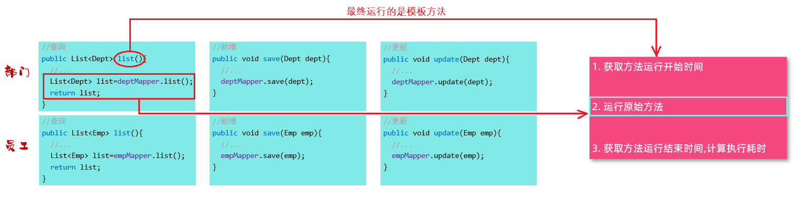
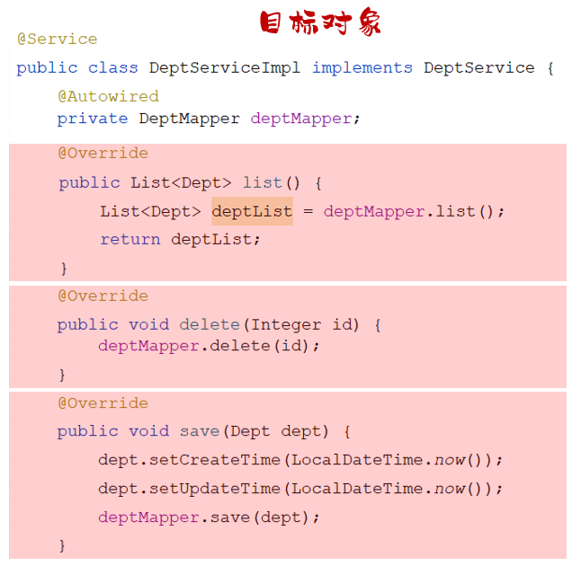

# Spring Aop（一）

IOC（控制反转）和 DI（依赖注入）是 Spring 框架的第一大核心；

AOP（面向切面编程）是 Spring 框架的第二大核心，

## 一、Aop 是什么

AOP（Aspect Oriented Programming）面向切面编程，事实上，就是面向特定方法（一个，或多个方法）编程。

场景：项目中开发了很多业务方法，现要计算每一个业务方法的耗时。有两种方案；

- 方案一：为每一个业务方法，添加计时的逻辑。这种做法显然是繁琐的，会让代码显得臃肿。
- 方案二：AOP 面向切面编程。

AOP 面向方法编程，在不修改源代码的基础上，对已有方法，进行无侵入性的增强（解耦）。

将计算方法执行耗时的公共的逻辑代码，定义在模板方法当中，

- 在方法开始运行之前，记录开始时间；
- 执行原始业务方法。
- 在方法结束运行后，记录结束时间；

中间运行的原始业务方法，可能是其中的一个业务方法：

- 比如：要统计部门管理的 `list` 方法执行耗时，就只有该方法是原始业务方法。
- 比如：要统计所有部门管理的业务方法执行耗时，那么所有的部门管理的业务方法，都是原始业务方法。

不论运行的是哪个业务方法，最后其实运行的就是定义的模板方法，

而在模板方法中，就完成了原始方法执行耗时的统计操作 。



这个流程，似曾相识，与 **Java 动态代理**技术是类似的：

- 所谓模板方法，就是代理对象中所定义的方法；
- 当运行原始业务方法时，就会运行代理对象中的方法。

AOP 面向切面编程，与 OOP 面向对象编程一样，是一种**编程思想**；

- **动态代理**技术，是这种思想最主流的实现方式。

Spring 框架的 AOP 技术，旨在管理 bean 对象的过程中，底层使用动态代理机制，对特定的方法进行编程（功能增强）。

## 二、Spring AOP 的使用

案例理解：使用 Spring AOP，统计各个业务方法的耗时。

1.引入依赖 `spring-boot-starter-aop` Maven 坐标；

demo-project/javaweb-practise/pom.xml

```xml
<!-- Spring Boot AOP-->
<dependency>
    <groupId>org.springframework.boot</groupId>
    <artifactId>spring-boot-starter-aop</artifactId>
</dependency>
```

### 1.@Aspect 注解

2.编写 AOP 程序，针对特定方法，根据业务需求进行编程。

- `@Aspect` 注解，用于标注切面类。

demo-project/javaweb-practise/src/main/java/com/kkcf/aop/TimeAspect.java

```java
package com.kkcf.aop;

import lombok.extern.slf4j.Slf4j;
import org.aspectj.lang.ProceedingJoinPoint;
import org.aspectj.lang.annotation.Around;
import org.aspectj.lang.annotation.Aspect;
import org.springframework.stereotype.Component;

@Slf4j
@Component
@Aspect
public class TimeAspect {
    @Around("execution(* com.kkcf.service.*.*(..))") // 切入点表达式。
    public Object recordTime(ProceedingJoinPoint pjp) throws Throwable {
        // 1.记录开始时间
        long start = System.currentTimeMillis();

        // 2.执行目标方法
        Object result = pjp.proceed();

        // 3.记录结束时间
        long end = System.currentTimeMillis();
        log.info("{} 方法耗时：{} ms", pjp.getSignature(), end - start);

        return result;
    }
}
```

重启服务，在接口测试工具中，调用登录接口。

观察控制台输出：

```sh
2024-09-29T14:07:01.207+08:00  INFO 20504 --- [javaweb-practise] [nio-8080-exec-1] com.kkcf.aop.TimeAspect: Emp com.kkcf.service.impl.EmpServiceImpl.loginEmp(Emp) 方法耗时：658 ms
```

## 三、AOP 应用场景

AOP 可以有很多应用场景，比如：

- 记录操作日志；
- 权限控制；
- 事务管理
- ……

> Spring 事务管理，底层就是使用 AOP 来实现的。
>
> 添加 `@Transactional` 注解后，AOP 程序自动会：
>
> 1. 在原始方法运行前，开启事务；
> 2. 在原始方法运行完毕后，提交或回滚事务。

## 四、AOP 的优势

AOP 的优势：

- 代码无侵入，没有修改原始业务方法，就可对原始业务方法进行功能增强。
- 减少重复代码；
- 提高开发效率；
- 维护方便。

## 五、AOP 核心概念

AOP 有五个核心概念：

### 1.JoinPoint 连接点

JoinPoint 连接点，指的是可以被 AOP 控制的方法对象。

- 比如：入门程序当中，所有的业务层方法，都可以被 AOP 控制，这些业务层方法都是连接点。

> Spring AOP 提供的 JoinPoint 当中，封装了连接点方法在执行时的相关信息（后面会有具体的讲解）


### 2.Advice 通知

Advice 通知，指那些**重复的逻辑**，也就是共性功能，最终体现为一个方法。

比如：在入门程序中。统计了各个业务方法的执行耗时：

1. 需要在业务方法运行开始前，先记录开始时间；
2. 在业务方法运行结束后，再来记录结束时间。

在 AOP 面向切面编程当中，我们只需要将这部分重复的代码逻辑，抽取出来单独定义。

抽取出来的这一部分重复的逻辑，也就是共性的功能。


### 3.PointCut 切入点

PointCut 切入点，指的是**匹配连接点的条件**。

Advice 通知，定义的共性功能，要应用在哪些方法上；此时就涉及到了切入点 PointCut 概念。

Advice 通知，仅会在切入点方法执行时被应用。

在 AOP 的开发当中，通常会通过一个**切入点表达式**，来描述切入点。


上图切入点表达式，如果改为 `DeptServiceImpl.list()`，就表示：

- 只有 `list()` 方法这一个切入点（PointCut）；
- 只有 `list()` 方法在运行时，才会应用通知（Advice）。

### 4.Aspect 切面

Aspect 切面，描述的是 Advice 通知与 PointCut 切入点的对应关系（通知 + 切入点）

当通知和切入点，结合在一起，就形成了一个切面；

通过切面，就能够描述当前 AOP 程序，要针对哪个原始方法，在什么时候，执行什么样的操作。即通知与切人点的对应关系。


切面所在的类，一般称为**切面类**（被 `@Aspect` 注解标识的类）。

### 5.Target 目标对象

Target 目标对象，表示 Advice 通知应用的对象，



## 六、AOP 的执行流程

Spring 的 AOP 底层，是基于**动态代理**技术实现的；

在程序运行的时候，会自动的基于动态代理技术，为目标对象 Target，生成一个对应的代理对象 Proxy。

在代理对象中，就会对目标对象当中的原始方法，进行功能的增强。


> Spring 底层，用到的代理技术是 CGLIB 动态代理。

## 七、AOP 的 Advice 通知类型

Spring 中 AOP 的通知类型有：

### 1.@Around 注解

**环绕通知**，通知方法，在目标方法前、后都被执行；

### 2.@Before 注解

**前置通知**，通知方法，在目标方法前被执行；

### 3.@AfterReturning 注解

**返回后通知**，通知方法，在目标方法后被执行，有异常不会执行；

### 4.@AfterThrowing 注解

**异常后通知**，通知方法，发生异常后执行。

在程序中，进行验证：

### 5.@After 注解

**后置通知**（也称**最终通知**），通知方法，在目标方法后被执行，无论是否有异常都会执行；

demo-project/javaweb-practise/src/main/java/com/kkcf/aop/MyAspect.java

```java
package com.kkcf.aop;

import lombok.extern.slf4j.Slf4j;
import org.aspectj.lang.ProceedingJoinPoint;
import org.aspectj.lang.annotation.*;
import org.springframework.stereotype.Component;

@Slf4j
@Component
@Aspect
public class MyAspect {
    @Around("execution(* com.kkcf.service.impl.DeptServiceImpl.*(..))")
    public Object around(ProceedingJoinPoint pjp) throws Throwable {
        log.info(" AOP ADVICE around before...");
        Object result = pjp.proceed();
        log.info(" AOP ADVICE around after...");

        return result;
    }

    @Before("execution(* com.kkcf.service.impl.DeptServiceImpl.*(..))")
    public void before() {
        log.info(" AOP ADVICE before...");
    }

    @After("execution(* com.kkcf.service.impl.DeptServiceImpl.*(..))")
    public void after() {
        log.info(" AOP ADVICE after...");
    }

    @AfterReturning("execution(* com.kkcf.service.impl.DeptServiceImpl.*(..))")
    public void afterReturning() {
        log.info(" AOP ADVICE afterReturning...");
    }

    @AfterThrowing("execution(* com.kkcf.service.impl.DeptServiceImpl.*(..))")
    public void afterThrowing() {
        log.info(" AOP ADVICE afterThrowing...");
    }
}
```

重启服务，使用接口测试工具，访问部门相关的接口，观察控制台日志输出：

```sh
2024-09-30T10:15:03.714+08:00  INFO 25116 --- [javaweb-practise] [nio-8080-exec-5] com.kkcf.aop.MyAspect                    :  AOP ADVICE around before...
2024-09-30T10:15:03.715+08:00  INFO 25116 --- [javaweb-practise] [nio-8080-exec-5] com.kkcf.aop.MyAspect                    :  AOP ADVICE before...
2024-09-30T10:15:03.767+08:00  INFO 25116 --- [javaweb-practise] [nio-8080-exec-5] com.kkcf.aop.MyAspect                    :  AOP ADVICE afterReturning...
2024-09-30T10:15:03.767+08:00  INFO 25116 --- [javaweb-practise] [nio-8080-exec-5] com.kkcf.aop.MyAspect                    :  AOP ADVICE after...
2024-09-30T10:15:03.767+08:00  INFO 25116 --- [javaweb-practise] [nio-8080-exec-5] com.kkcf.aop.MyAspect                    :  AOP ADVICE around after...
```

`@AfterThrowing` 异常后通知，与 `@AfterRunning` 返回后通知，是互斥的。

当连接点执行出现异常后：

- `@AfterReturning` 标识的通知方法，不会执行；`@Around` 环绕通知，环绕后的代码逻辑，也不会再执行了。
- `@AfterThrowing` 标识的通知方法，会执行；

使用通知类型，注意事项：

- `@Around` 环绕通知，需要手动调用 `ProceedingJoinPoint` 的 `proceed` 方法，让目标方法执行；其他通知不需要手动调用 `proceed` 方法。
- `@Around` 环绕通知，方法的返回值，必须指定为 `Object` 类型，否则原始方法执行完毕，获取不到返回值。

## 八、@PointCut 注解抽取切入点表达式

使用 `@PointCut` 注解，将切入点表达式抽取出来：

- 可以在本类，或其它类中，使用抽取出来的切入点表达式。

demo-project/javaweb-practise/src/main/java/com/kkcf/aop/MyAspect.java

```java
package com.kkcf.aop;

import lombok.extern.slf4j.Slf4j;
import org.aspectj.lang.ProceedingJoinPoint;
import org.aspectj.lang.annotation.*;
import org.springframework.stereotype.Component;

@Slf4j
@Component
@Aspect
public class MyAspect {
    @Pointcut("execution(* com.kkcf.service.impl.DeptServiceImpl.*(..))")
    public void pt() {
    }

    @Around("pt()")
    public Object around(ProceedingJoinPoint pjp) throws Throwable {
        log.info(" AOP ADVICE around before...");
        Object result = pjp.proceed();
        log.info(" AOP ADVICE around after...");

        return result;
    }

    @Before("pt()")
    public void before() {
        log.info(" AOP ADVICE before...");
    }

    @After("pt()")
    public void after() {
        log.info(" AOP ADVICE after...");
    }

    @AfterReturning("pt()")
    public void afterReturning() {
        log.info(" AOP ADVICE afterReturning...");
    }

    @AfterThrowing("pt()")
    public void afterThrowing() {
        log.info(" AOP ADVICE afterThrowing...");
    }
}
```

- 注意：当切入点方法使用 `private` 修饰时，仅能在当前切面类中，引用该表达式；

在同一个包下的切面类 `MyAspectA` 中，引用抽取的切入点表达式：

demo-project/javaweb-practise/src/main/java/com/kkcf/aop/MyAspectA.java

```java
package com.kkcf.aop;

import lombok.extern.slf4j.Slf4j;
import org.aspectj.lang.annotation.After;
import org.aspectj.lang.annotation.Aspect;
import org.aspectj.lang.annotation.Before;
import org.springframework.core.annotation.Order;
import org.springframework.stereotype.Component;

@Slf4j
@Component
@Order(2)
@Aspect
public class MyAspectA {
    @Before("com.kkcf.aop.MyAspect.pt()")
    public void before() {
        log.info("MyAspectA.before……");
    }

    @After("com.kkcf.aop.MyAspect.pt()")
    public void after() {
        log.info("MyAspectA.after……");
    }
}
```

- 在引用的时候，具体的语法为：`全类名.方法名()`；
