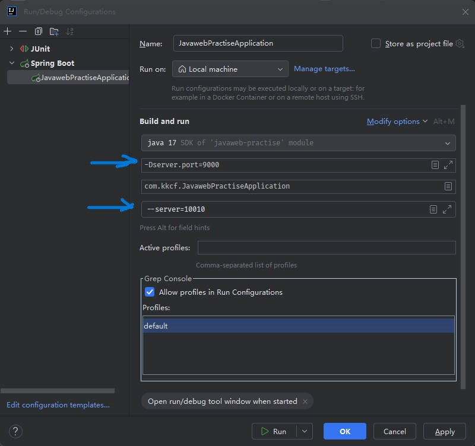

# Spring Boot 属性配置优先级

## 一、Spring Boot 三种配置文件

前面已经介绍过，Spring Boot 项目，支持的三种配置文件格式，优先级排名是（从高到低）：

1. application.properties
2. application.yml
3. application.yaml

在项目开发中，推荐只使用一个配置文件格式,，最为主流的就是 yml 格式。

## 二、Spring Boot 二种外部属性配置

为了增强程序的扩展性，在启动 Spring Boot 项目时，还支持另外两种常见的配置方式：

### 2.1.Java 系统属性

Spring Boot 还支持 Java 系统属性的配置方式，以配置 Tomcat 服务器端口号为例，格式如下：

```java
-Dserver.port=9000
```

### 2.2.命令行参数

Spring Boot 还支持命令行参数的配置方式，以配置 Tomcat 服务器端口号为例，格式如下：

```sh
--server.port=10010
```

## 三、IDEA 设置 Java 系统属性、命令行参数

在 IDEA 中，运行程序，可配置项目的 **Java 系统属性**，**命令行参数**。

左上方点击要运行的方法 -> Edit Configurations -> Modify Options -> Add VM options 、Program arguments



Spring Boot 项目属性配置优先级从高到低：

1. 命令行参数；
2. Java 系统属性；
3. 三种配置文件。

## 四、Maven 项目打包

Spring Boot 项目进行打包时，需要引入 `spring-boot-maven-plugin` 插件（基于官方骨架创建的项目，会自动添加该插件）

demo-project/javaweb-practise/pom.xml

```xml
<build>
    <plugins>
        <plugin>
            <groupId>org.springframework.boot</groupId>
            <artifactId>spring-boot-maven-plugin</artifactId>
            <configuration>
                <excludes>
                    <exclude>
                        <groupId>org.projectlombok</groupId>
                        <artifactId>lombok</artifactId>
                    </exclude>
                </excludes>
            </configuration>
        </plugin>
    </plugins>
</build>
```

IDEA 打包 Maven 项目：

- 在 IDEA Maven 面板中，找到当前项目：Lifecycle -> 双击 package

基于 Maven 的 Java 项目打包：执行 Maven 的打包指令 package。将项目打包成 jar 包；

## 五、命令行设置 Java 系统属性、命令行参数

项目打包上线后，要通过命令，配置 Tomcat 服务器端口号为例，执行 `java -jar` 命令，运行 jar 包

设置 Java 系统属性

```sh
java -Dserver.port=9000 -jar jar包名称
```

设置命令行参数

```sh
java -jar jar包名称 --server.port=10010
```

## 六、Spring Boot 属性配置优先级总结

在 Spring Boot 项目中，常见的属性配置方式有五种，

- 三种配置文件；
- 二种外部属性的配置（Java 系统属性、命令行参数)。

它们的优先级从高到低)：

1. 命令行参数（--xxx=xxx）
2. java 系统属性（-Dxxx=xxx）
3. application.properties、
4. application.yml
5. application.yaml

## 七、在后台运行 jar 包

### 7.1.nohup 命令

`nohup`（no hangup）命令用于在后台运行程序，并且即使你关闭终端或会话，程序仍会继续运行。

**步骤：**

1. 打开终端，切换到包含 JAR 文件的目录。

2. 使用以下命令启动 JAR 包：

   ```bash
   nohup java -jar your-app.jar &
   ```

   其中：

   - `your-app.jar` 是你的 JAR 文件名。
   - `&` 确保该命令在后台执行。
   - `nohup` 确保命令不会因会话关闭而被终止。

3. 通过 `nohup` 启动时，默认会将输出（包括标准输出和错误输出）保存到 `nohup.out` 文件中。你可以查看该文件来检查程序的运行日志：

   ```bash
   tail -f nohup.out
   ```

4. 如果你希望自定义输出文件，可以这样做：

   ```bash
   nohup java -jar your-app.jar > output.log 2>&1 &
   ```

   这将把输出保存到 `output.log` 文件中。

kill 命令终止进程

`nohup` 本身不会提供直接的命令来停止后台进程，但你可以使用 `kill` 命令终止该进程。

1. **查找进程的 PID（进程 ID）**
   如果你知道后台进程的名称或部分命令，你可以使用 `ps` 或 `pgrep` 命令查找进程的 PID。例如，假设你使用 `java -jar your-app.jar` 启动了后台进程，你可以执行：

   ```bash
   ps aux | grep 'your-app.jar'
   ```

   这将列出包含 `your-app.jar` 的所有进程信息。输出中包含进程 ID（PID）。例如：

   ```bash
   cdhr    12345  0.5  1.2 123456 1234 ?        Sl   12:34   0:00 java -jar /path/to/your-app.jar
   ```

2. **使用 `kill` 命令终止进程**
   一旦你找到了进程的 PID（比如 `12345`），你可以使用 `kill` 命令终止该进程：

   ```bash
   kill 12345
   ```

   如果进程没有响应，可以使用 `-9` 信号强制终止进程：

   ```bash
   kill -9 12345
   ```

### 7.2.Systemd 服务

推荐用于生产环境，确保应用随服务器重启而启动

1.进入 `/etc/systemd/system/` 目录

```bash
cd /etc/systemd/system/
```

2 创建一个 `service` 文件

```bash
sudo vim myapp.service
```

3.在创建的 `myapp.service` 里面填写以下内容：

```properties
[Unit]
Description=My Spring Boot Application
After=network.target

[Service]
User=root
WorkingDirectory=/path/to/your-app  # 你的 JAR 包所在目录
ExecStart=/usr/bin/java -jar your-app.jar
SuccessExitStatus=143 # Spring Boot 优雅关闭的退出码
Restart=always
RestartSec=10
StandardOutput=file:/var/log/myapp.log
StandardError=file:/var/log/myapp-error.log

[Install]
WantedBy=multi-user.target
```

[Unit]

- `Description`：服务描述。
- `After=network.target`：确保网络服务启动后再运行此服务。

[Service]

- `User=root`：以 `root` 用户运行（可以改为其他用户）。
- `WorkingDirectory=/path/to/your-app`：指定应用的工作目录。
- `ExecStart=/usr/bin/java -jar your-app.jar`：启动 `jar` 包的命令。
- `SuccessExitStatus=143`：Spring Boot 优雅关闭的退出码。
- `Restart=always`：如果应用崩溃或意外退出，会自动重启。
- `RestartSec=10`：等待 10 秒后重启。
- `StandardOutput=file:/var/log/myapp.log`：日志输出到 `/var/log/myapp.log`。
- `StandardError=file:/var/log/myapp-error.log`：错误日志输出到 `/var/log/myapp-error.log`。

[Install]

- `WantedBy=multi-user.target`：让 `systemd` 在多用户模式下启动此服务。

> 查看 Java 绝对路径：
>
> ```bash
> which java
> ```
>
> 示例输出：
>
> ```shell
> /home/local/java/jdk-17.0.12/bin/java
> ```
>
> 那么 `ExecStart` 应该写成：
>
> ```bash
> ExecStart=/home/local/java/jdk-17.0.12/bin/java -jar your-app.jar
> ```
>
>

4.重新加载 `systemd` 配置

```bash
sudo systemctl daemon-reload
```

5.启动服务

```bash
sudo systemctl start myapp
```

6.设置开机自启

```bash
sudo systemctl enable myapp
```

7.查看服务状态

```bash
sudo systemctl status myapp
```

8.其它命令：

```bash
sudo systemctl stop myapp # 停止服务
sudo systemctl restart myapp # 重启服务
sudo systemctl disable myapp # 关闭开机自启
journalctl -u myapp -f # 查看服务日志
```

## 八、JVM 虚拟机时区设置

JVM 虚拟机时区，默认跟随系统时区。

如果 JVM 虚拟机与系统时区不符，修改 `/etc/timezone` 文件

替换其中内容为，将虚拟机时区设为上海时区：

```conf
Asia/Shanghai
```
