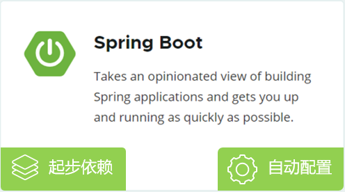
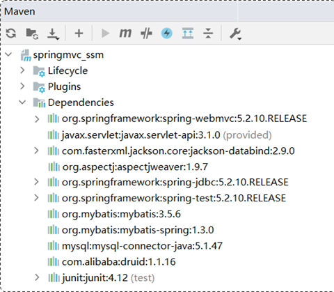
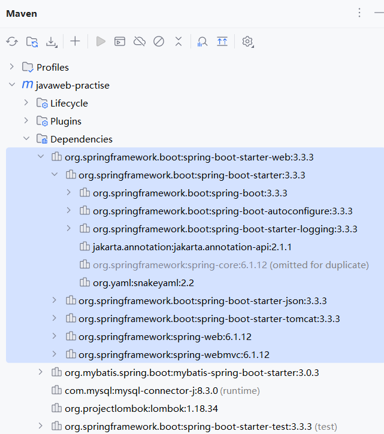

# Spring Boot 原理之起步依赖、自动配置（一）

Spring 是目前最流行的 Java 框架，它可以快速、方便的来构建 Java 项目。

在 Spring 家族中，有很多优秀的框架，它们都基于一个基础框架 Spring Framework（即 Spring 框架）。

开发者直接基于 Spring Framework 框架，进行开发， 会比较繁琐，主要体现在：

- pom.xml 的依赖配置，需要自行找到所需依赖，和它配套的依赖，以及对应的版本，否则会出现版本冲突问题。比较繁琐。
- 配置文件（比如 application.yml）中，要做大量的配置，造成 Spring 框架入门难度较大，学习成本较高。


基于 Spring 存在的问题，官方在 Spring 4.0 版本后，推出了 Spring Boot 框架。

Spring Boot 框架简化（非替代）了 Spring 框架的开发。直接基于 Spring Boot 框架来构建 Java 项目，让项目开发更加简单，快捷。

Spring Boot 框架，之所以简单、快捷，是因为底层提供了两个重要的机制：

- 起步依赖；用于简化 pom.xml 文件中依赖的配置。从而解决 Spring 框架中依赖配置繁琐的问题。
- 自动配置。用于简化 Spring 容器中 Bean 的声明、配置，只需引入起步依赖，常用的配置都已完成，直接使用即可。

Spring Boot 框架的原理，就是它的**起步依赖**、**自动配置**的原理。



## 一、Spring Boot 起步依赖

在不使用 Spring Boot，而是 Spring 框架，进行 Web 项目开发时，需要引入如下依赖：

- spring-webmvc 依赖：Spring 框架进行 Web 程序开发所需要的依赖；
- servlet-api 依赖：Servlet 基础依赖；
- jackson-databind 依赖：JSON 处理工具包；
- 如果要使用 AOP，还需要引入 aop 依赖、aspect 依赖

项目中所引入的这些依赖，还需要保证版本匹配，否则就可能会出现版本冲突问题。



当使用 Spring Boot 框架，进行 Web 项目开发时，就不需要像上面这么繁琐的引入依赖了。

只需要引入一个 Web 开发的**起步依赖**：`springboot-starter-web` 即可。

它会利用 **Maven 的依赖传递**特性，将相关的依赖（以及对应的版本号）全部引入进来。



Spring Boot 框架，提供项目开发所需[常见起步依赖](https://docs.spring.io/spring-boot/docs/2.7.7/reference/htmlsingle/#using.build-systems.starters)；比如：`springboot-starter-web`：

- 它是 Spring Boot 结合 Web 开发的起步依赖，
- 其中集成了 Web 开发常见的依赖：json、web、webmvc、tomcat…。
- 引入这个起步依赖，其他的依赖，都会自动的通过 Maven 的依赖传递引入。

结论：起步依赖的原理就是 Maven 的依赖传递。

## 二、Spring Boot 自动配置

Spring 项目启动后，一些**配置类**，**Bean 对象**，就自动存入到了 IOC 容器中。不需要手动去声明；从而简化了开发，省去了繁琐的配置操作。

- 比如：事务管理、AOP 程序的开发，不需要手动声明相关 Bean 对象，直接使用即可。

项目启动后，在 IDEA 中，查看 IOC 容器（Spring 容器）管理的 Bean 对象。

- Run -> Actuato -> Bean

比如：在其中可以看到，有两个 CommonConfig，

- 在第一个 CommonConfig 类中，定义了一个 Bean 对象，名字就叫 saxReader（即前面自定义配置类中管理的 Bean 对象，属于 dom4j 包，用于 xml 的解析）。
- 在第二个 CommonConfig 类中，它的 Bean 对象名字叫 commonConfig，因为 CommonConfig 配置类上添加了一个注解 `@Configuration`，该注解底层封装了 `@Component` 注解。
- 所以，配置类，最终也是 Spring IOC 容器中的一个 Bean 对象。

在 IOC 容器中，除了开发者自行用配置类定义的 Bean 以外，还有很多 Spring Boot 项目在启动时，加载进来的配置类。它们也会生成很多的 Bean 对象。

比如：在其中可以看到 gsonAutoConfig 中，管理了 gson 的 Bean 对象

> gson 是 Google 提供的，用于将 Java 对象转为 Json 对象的包。

在测试类中，要使用 gson Bean 对象，可以使用 `@Autowired` 注解进行依赖注入。

demo-project/javaweb-practise/src/test/java/com/kkcf/AutoConfigurationTest.java

```java
package com.kkcf;

import com.google.gson.Gson;
import com.kkcf.pojo.Result;
import org.junit.jupiter.api.Test;
import org.springframework.beans.factory.annotation.Autowired;
import org.springframework.boot.test.context.SpringBootTest;

@SpringBootTest
public class AutoConfigurationTest {
    @Autowired
    private Gson gson;

    @Test
    public void testGson() {
        String jsonStr = gson.toJson(Result.success("哈哈"));
        System.out.println(jsonStr); // {"code":1,"msg":"success","data":"哈哈"}
    }
}
```

Spring Boot 自动配置，就是当 Spring Boot 项目启动时，通过自动配置，将配置类，和它管理的 Bean 对象，自动存入到 IOC 容器中；不需要手动去声明。

分析 Spring Boot 的自动配置原理，就是解析在 Spring Boot 项目中，引入依赖之后，是如何将依赖的 jar 包中，所定义的配置类，以及 Bean 对象，加载到 Spring IOC 容器中的。
