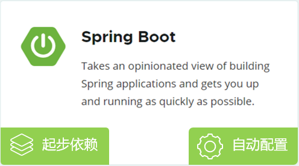
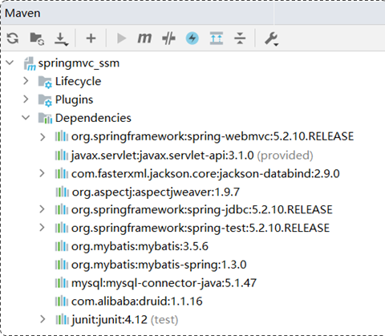
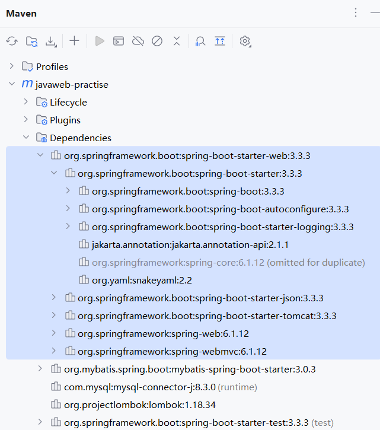

# Spring Boot 原理之起步依赖、自动配置（一）

Spring 是目前最流行的 Java 框架，它可以快速、方便的来构建 Java 项目。

在 Spring 家族中，有很多优秀的框架，它们都基于一个基础框架 Spring Framework（即 Spring 框架）。

直接基于 Spring FrameWork 框架进行开发， 会比较繁琐，主要体现在：

- pom.xml 的依赖配置比较繁琐，需要自行找到所需依赖，还需要找到该依赖所配套的依赖，以及对应版本，否则就会出现版本冲突问题。
- Spring 配置文件中，要做大量的配置，造成 Spring 框架入门难度较大，学习成本较高。


基于 Spring 存在的问题，官方在 Spring 4.0 版本后，推出了 Spring Boot 框架。

Spring Boot 简化 Spring 框架的开发（不是替代）。直接基于 Spring Boot 来构建 Java 项目，让项目开发更加简单，快捷。

Spring Boot 框架，之所以简单、快捷，是因为底层提供了两个重要的机制：

- 起步依赖；简化 pom.xom 文件中依赖的配置。从而解决 Spring 框架中依赖配置繁琐的问题。
- 自动配置。简化 Spring 容器中 Bean 的声明、配置，只需引入起步依赖，常用的配置都已完成，直接使用即可。

Spring Boot 框架的原理，就是它的起步依赖、自动配置的原理。



## 一、Spring Boot 起步依赖

我们首先来学习 Spring Boot 当中起步依赖的原理。

在不使用 Spring Boot，而是 Spring 框架，进行 Web 程序开发时，需要引入如下依赖：

- spring-webmvc 依赖：Spring 框架进行 Web 程序开发所需要的依赖；
- servlet-api 依赖：Servlet 基础依赖；
- jackson-databind 依赖：JSON 处理工具包；
- 如果要使用 AOP，还需要引入 aop 依赖、aspect 依赖

项目中所引入的这些依赖，还需要保证版本匹配，否则就可能会出现版本冲突问题。



使用了 Spring Boot，就不需要像上面这么繁琐的引入依赖了。只需要引入一个 Web 开发的起步依赖：springboot-starter-web。

它会利用 **Maven 的依赖传递**特性，将相关的依赖（以及对应的版本号）全部引入进来。



Spring Boot 提供项目开发所需的所有的[常见依赖](https://docs.spring.io/spring-boot/docs/2.7.7/reference/htmlsingle/#using.build-systems.starters)；比如：

- springboot-starter-web，是 Web 开发的起步依赖，其中集成了 Web 开发中常见的依赖：json、web、webmvc、tomcat……。
- 引入这一个起步依赖，其他的依赖都会自动的通过 Maven 的依赖传递引入。

结论：起步依赖的原理就是 Maven 的依赖传递。

## 二、Spring Boot 自动配置

Spring 容器自动启动后，一些配置类，Bean 对象，就自动存入到了 IOC 容器中。不需要手动去声明；

从而简化了开发，省去了繁琐的配置操作。


在 IDEA 中，查看项目启动后，查看 IOC 容器（Spring 容器）管理的 Bean 对象。

- Run -> Actuato -> Bean

在其中 gsonAutoConfig 中，可以看到管理了 gson Bean 对象（这是 Google 提供的，用于将 Java 对象转为 Json 对象的包）

在测试类中，使用 gson Bean 对象。

demo-project/javaweb-practise/src/test/java/com/kkcf/AutoConfigurationTest.java

```java
package com.kkcf;

import com.google.gson.Gson;
import com.kkcf.pojo.Result;
import org.junit.jupiter.api.Test;
import org.springframework.beans.factory.annotation.Autowired;
import org.springframework.boot.test.context.SpringBootTest;

@SpringBootTest
public class AutoConfigurationTest {
    @Autowired
    private Gson gson;

    @Test
    public void testGson() {
        String jsonStr = gson.toJson(Result.success("哈哈"));
        System.out.println(jsonStr);
    }
}
```


Spring Boot 自动配置，就是当 Spring 项目启动后，一些配置类的 Bean 对象，就自动存入到 IOC 容器中；不需要手动去声明，从而简化了开发，省去了繁琐的配置操作；