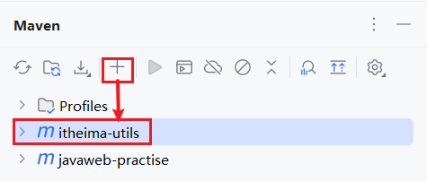
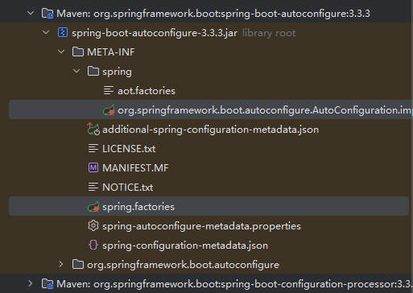

# Spring Boot 原理之自动配置第三方依赖的 Bean、自动配置

解析 Spring Boot 自动配置的原理，就是分析在当前项目中，引入依赖后，是如何将依赖的 jar 包中所提供的 Bean 对象以及配置类，加载到当前 Spring 项目的 IOC 容器中的。

## 一、第三方依赖引入

在 Maven 项目中，引入第三方提供的依赖。

在 IDEA 右侧 Maven 面板中，引入一个本地的 itheima-utils 依赖。



在当前项目的 pom.xml 文件中，引入该依赖。

demo-project/javaweb-practise/pom.xml

```xml-dtd
<!-- 第三方依赖 -->
<dependency>
    <groupId>com.example</groupId>
    <artifactId>itheima-utils</artifactId>
    <version>0.0.1-SNAPSHOT</version>
</dependency>
```

该依赖中，定义了一个类 `TokenParser`，并声明了 `@Component` 注解，将它交给 IOC 容器管理。

com/example/TokenParser.java

```java
package com.example;

import org.springframework.stereotype.Component;

@Component
public class TokenParser {

    public void parse() {
        System.out.println("TokenParser ... parse ...");
    }
}
```

在当前项目测试类中，添加测试方法 `testTokenParse`：

- 在其中获取第三方依赖提供的 `TokenParser` 类型的 Bean 对象。

demo-project/javaweb-practise/src/test/java/com/kkcf/AutoConfigurationTest.java

```java
package com.kkcf;

import com.example.TokenParser;
import org.junit.jupiter.api.Test;
import org.springframework.beans.factory.annotation.Autowired;
import org.springframework.boot.test.context.SpringBootTest;
import org.springframework.context.ApplicationContext;

@SpringBootTest
public class AutoConfigurationTest {
    @Autowired
    private ApplicationContext applicationContext;

    @Test
    public void testTokenParse() {
        System.out.println(applicationContext.getBean(TokenParser.class));
    }
}
```

执行该测试方法，发现出现了异常：

```sh
Java HotSpot(TM) 64-Bit Server VM warning: Sharing is only supported for boot loader classes because bootstrap classpath has been appended

org.springframework.beans.factory.NoSuchBeanDefinitionException: No qualifying bean of type 'com.example.TokenParser' available

  at org.springframework.beans.factory.support.DefaultListableBeanFactory.getBean(DefaultListableBeanFactory.java:343)
  at org.springframework.beans.factory.support.DefaultListableBeanFactory.getBean(DefaultListableBeanFactory.java:334)
  at org.springframework.context.support.AbstractApplicationContext.getBean(AbstractApplicationContext.java:1261)
  at com.kkcf.AutoConfigurationTest.testTokenParse(AutoConfigurationTest.java:26)
  at java.base/java.lang.reflect.Method.invoke(Method.java:568)
  at java.base/java.util.ArrayList.forEach(ArrayList.java:1511)
  at java.base/java.util.ArrayList.forEach(ArrayList.java:1511)
```

异常信息描述： 没有 com.example.TokenParse 类型的 Bean。

说明，在 Spring 容器中，没有该类型的 Bean 对象。

引入的第三方依赖中，Bean 对象、配置类，为什么没有生效？原因：

- 在之前介绍 IOC 的时候有提到过，在类上添加 `@Component` 注解来声明 Bean 对象，还需要保证 `@Component` 注解能被当前项目的 Spring 框架扫描到。
- Spring Boot 项目中，引导（启动）类上的 `@SpringBootApplication` 注解，具有组件扫描的作用，但是它只会扫描启动类所在的包及其子包。
- 第三方依赖中提供的包（比如 com.example）扫描不到。

## 二、Spring Boot 项目扫描第三方依赖 Bean 对象

要让当前 Spring Boot 项目，扫描到第三方依赖中声明的 Bean 对象，有两种方案：

### 1.@ComponentScan 注解

方案一：在引导（启动）类上，使用 `@ComponentScan` 注解，指定要扫描的依赖包。

- 一旦声明该注解，原来默认扫描就会被覆盖掉，所以要重新指定。

demo-project/javaweb-practise/src/main/java/com/kkcf/JavawebPractiseApplication.java

```java
package com.kkcf;

import org.springframework.boot.SpringApplication;
import org.springframework.boot.autoconfigure.SpringBootApplication;
import org.springframework.context.annotation.ComponentScan;

import javax.xml.transform.sax.SAXResult;

@ComponentScan({"com.kkcf", "com.example"})
@SpringBootApplication
public class JavawebPractiseApplication {
    public static void main(String[] args) {
        SpringApplication.run(JavawebPractiseApplication.class, args);
    }
}
```

重新执行测试方法 `testTokenParse`，控制台输出如下：

```sh
com.example.TokenParser@6cd6698b
```

说明，TokenParser 的 Bean 对象，已经在 IOC 容器中管理，并且可以注入使用了。

事实上，采用以上方式，当需要引入大量的第三方依赖时，就需要在启动类上配置很多要扫描的包，缺点显而易见：

- 配置繁琐。
- 这种大面积的扫描性能也比较低。

结论：Spring Boot 中，并没有采用以上这种方案。

> `@Configuration` 注解，用于声明配置类，
>
> - 该注解底层使用了 `@Component` 注解，用于将配置类生成 Bean 对象，并交给 IOC 容器管理。

### 2.@Import 注解

方案2：`@Import` 注解，导入的类会作为 Bean 对象被 Spring 加载到 IOC 容器中。

导入形式，主要有以下几种：

- 导入普通类；
- 导入配置类；
- 导入 `ImportSelector` 接口的实现类。

#### 1.导入普通类

在引导（启动）类上，加上 `@Import` 注解，并指定要导入的类。

demo-project/javaweb-practise/src/main/java/com/kkcf/JavawebPractiseApplication.java

```java
package com.kkcf;

import com.example.TokenParser;
import org.springframework.boot.SpringApplication;
import org.springframework.boot.autoconfigure.SpringBootApplication;
import org.springframework.context.annotation.Import;

@Import(TokenParser.class)
@SpringBootApplication
public class JavawebPractiseApplication {
    public static void main(String[] args) {
        SpringApplication.run(JavawebPractiseApplication.class, args);
    }
}
```

执行测试方法 `testTokenParse`，控制台输出：

```sh
com.example.TokenParser@65c689e7
```

说明，`TokenParser` 的 Bean 对象，已经在 IOC 容器中管理，并且可以注入使用了。

#### 2.导入配置类

第三方依赖中，有配置类 `HeaderConfig`：

- 其中配置了 `headerParser` 和 `headerGenerator` 两个 Bean 对象。

com/example/HeaderConfig.java

```java
package com.example;

import org.springframework.context.annotation.Bean;
import org.springframework.context.annotation.Configuration;

@Configuration
public class HeaderConfig {
    @Bean
    public HeaderParser headerParser() {
        return new HeaderParser();
    }

    @Bean
    public HeaderGenerator headerGenerator() {
        return new HeaderGenerator();
    }
}
```

在项目引导（启动）类上，使用 `@Import` 注解，导入该配置类：

demo-project/javaweb-practise/src/main/java/com/kkcf/JavawebPractiseApplication.java

```java
package com.kkcf;

import com.example.HeaderConfig;
import org.springframework.boot.SpringApplication;
import org.springframework.boot.autoconfigure.SpringBootApplication;
import org.springframework.context.annotation.Import;

import javax.xml.transform.sax.SAXResult;

@Import(HeaderConfig.class)
@SpringBootApplication
public class JavawebPractiseApplication {
    public static void main(String[] args) {
        SpringApplication.run(JavawebPractiseApplication.class, args);
    }
}
```

在测试类中，新增测试方法 `testHeaderParser`：

demo-project/javaweb-practise/src/test/java/com/kkcf/AutoConfigurationTest.java

```java
package com.kkcf;

import com.example.HeaderParser;
import org.junit.jupiter.api.Test;
import org.springframework.beans.factory.annotation.Autowired;
import org.springframework.boot.test.context.SpringBootTest;
import org.springframework.context.ApplicationContext;

@SpringBootTest
public class AutoConfigurationTest {
    @Autowired
    private ApplicationContext applicationContext;

    @Test
    public void testHeaderParser() {
        System.out.println(applicationContext.getBean(HeaderParser.class));
    }
}
```

执行测试方法 `testHeaderParser`，控制台输出：

```sh
com.example.HeaderParser@2a0ce342
```

说明 `HeaderConfig` 配置类中，配置的 `headerParser` 的 Bean 对象，已经在 IOC 容器中管理，并且可以注入使用了。

#### 3.导入 ImportSelector 接口的实现类

`ImportSeiector` 接口，源码如下：

```java
//
// Source code recreated from a .class file by IntelliJ IDEA
// (powered by FernFlower decompiler)
//

package org.springframework.context.annotation;

import java.util.function.Predicate;
import org.springframework.core.type.AnnotationMetadata;
import org.springframework.lang.Nullable;

public interface ImportSelector {
    String[] selectImports(AnnotationMetadata importingClassMetadata);

    @Nullable
    default Predicate<String> getExclusionFilter() {
        return null;
    }
}
```

- `String[] selectImports` 方法，用于封装哪些类需要生成 Bean 对象导入到 Spring 容器中。

在第三方依赖中， 有实现了 `ImportSelector` 接口的实现类 `MyImportSelector`

com/example/HeaderConfig.java

```java
package com.example;

import org.springframework.context.annotation.ImportSelector;
import org.springframework.core.type.AnnotationMetadata;

public class MyImportSelector implements ImportSelector {
    public String[] selectImports(AnnotationMetadata importingClassMetadata) {
        return new String[]{"com.example.HeaderConfig"};
    }
}
```

在项目引导（启动）类上，使用 `@Import` 注解，导入该实现类：

demo-project/javaweb-practise/src/main/java/com/kkcf/JavawebPractiseApplication.java

```java
package com.kkcf;

import com.example.MyImportSelector;
import org.springframework.boot.SpringApplication;
import org.springframework.boot.autoconfigure.SpringBootApplication;
import org.springframework.context.annotation.Import;

import javax.xml.transform.sax.SAXResult;

@Import(MyImportSelector.class)
@SpringBootApplication
public class JavawebPractiseApplication {
    public static void main(String[] args) {
        SpringApplication.run(JavawebPractiseApplication.class, args);
    }
}
```

执行测试方法 `testHeaderParser`，控制台输出：

```sh
com.example.HeaderParser@5d04fbb7
```

说明 `MyImportSelector` 实现类的 `selectImports` 方法中，声明的 `HeaderConfig` 配置类所配置的 `HeaderParser` 的 Bean 对象，已经在 IOC 容器中管理，并且可以注入使用了。

基于以上方式，当要引入一个第三方依赖时，开发者要实现自动配置：

- 需要知道第三方依赖中，有哪些配置类、Bean 对象、`ImportSelector` 实现类需要被导入；

这对开发者很不友好，非常繁琐，也是不现实的；

### 3.@EnableXxxx 注解

第三方依赖，最清楚自己有哪些配置类、Bean 对象、`ImportSelector` 实现类需要被导入；

所以不用开发者自行指定，而是让第三方依赖来指定。

- 比较常见的方案，就是第三方依赖中，提供一个 @EnableXxxx 注解，注解中封装的就是 `@Import` 注解

在第三方依赖中，有一个注解 `@EnableHeaderConfig`，其中使用了 `@Import` 注解。

com/example/EnableHeaderConfig.java

```java
package com.example;

import org.springframework.context.annotation.Import;

import java.lang.annotation.ElementType;
import java.lang.annotation.Retention;
import java.lang.annotation.RetentionPolicy;
import java.lang.annotation.Target;

@Retention(RetentionPolicy.RUNTIME) // 元注解
@Target(ElementType.TYPE) // 元注解
@Import(MyImportSelector.class)
public @interface EnableHeaderConfig {
}
```

在引导（启动）类上，加上 `@EnableHeaderConfig` 注解；

demo-project/javaweb-practise/src/main/java/com/kkcf/JavawebPractiseApplication.java

```java
package com.kkcf;

import com.example.EnableHeaderConfig;
import org.springframework.boot.SpringApplication;
import org.springframework.boot.autoconfigure.SpringBootApplication;

@EnableHeaderConfig // 使用第三方依赖提供的 Enable 开头的注解
@SpringBootApplication
public class JavawebPractiseApplication {
    public static void main(String[] args) {
        SpringApplication.run(JavawebPractiseApplication.class, args);
    }
}
```

执行测试方法 `testHeaderParser`，控制台输出：

```sh
com.example.HeaderParser@68543a35
```

说明 `@EnableHeaderConfig` 注解中，使用 `@Import` 注解导入了 `MyImportSelector` 的 `selectImports` 方法中返回的 `HeaderConfig` 配置类中，配置的 `HeaderParser` 的 Bean 对象，已经在 IOC 容器中管理，并且可以注入使用了。

## 三、Spring Boot 自动配置原理分析

上文介绍了在项目中，引入第三方依赖后，加载其中定义好的 Bean 对象、配置类；从而完成手动配置操作。

下面通过源码跟踪，来剖析下 Spring Boot 底层，是如何基于以上手动配置操作，完成自动配置的。

> 源码跟踪技巧：在跟踪框架源码时，不要逐行去看代码，逐个研究方法，而是要抓住关键点，找到核心流程；
>
> 先在宏观上对整个流程或者整个原理有一个认识，有精力再去研究其中的细节。

### 1.@SpringBootApplication 注解与启动类

分析 Spring Boot 自动配置的原理，要从启动（引导）类上的 `@SpringBootApplication` 注解开始，它的源码如下：

```java
import ……

@Target({ElementType.TYPE}) // 元注解
@Retention(RetentionPolicy.RUNTIME) // 元注解
@Documented // 元注解
@Inherited // 元注解
@SpringBootConfiguration
@EnableAutoConfiguration
@ComponentScan(
    excludeFilters = {@Filter(
    type = FilterType.CUSTOM,
    classes = {TypeExcludeFilter.class}
), @Filter(
    type = FilterType.CUSTOM,
    classes = {AutoConfigurationExcludeFilter.class}
)}
)
public @interface SpringBootApplication {……}
```

- `@Target`、`@Retention`、`@Documented`、`@Inherited` 这样的修饰注解的注解，称为元注解；
- `@SpringBootConfiguration` 注解中，封装了 `@Configuration` 注解，用于声明配置类；表示启动类就是一个配置类。
  - 所以可以在启动类中，使用 `@Bean` 注解声明 Bean 对象。
  - 该注解中封装的 `@Indexed` 注解，是用来加速应用启动的（不用关心）。
- `@ComponentScan` 注解，用于启动类所在包及其子包的组件扫描，扫描 `@Component` 注解及其衍生注解声明的类。
- `@EnableAutoConfiguration` 注解，**自动配置的核心注解**，其中封装了 `@Import` 注解，来导入指定的配置类或者 Bean 对象。

### 2.@EnableAutoConfiguration  注解

`@EnableAutoConfiguration ` 注解源码如下：

```java
//
// Source code recreated from a .class file by IntelliJ IDEA
// (powered by FernFlower decompiler)
//

package org.springframework.boot.autoconfigure;

import java.lang.annotation.Documented;
import java.lang.annotation.ElementType;
import java.lang.annotation.Inherited;
import java.lang.annotation.Retention;
import java.lang.annotation.RetentionPolicy;
import java.lang.annotation.Target;
import org.springframework.context.annotation.Import;

@Target({ElementType.TYPE}) // 元注解
@Retention(RetentionPolicy.RUNTIME) // 元注解
@Documented // 元注解
@Inherited // 元注解
@AutoConfigurationPackage
@Import({AutoConfigurationImportSelector.class})
public @interface EnableAutoConfiguration {
    String ENABLED_OVERRIDE_PROPERTY = "spring.boot.enableautoconfiguration";

    Class<?>[] exclude() default {};

    String[] excludeName() default {};
}
```

- `@Import` 注解中，导入的是 `AutoConfigurationImportSelector.class` 类。
- `AutoConfigurationImportSelector` 事实上是 `ImportSelector` 接口的实现类。

`AutoConfigurationImportSelector` 源码如下：

```java
import ……

public class AutoConfigurationImportSelector implements DeferredImportSelector, BeanClassLoaderAware, ResourceLoaderAware, BeanFactoryAware, EnvironmentAware, Ordered {……}
```

- 可见 `AutoConfigurationImportSelector` 类实现了 `DeferredImportSelector` 接口；

`DeferredImportSelector` 接口源码如下，它继承自  `ImportSelector` 接口：

```java
import ……

public interface DeferredImportSelector extends ImportSelector {……}
```

### 3.AutoConfigurationImportSelector 类

`AutoConfigurationImportSelector` 类源码如下，它的 `selectImports` 实现方法如下：

```java
public class AutoConfigurationImportSelector implements DeferredImportSelector, BeanClassLoaderAware, ResourceLoaderAware, BeanFactoryAware, EnvironmentAware, Ordered {
    private static final AutoConfigurationEntry EMPTY_ENTRY = new AutoConfigurationEntry();
    private static final String[] NO_IMPORTS = new String[0];
    private static final Log logger = LogFactory.getLog(AutoConfigurationImportSelector.class);
    private static final String PROPERTY_NAME_AUTOCONFIGURE_EXCLUDE = "spring.autoconfigure.exclude";
    private ConfigurableListableBeanFactory beanFactory;
    private Environment environment;
    private ClassLoader beanClassLoader;
    private ResourceLoader resourceLoader;
    private ConfigurationClassFilter configurationClassFilter;

    public AutoConfigurationImportSelector() {
    }

    // 重写了 selectImports 方法
    public String[] selectImports(AnnotationMetadata annotationMetadata) {
        if (!this.isEnabled(annotationMetadata)) {
            return NO_IMPORTS;
        } else {
            AutoConfigurationEntry autoConfigurationEntry = this.getAutoConfigurationEntry(annotationMetadata);
            return StringUtils.toStringArray(autoConfigurationEntry.getConfigurations());
        }
    }

    // 👆 selectImports() 方法，调用了 👇 getAutoConfigurationEntry() 方法，获取可自动配置的配置类信息集合

    protected AutoConfigurationEntry getAutoConfigurationEntry(AnnotationMetadata annotationMetadata) {
        if (!this.isEnabled(annotationMetadata)) {
            return EMPTY_ENTRY;
        } else {
            AnnotationAttributes attributes = this.getAttributes(annotationMetadata);
            List<String> configurations = this.getCandidateConfigurations(annotationMetadata, attributes);
            configurations = this.removeDuplicates(configurations);
            Set<String> exclusions = this.getExclusions(annotationMetadata, attributes);
            this.checkExcludedClasses(configurations, exclusions);
            configurations.removeAll(exclusions);
            configurations = this.getConfigurationClassFilter().filter(configurations);
            this.fireAutoConfigurationImportEvents(configurations, exclusions);
            return new AutoConfigurationEntry(configurations, exclusions);
        }
    }

    // 👆 getAutoConfigurationEntry() 方法，通过调用 👇 getCandidateConfigurations(annotationMetadata, attributes) 方法获取在配置文件中配置的所有自动配置类的集合。

    protected List<String> getCandidateConfigurations(AnnotationMetadata metadata, AnnotationAttributes attributes) {
        List<String> configurations = ImportCandidates.load(AutoConfiguration.class, this.getBeanClassLoader()).getCandidates();
        Assert.notEmpty(configurations, "No auto configuration classes found in META-INF/spring/org.springframework.boot.autoconfigure.AutoConfiguration.imports. If you are using a custom packaging, make sure that file is correct.");
        return configurations;
    }

    // ……
}
```

可见，最终 Spring Boot 会在 `META-INF/spring/org.springframework.boot.autoconfigure.AutoConfiguration.imports`. 这个文件中，加载自动配置的配置类，Bean 对象。

Spring Boot 项目，通常在引入的起步依赖中，都包含这个文件。



> Spring 3.x 之前，还会在 `META-INF/spring.factories` 文件中加载自动配置。

通常在引入的起步依赖中，都有包含这个文件，比如 Spring Boot Web 的起步依赖。


可以看到，之前使用的 gson 依赖，也在这个配置文件中：

org.springframework.boot.autoconfigure.AutoConfiguration.imports

```imports
……
org.springframework.boot.autoconfigure.gson.GsonAutoConfiguration
……
```

查看 gson 依赖中的 `GsonAutoConfiguration` 配置类：

- 可以看到使用的 `@AutoConfiguration` 注解（它其中封装了 `@Configuration` 注解）标注，说明这是个配置类。

```java
@AutoConfiguration
@ConditionalOnClass({Gson.class})
@EnableConfigurationProperties({GsonProperties.class})
public class GsonAutoConfiguration {……}
```

至此，可以理解 Spring Boot 的自动配置，原理就是在配置类中定义一个 `@Bean` 标识的方法；

而 Spring 会自动调用配置类中使用 `@Bean` 标识的方法，并把方法的返回值注册到 IOC 容器中。

## 四、Spring Boot 自动配置总结

总结：自动配置原理，源码的入口就是引导类上的 `@SpringBootApplication` 注解，在这个注解中，封装了三个注解，分别是：

- `@SpringBootConfiguration`，声明当前类是一个配置类；
- `@ComponentScan`，进行组件扫描（默认扫描启动类所在包及其子包）；
- `@EnableAutoConfiguration`，封装了 `@Import` 注解，其中指定了一个 `ImportSelector` 接口的实现类 `AutoConfigurationImportSelector`；
  - 在实现类重写的 `selectImports()` 方法，读取当前项目下所有依赖 jar 包中 `META-INF/spring/org.springframework.boot.autoconfigure.AutoConfiguration.imports` 文件里面定义的配置类中 `@Bean` 注解标识的方法。
  - Spring Boot 项目启动时，就会加载配置文件中定义的配置类，并将这些类的全限定名，封装到 String 类型的数组中；
  - 最终通过 `@Import` 注解，将这些配置类全部加载到 IOC 容器中进行管理。

`META-INF/spring/org.springframework.boot.autoconfigure.AutoConfiguration.imports` 文件中，定义的配置类非常多，而每个配置类中又可以定义很多的 Bean 对象；

这些 Bean 并不会全部注册到 IOC 容器中；

在声明 Bean 对象时，上面有加一个 `@ConditionalXxxx` 的注解，用于按照条件进行装配，只有满足条件之后，Bean 才会注册到 IOC 容器中。
