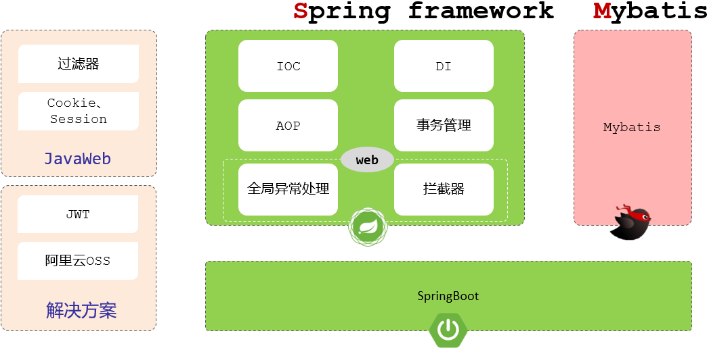

# Java Web 后端开发总结

## 一、三层架构

Java Web 后端开发，现在基本上都是基于标准的三层架构进行开发的。在三层架构中：

- Controller 控制器层，负责接收请求响应数据；
- Service 业务层，负责具体的业务逻辑处理；
- Dao 数据访问层，也叫持久层，用来处理数据访问操作。

## 二、过滤器、拦截器

在执行具体的业务逻辑前，需要去做一些通用的业务处理。

- 比如：进行统一的登录校验；统一的字符编码……

可以借助于两种方式：

- 方式一：Java Web 当中三大组件之一的过滤器 Filter；
- 方式二：Spring 提供的拦截器 Interceptor 来实现。

## 三、Spring 第一大核心 IOC、DI

为了实现三层架构，层与层之间的解耦，要使用 Spring 框架第一大核心：IOC 控制反转、DI 依赖注入。

- IOC 控制反转，指的是将对象创建的控制权，由应用程序自身，交给外部容器，这个容器就是我们常说的 IOC 容器或 Spring 容器。
- DI 依赖注入，指的是容器为程序提供运行时所需要的资源。

## 四、Spring 第二大核心 AOP，以及常用技术栈

除此之外，常用的 web 后端开发技术还有：

- Spring 第二大核心是 AOP 面向切面编程；
- Spring 中的事务管理、
- Spring 中全局异常处理器。
- 会话技术 Cookie、Session 和新的会话跟踪解决方案 JWT 令牌。
- 阿里云 OSS 对象存储服务。
- Mybatis 持久层架构操作数据库等技术。

这些 Web 后端开发技术，都可基于主流的 Spring Boot 进行整合使用。

Spring Boot 又是基于 Spring Framework 框架用来简化开发，提高开发效率的框架。

以上技术，与框架之间的关系，如下图所示：

- Filter 过滤器、Cookie、 Session 会话技术，是传统的 Java Web 规范提供的技术。
- JWT 令牌、阿里云 OSS 对象存储服务，是现在企业项目中常见的一些解决方案。
- IOC 控制反转、DI 依赖注入、AOP 面向切面编程、事务管理、全局异常处理、拦截器，是 Spring Framework 框架当中提供的核心功能。
- Mybatis 是一个独立的持久层框架，用来操作数据库。

## 五、Spring MVC 与 Spring Framework

Spring 生态中，对 Web 程序开发提供了很好的支持，

- 比如：全局异常处理器、拦截器这些都是 Spring web 开发模块所提供的功能；

Spring 的 Web 开发模块，也称为：Spring MVC 框架；

Spring MVC 不是一个单独的框架，它是 Spring 框架的一部分，是 Spring 框架中的 Web 开发模块，用来简化原始的 Servlet 程序开发的。

## 六、SSM 与 Spring Boot

外界俗称的 SSM，就是由 Spring MVC、Spring Framework、Mybatis 三块组成。

基于传统的 SSM 框架，开发项目会比较繁琐，效率也比较低；

现在企业项目开发，基本都是基于 Spring Boot 整合 SSM 进行项目开发的。
