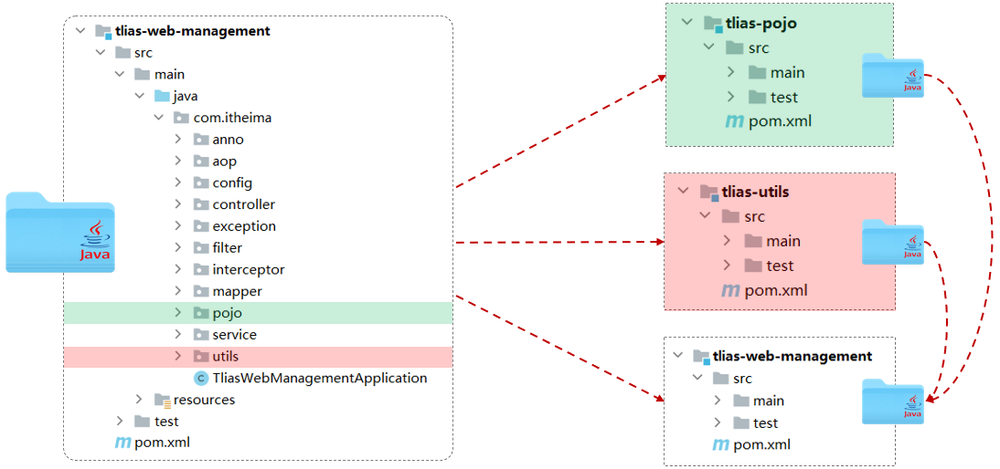

# Maven 高级之分模块设计

Maven 是一款构建和管理 Java 项目的工具。掌握 Maven 工具的基本使用之后，对于简单的项目构建及管理基本没什么问题。

然而开发一些中大型项目，仅凭 Maven 的基础知识，就难以应对了。

接下来介绍 Maven 提供的一些高级功能，这些功能，在构建和管理 Java 项目时，用的非常多。

Maven 高级功能包括:

- 分模块设计与开发
- 继承与聚合
- 私服

## 一、分模块设计是什么？

分模块设计，就是在设计一个 Java 项目时，将它拆分成多个模块。


如果项目不分模块，意味着所有的业务代码，都写在一个项目中。

- 随着这个项目的业务扩张，项目中的业务功能，会越来越多。

如果开发的是一个大型的电商项目，里面可能包含了商品模块、搜索模块、购物车模块、订单模块、用户中心模块…。

这些所有的业务代码，都在一个 Java 项目当中编写。加上大量开发人员同时操作一个项目，有两大问题：

- 项目管理和维护起来，将会非常的困难。
- 项目中，定义的一些通用工具类、组件，复用非常不方便。

分模块设计，就是在项目设计阶段，将一个大的项目，按照功能、结构，拆分成若干个模块，每一个模块都是独立的。

.png)

- 将商品相关业务功能，放在商品模块；搜索相关业务功能，放在搜索模块；购物车模块、订单模块…类似。
- 为了组件的复用，可以将项目中的实体类、工具类，通用组件，单独的抽取到一个模块当中。

这样就将一个项目，拆分成了若干个模块，这就是分模块儿设计。

- 进行项目管理的时候，就可以项目组为单位，负责不同模块的开发，这样更加**便于项目的管理、维护、拓展**。
- 当前模块（比如订单模块）需要用到实体类、工具类、或通用组件，直接引入通用模块坐标即可**便于模块键的相互调用、资源共享**。

## 二、分模块设计案例理解

在之前开发的案例工程。可以看到除了部门管理、员工管理、登录认证等等相关业务功能外；

还定义了一些实体类。

- 即 pojo 包下存放的类，其中有分页查询结果封装 `EmpPageBean` 类、 统一响应结果 `Result` 类等等；

还定义了一些通用的工具类。

- 即 utils 包下存放的类，其中有 `JwtUtil` 类、阿里云 OSS 操作的工具类 `AliyunOSSUtil` 等等。

如果在其它项目组，也想使用上面封装的这些公共组件，有两种方案。

- 方案一：直接依赖当前项目 javaweb-practise，但存在两大缺点：

  - 项目在启动时将会把所有的类都加载进来，会影响性能。
  - 所有的业务代码，都对外公开了，非常不安全。

- 方案二：分模块设计：

  - 将 pojo 包下的实体类，抽取到一个 Maven 模块 javaweb-pojo 中。
  - 将 utils 包下的工具类，抽取到一个 Maven 模块 javaweb-utils 中
  - 其他的业务代码，仍放在 javaweb-practise 这个模块中，在该模块中引入  javaweb-pojo、 javaweb-utils 依赖。



注意：分模块开发，要先针对模块功能进行设计，再进行编码。而不是先将工程开发完毕，然后进行拆分。

当前仅为了演示分模块开发，所以是基于前面开发的项目，进行拆分的，

### 1.javaweb-pojo 模块

在 IDEA 中，创建 Maven 模块 javaweb-pojo，用于存放实体类

1. Project Structure -> Moudule -> + 号 -> New Module -> Java
2. 右侧 Build system 选择 Maven。
3. 填写 Maven 模块名称，坐标信息。
   1. 在右侧打开 Advanced Setting；
   2. GroupId 设为 `com.kkcf`；表示组织名。
   3. ArtifactId 设为 `javaweb-pojo`；表示模块名。
   4. Version 会被 IDEA 自动生成，无需手动指定，表示版本号。

4. 点击 Create 创建项目，

将原项目 pojo 包，拷贝 javaweb-pojo 模块 com.kkcf 包下，与原项目路径保持一致；

pojo 实体类中，使用了 Lombok 依赖，在 pom.xml 中，引入该依赖消除报错。

demo-project/javaweb-pojo/pom.xml

```xml
<dependency>
    <groupId>org.projectlombok</groupId>
    <artifactId>lombok</artifactId>
    <version>1.18.24</version>
</dependency>
```

删除原项目 pojo 包，在原项目 pom.xml 中，引入 javaweb-pojo 依赖

demo-project/javaweb-practise/pom.xml

```xml
<!-- Maven 分模块设计-->
<dependency>
    <groupId>com.kkcf</groupId>
    <artifactId>javaweb-pojo</artifactId>
    <version>1.0-SNAPSHOT</version>
</dependency>
```

### 2.javaweb-utils 模块

在 IDEA 中，创建 Maven 模块 javaweb-utils，用于存放实体类

1. Project Structure -> Moudule -> + 号 -> New Module -> Java
2. 右侧 Build system 选择 Maven。
3. 填写 Maven 模块名称，坐标信息。
   1. 在右侧打开 Advanced Setting；
   2. GroupId 设为 `com.kkcf`；表示组织名。
   3. ArtifactId 设为 `javaweb-utils`；表示模块名。
   4. Version 会被 IDEA 自动生成，无需手动指定，表示版本号。

4. 点击 Create 创建项目，

将原项目 utils 包，拷贝到 javaweb-utils 模块的 com.kkcf 包下，与原项目路径保持一致。

消除 utils 包下的报错，在 pom.xml 中，引入依赖：

demo-project/javaweb-utils/pom.xml

```xml
<!-- Spring Boot Web-->
<dependency>
    <groupId>org.springframework.boot</groupId>
    <artifactId>spring-boot-starter-web</artifactId>
    <version>3.3.3</version>
</dependency>

<!-- Lombk -->
<dependency>
    <groupId>org.projectlombok</groupId>
    <artifactId>lombok</artifactId>
    <version>1.18.34</version>
</dependency>

<!-- 阿里云 OSS SDK -->
<dependency>
    <groupId>com.aliyun.oss</groupId>
    <artifactId>aliyun-sdk-oss</artifactId>
    <version>3.17.4</version>
</dependency>
<dependency>
    <groupId>javax.xml.bind</groupId>
    <artifactId>jaxb-api</artifactId>
    <version>2.3.1</version>
</dependency>
<dependency>
    <groupId>javax.activation</groupId>
    <artifactId>activation</artifactId>
    <version>1.1.1</version>
</dependency>

<!-- JWT -->
<dependency>
    <groupId>io.jsonwebtoken</groupId>
    <artifactId>jjwt</artifactId>
    <version>0.9.1</version>
</dependency>
```

删除原项目的 utils 包，然后在原项目 pom.xml 中引入 javaweb-utils 的依赖

demo-project/javaweb-practise/pom.xml

```xml
<dependency>
    <groupId>com.kkcf</groupId>
    <artifactId>javaweb-utils</artifactId>
    <version>1.0-SNAPSHOT</version>
</dependency>
```

至此，已经完成了模块的拆分，拆分出了 javaweb-practise、javaweb-pojo，javaweb-utils 三个包，

其他项目中要用，就可以直接引入依赖。
