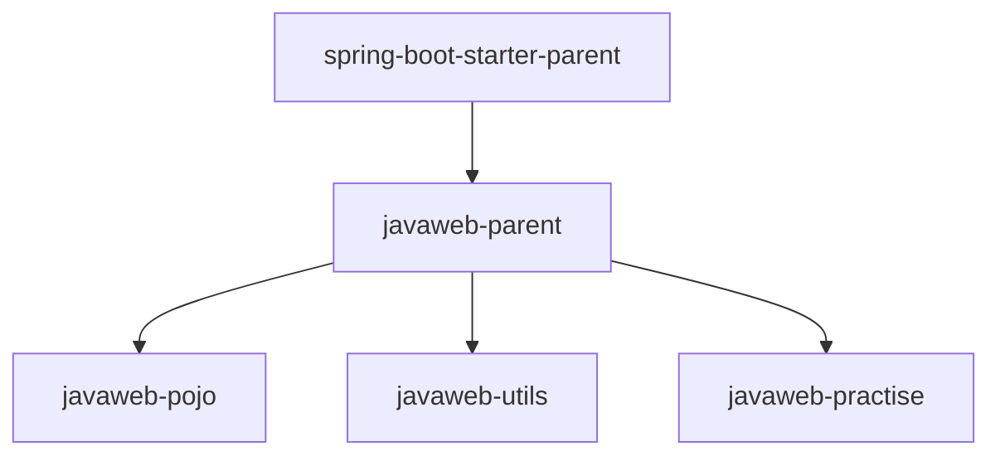

# Maven 高级之继承、版本锁定

## 一、Maven 继承是什么

案例分模块设计之后，发现 javaweb-pojo、javaweb-utils、javaweb-practise 三个 Maven 模块中，都引入了 lombok 的依赖。

如果是做一个大型项目，各个模块中重复的依赖，可能会很多。在每一个 Maven 模块里，都配置一次，是比较繁琐的。

为解决这个问题，可以再创建一个父工程 javaweb-parent：

1. 让三个模块 javaweb-pojo、javaweb-utils、javaweb-practise 继承这个父工程 。；
2. 将各个模块中共有的依赖，提取到父工程 javaweb-parent 中；
3. 只要子工程继承了父工程，依赖也会继承下来，这样就无需在各个子工程中进行配置了。

Maven 工程继承：

- 概念：两个工程间的父子关系，与 java 中类继承相似，子工程可以继承父工程中的配置信息，
- 作用：简化依赖配置、统一管理依赖。

Maven 工程的继承，在子工程的 pom.xml 文件中使用 `<parent>` 标签配置：

```xml
<parent>
    <groupId>...</groupId>
    <artifactId>...</artifactId>
    <version>...</version>
    <relativePath>....</relativePath>
</parent>
```

## 二、Maven 继承案例理解

当前项目 javaweb-practise，还有点特殊，它是一个 Spring Boot 项目；

所有的 Spring Boot 项目，都有一个统一的父工程，即 spring-boot-starter-parent。

与 java 语言类似，Maven 项目不支持多继承，但可以多重继承；

子工程如果继承了 spring-boot-starter-parent，就无法继承自定义的父工程 javaweb-parent了。

所以可以让自己定义父工程 javaweb-parent 继承 spring-boot-starter-parent，具体继承结构如下：



### 1.父工程创建

在 IDEA 中，创建 Maven 模块 javaweb-parent，作为父工程。

1. Project Structure -> Moudule -> + 号 -> New Module -> Java
2. 右侧 Build system 选择 Maven。
3. 填写 Maven 模块名称，坐标信息。
   1. 在右侧打开 Advanced Setting；
   2. GroupId 设为 `com.kkcf`；表示组织名。
   3. ArtifactId 设为 `javaweb-parent`；表示模块名。
   4. Version 会被 IDEA 自动生成，无需手动指定，表示版本号。

4. 点击 Create 创建项目，

### 2.父工程打包方式设置

在父工程的 pom.xml 文件中，设置打包方式为 pom（默认 jar）。

demo-project/javaweb-parent/pom.xml

```xml
<groupId>com.kkcf</groupId>
<artifactId>javaweb-parent</artifactId>
<version>1.0-SNAPSHOT</version>
<packaging>pom</packaging>
```

Maven 项目打包方式：

- jar：普通模块打包，Spring Boot 项目基本都是 jar 包，因为内嵌了 Tomcat 服务器。
- war：普通 Web 程序打包，需要部署在外部的 Tomcat 服务器中运行。
- pom：父工程或聚合工程，该模块不写代码，仅进行依赖管理。

### 3.子工程中描述父工程信息

在子工程的 pom.xml 文件中，配置继承关系。使用 `<parent>` 标签，描述父工程信息。

javaweb-pojo 子工程：

demo-project/javaweb-pojo/pom.xml

```xml
<parent>
    <groupId>com.kkcf</groupId>
    <artifactId>javaweb-parent</artifactId>
    <version>1.0-SNAPSHOT</version>
    <relativePath>../javaweb-parent/pom.xml</relativePath>
</parent>

<artifactId>javaweb-pojo</artifactId>
<version>1.0-SNAPSHOT</version>
```

- 在子工程中，配置了继承关系之后，坐标中的 `<groupId>` 标签可省略，因为会自动继承父工程的 。
- `<relativePath>` 指定父工程的 pom 文件的相对位置（如果不指定，将从本地仓库/远程仓库查找该工程）。

javaweb-utils 子工程：

demo-project/javaweb-utils/pom.xml

```xml
<parent>
    <groupId>com.kkcf</groupId>
    <artifactId>javaweb-parent</artifactId>
    <version>1.0-SNAPSHOT</version>
    <relativePath>../javaweb-parent/pom.xml</relativePath>
</parent>

<artifactId>javaweb-utils</artifactId>
<version>1.0-SNAPSHOT</version>
```

javaweb-practise 子工程：

demo-project/javaweb-practise/pom.xml

```xml
<parent>
    <groupId>com.kkcf</groupId>
    <artifactId>javaweb-parent</artifactId>
    <version>1.0-SNAPSHOT</version>
    <relativePath>../javaweb-parent/pom.xml</relativePath>
</parent>
<!--<parent>
    <groupId>org.springframework.boot</groupId>
    <artifactId>spring-boot-starter-parent</artifactId>
    <version>3.3.3</version>
    <relativePath/> &lt;!&ndash; lookup parent from repository &ndash;&gt;
</parent>-->
<artifactId>javaweb-practise</artifactId>
<version>0.0.1-SNAPSHOT</version>
<name>javaweb-practise</name>
<description>javaweb-practise</description>
```

### 4.父工程中配置共有依赖

在父工程 javaweb-parent 的 pom.xml 中，配置各个工程共有的依赖（子工程会自动继承父工程的依赖），以及共有的父工程 spring-boot-starter-parent 依赖。

demo-project/javaweb-parent/pom.xml

```xml
<parent>
    <groupId>org.springframework.boot</groupId>
    <artifactId>spring-boot-starter-parent</artifactId>
    <version>3.3.3</version>
    <relativePath/>
</parent>

……

<dependencies>
    <dependency>
        <groupId>org.projectlombok</groupId>
        <artifactId>lombok</artifactId>
        <version>1.18.24</version>
    </dependency>
</dependencies>
```

至此，已经将各个子工程中，共有的依赖（lombok），定义在了父工程中，子工程中的这一项依赖，就可以删除了。

删除之后，可以看到父工程中配置的依赖 lombok，被子工程继承下来了。

> 真实企业开发中，都是先设计好模块之后，再开始创建模块。
>
> 一般都会先创建父工程 javaweb-parent，再创建各个子模块，放在父工程目录下。 这样层级结构会更加清晰一些，如下所示。
>
> ├─📁 javaweb-parent
> │ ├─📁 javaweb-pojo
> │ ├─📁 javaweb-practise
> │ ├─📁 javaweb-utils

## 三、Maven 版本锁定

在项目开发中，有一部分依赖，并不是各个模块都共有的。比如：

- 一个父工程有五个自工程，其中三个用到了 jwt 依赖。 其它两个并不需要这个依赖，
- 那么这个依赖，不应配置在父工程中，而是在需要的模块中配置。

由于是一个项目，那它的多个模块中，依赖的版本要一致，这样便于项目依赖的统一管理。比如：

- jwt 依赖，都使用 0.9.1 版本。

如果项目要升级，要使用 jwt 最新版本 `0.9.2` 中的一个新功能，需要将依赖的版本升级，应怎么做呢？

1. 找到项目中哪些模块用到了 jwt 的依赖。
2. 依次将它们的版本 `<version>` 标签中的值更换为`0.9.2`。

如果项目拆分的模块比较多，以上操作非常繁琐。并且容易出现遗漏。

为解决这个问题，要使用 Maven 版本锁定功能，统一管理各个依赖的版本。

在 Maven 父工程的 pom.xml 文件中，通过 `<dependencyManagement>` 来统一管理依赖版本。

demo-project/javaweb-parent/pom.xml

```xml
<!--统一管理依赖版本-->
<dependencyManagement>
    <dependencies>
        <!--JWT令牌-->
        <dependency>
            <groupId>io.jsonwebtoken</groupId>
            <artifactId>jjwt</artifactId>
            <version>0.9.1</version>
        </dependency>
    </dependencies>
</dependencyManagement>
```

在子工程中，只需引入依赖，无需指定版本号。

demo-project/javaweb-practise/pom.xml

```xml
<dependencies>
    <!--JWT 令牌-->
    <dependency>
        <groupId>io.jsonwebtoken</groupId>
        <artifactId>jjwt</artifactId>
    </dependency>
</dependencies>
```

在父工程中，所配置的 `<dependencyManagement>` 标签只能统一管理依赖版本，并不会将这个依赖直接引入进来。 这点和 `<dependencies>` 标签是不同的。

子工程要使用这个依赖，还是需要引入的，只是无需使用 `<version>` 标签指定版本号了，父工程统一管理。变更依赖版本。

## 四、Maven 版本锁定案例理解

javaweb-utils 模块中，配置的依赖，将其版本统一交给 javaweb-parent 进行统一管理，使用 `<dependencyManagement>` 标签。

demo-project/javaweb-parent/pom.xml

```xml
<dependencyManagement>
    <dependencies>
        <!-- Spring Boot Web-->
        <dependency>
            <groupId>org.springframework.boot</groupId>
            <artifactId>spring-boot-starter-web</artifactId>
            <version>3.3.3</version>
        </dependency>

        <!-- 阿里云 OSS SDK -->
        <dependency>
            <groupId>com.aliyun.oss</groupId>
            <artifactId>aliyun-sdk-oss</artifactId>
            <version>3.17.4</version>
        </dependency>
        <dependency>
            <groupId>javax.xml.bind</groupId>
            <artifactId>jaxb-api</artifactId>
            <version>2.3.1</version>
        </dependency>
        <dependency>
            <groupId>javax.activation</groupId>
            <artifactId>activation</artifactId>
            <version>1.1.1</version>
        </dependency>

        <!-- JWT -->
        <dependency>
            <groupId>io.jsonwebtoken</groupId>
            <artifactId>jjwt</artifactId>
            <version>0.9.1</version>
        </dependency>
    </dependencies>
</dependencyManagement>
```

很多时候，在 Spring Boot 项目中，引入依赖坐标，不需要指定依赖的版本 `<version>` ；

就是因为在父工程 spring-boot-starter-parent 中，已经通过 `<dependencyManagement>` 标签，对依赖的版本进行了统一的管理维护。

### 1.pom.xml 属性配置

可以通过在 `<>properties?` 标签中，声明自定义属性，以及属性引用的形式，在父工程中，将依赖的版本号进行集中管理维护。 具体语法为：

demo-project/javaweb-parent/pom.xml

```xml
<properties>
    <maven.compiler.source>17</maven.compiler.source>
    <maven.compiler.target>17</maven.compiler.target>
    <project.build.sourceEncoding>UTF-8</project.build.sourceEncoding>
    <!-- 自定义属性 -->
    <lombok.version>1.18.24</lombok.version>
    <aliyun-sdk-oss.version>3.17.4</aliyun-sdk-oss.version>
    <jaxb-api.version>2.3.1</jaxb-api.version>
    <activation.version>1.1.1</activation.version>
    <jjwt.version>0.9.1</jjwt.version>
</properties>

<dependencies>
    <dependency>
        <groupId>org.projectlombok</groupId>
        <artifactId>lombok</artifactId>
        <!-- 引用属性 -->
        <version>${lombok.version}</version>
    </dependency>
</dependencies>

<dependencyManagement>
    <dependencies>
        <!-- Spring Boot Web-->
        <dependency>
            <groupId>org.springframework.boot</groupId>
            <artifactId>spring-boot-starter-web</artifactId>
            <version>3.3.3</version>
        </dependency>

        <!-- 阿里云 OSS SDK -->
        <dependency>
            <groupId>com.aliyun.oss</groupId>
            <artifactId>aliyun-sdk-oss</artifactId>
            <!-- 引用属性 -->
            <version>${aliyun-sdk-oss.version}</version>
        </dependency>
        <dependency>
            <groupId>javax.xml.bind</groupId>
            <artifactId>jaxb-api</artifactId>
            <!-- 引用属性 -->
            <version>${jaxb-api.version}</version>
        </dependency>
        <dependency>
            <groupId>javax.activation</groupId>
            <artifactId>activation</artifactId>
            <!-- 引用属性 -->
            <version>${activation.version}</version>
        </dependency>

        <!-- JWT -->
        <dependency>
            <groupId>io.jsonwebtoken</groupId>
            <artifactId>jjwt</artifactId>
            <!-- 引用属性 -->
            <version>${jjwt.version}</version>
        </dependency>
    </dependencies>
</dependencyManagement>
```

版本集中管理后，要想修改依赖的版本，只需在父工程自定义属性处，修改对应的属性值即可。

父工程与子工程中，配置了同一依赖，会以子工程依赖的版本为准。

面试题：pom.xml 文件中`<dependencyManagement>` 标签与 `<dependencies>` 标签的区别是什么？

- `<dependencies>` 是直接依赖，在父工程配置了依赖，子工程会直接继承下来。
- `<dependencyManagement>` 是统一管理依赖版本，子工程不会直接继承，还需要引入依赖，但无需指定版本。
